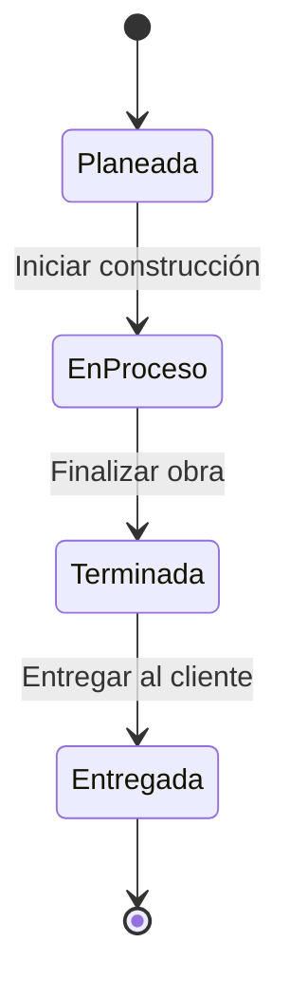
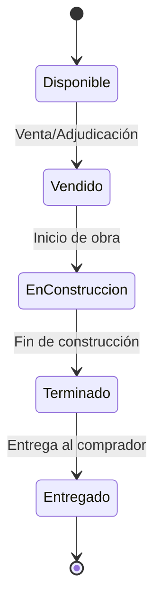

# RF-PROJ-002: Estructura Jerárquica de Obra

**Epic:** MAI-002 - Proyectos y Estructura de Obra
**Tipo:** Requerimiento Funcional
**Prioridad:** Crítica (P0)
**Estado:** 📋 Pendiente
**Última actualización:** 2025-11-17

---

## 📋 Descripción

El sistema debe permitir definir y gestionar la estructura jerárquica de un proyecto de construcción inmobiliaria, organizando el desarrollo en **Etapas** → **Manzanas** (opcional) → **Lotes** → **Viviendas**. Esta estructura permite rastrear avances físicos, asignar presupuestos, controlar inventarios y gestionar entregas de forma granular.

---

## 🎯 Objetivos

1. **Organización:** Estructurar proyectos grandes en unidades manejables
2. **Trazabilidad:** Rastrear cada vivienda desde cimentación hasta entrega
3. **Control:** Asignar presupuestos, equipos y recursos por nivel jerárquico
4. **Flexibilidad:** Soportar diferentes esquemas (con/sin manzanas, edificios verticales)
5. **Escalabilidad:** Manejar desde 10 hasta 1000+ viviendas por proyecto

---

## 📐 Jerarquía de Niveles

### Nivel 1: Proyecto (RF-PROJ-001)
```
Fraccionamiento "Villas del Sol"
├─ 250 viviendas
├─ 15 hectáreas
└─ 24 meses de plazo
```

### Nivel 2: Etapa
```
Etapa 1
├─ 80 viviendas (32% del total)
├─ Plazo: 8 meses
├─ Estado: En ejecución
└─ Subdivisión en manzanas
```

### Nivel 3: Manzana (solo fraccionamientos/conjuntos)
```
Manzana A
├─ 20 lotes
├─ Vialidad perimetral
├─ Área verde común
└─ Infraestructura (agua, luz, drenaje)
```

### Nivel 4: Lote
```
Lote 12
├─ Área: 120 m²
├─ Frente: 6 m
├─ Fondo: 20 m
├─ Prototipo: Casa Tipo A (75 m² construcción)
└─ Estado: Cimentación
```

### Nivel 5: Vivienda
```
Casa #A-012
├─ Lote: 12, Manzana A
├─ Prototipo: Casa Tipo A
├─ Área construida: 75 m²
├─ Avance: 45%
└─ Estado: En construcción
```

---

## 🏗️ Definición de Niveles

### 1. Etapa (Stage)

**Descripción:** División temporal o geográfica del proyecto para facilitar construcción escalonada.

#### 1.1 Datos de la Etapa
```yaml
Código: ETAPA-1
Nombre: "Etapa 1 - Zona Norte"
Descripción: "Primera etapa de 80 viviendas en zona norte del fraccionamiento"
Orden: 1 (secuencia de construcción)
Proyecto: UUID del proyecto padre

# Fechas
Fecha inicio planeada: 2025-06-01
Fecha inicio real: 2025-06-08
Fecha fin planeada: 2026-01-31
Fecha fin real: null (aún en proceso)

# Cantidades
Total de manzanas: 4 (solo fraccionamientos)
Total de lotes: 80
Total de viviendas: 80

# Estado
Estado: planeada | en_proceso | terminada | entregada
Avance físico: 58.5%

# Financiero
Presupuesto asignado: $32,000,000 (80 viv × $400k c/u)
Costo ejercido: $18,720,000 (58.5%)
```

#### 1.2 Casos de Uso de Etapas

**Fraccionamiento en 3 etapas:**
```
Proyecto: Villas del Sol (250 viviendas)
├─ Etapa 1: 80 viviendas (2025)
├─ Etapa 2: 90 viviendas (2026)
└─ Etapa 3: 80 viviendas (2027)
```

**Torre vertical (edificio):**
```
Proyecto: Torre Skyline (120 departamentos)
├─ Etapa 1: Cimentación y estructura
├─ Etapa 2: Acabados niveles 1-7
└─ Etapa 3: Acabados niveles 8-15
```

#### 1.3 Estados de Etapa



### 2. Manzana (Block)

**Descripción:** Agrupación de lotes contiguos en fraccionamientos horizontales. No aplica para edificios verticales.

#### 2.1 Datos de la Manzana
```yaml
Código: MZA-A
Nombre: "Manzana A"
Etapa: UUID de la etapa padre
Proyecto: UUID del proyecto

# Geometría
Total de lotes: 20
Área total: 2,400 m² (20 lotes × 120 m² c/u)
Perímetro: 180 m

# Infraestructura
Vialidad asignada: Calle Privada Nogales
Área verde: 150 m²
Caseta de vigilancia: Sí
Estacionamiento de visitas: 4 cajones

# Servicios
Red de agua potable: Instalada ✅
Red de drenaje: Instalada ✅
Red eléctrica subterránea: Instalada ✅
Alumbrado público: Instalado ✅
Banquetas: Instaladas ✅
Pavimentación: En proceso 🚧

# Estado
Estado: planeada | urbanizacion | construccion | terminada
Avance de urbanización: 85%
Viviendas terminadas: 12/20 (60%)
```

#### 2.2 Configuraciones Típicas

**Manzana rectangular:**
```
      Calle Principal
    ┌─────────────────┐
C   │ L1  L2  L3  L4  │ C
a   │                 │ a
l   │ L5  L6  L7  L8  │ l
l   │                 │ l
e   │ L9  L10 L11 L12 │ e
    │                 │
P   │ L13 L14 L15 L16 │ P
r   │                 │ r
i   │ L17 L18 L19 L20 │ i
v   └─────────────────┘ v
      Calle Secundaria
```

**Manzana con área verde central:**
```
    ┌─────────────────┐
    │ L1  L2  L3  L4  │
    │                 │
    │   Área Verde    │
    │    Común        │
    │                 │
    │ L5  L6  L7  L8  │
    └─────────────────┘
```

### 3. Lote (Lot)

**Descripción:** Terreno individual donde se construye una vivienda. Unidad mínima de venta.

#### 3.1 Datos del Lote
```yaml
Código: LOTE-012
Número: 12
Manzana: UUID de la manzana (si aplica)
Etapa: UUID de la etapa
Proyecto: UUID del proyecto

# Geometría del terreno
Área total: 120.00 m²
Frente: 6.00 m
Fondo: 20.00 m
Forma: rectangular | irregular
Coordenadas GPS:
  Latitud: 19.432650
  Longitud: -99.133280

# Linderos
Colindancia norte: Lote 11
Colindancia sur: Lote 13
Colindancia este: Calle Nogales
Colindancia oeste: Área verde

# Uso
Prototipo asignado: Casa Tipo A (UUID)
Área de construcción: 75.00 m² (primer nivel)
Área de ampliación futura: 25.00 m² (segundo nivel)
Cajones de estacionamiento: 1

# Datos catastrales
Cuenta predial: 12345678901234
Clave catastral: 14-028-001-012-000
Valor catastral: $850,000 MXN

# Estado
Estado: disponible | vendido | en_construccion | terminado | entregado
Fecha de venta: 2025-05-20
Comprador: "Juan Pérez García"
NSS comprador: 12345678901 (si es INFONAVIT)
```

#### 3.2 Estados de Lote



### 4. Vivienda (Housing Unit)

**Descripción:** Unidad habitacional construida en el lote, basada en un prototipo (RF-PROJ-003).

#### 4.1 Datos de la Vivienda
```yaml
Código: VIV-A-012
Identificador comercial: "Casa A-012"
Lote: UUID del lote padre
Manzana: UUID de la manzana (si aplica)
Etapa: UUID de la etapa
Proyecto: UUID del proyecto

# Prototipo
Prototipo: UUID del prototipo base (Casa Tipo A)
Área construida nivel 1: 75.00 m²
Área construida nivel 2: 0.00 m² (aún no ampliado)
Área total construida: 75.00 m²

# Configuración
Recámaras: 2
Baños: 1.5
Cocina: Integral
Sala-comedor: Abierta
Patio trasero: 30 m²
Estacionamiento: Techado, 1 cajón

# Acabados (puede variar del prototipo)
Piso: Cerámica estándar
Muros: Pintura vinílica blanca
Cancelería: Aluminio natural
Cocina integral: Melamina color maple
Azulejo baños: 2.10 m de altura

# Avance de construcción
Estado general: en_proceso | terminada | entregada
Avance físico total: 45%
Avances por etapa constructiva:
  - Cimentación: 100% ✅
  - Estructura: 100% ✅
  - Muros: 80% 🚧
  - Instalaciones: 60% 🚧
  - Acabados: 20% 📋
  - Urbanización: 15% 📋

# Fechas
Fecha inicio construcción: 2025-08-15
Fecha programada terminación: 2025-12-15
Fecha real terminación: null
Fecha de entrega: null

# Calidad
Inspecciones realizadas: 3
Incidencias detectadas: 2
Incidencias resueltas: 1
Certificado de calidad: Pendiente
```

#### 4.2 Relación con Avances de Obra

Cada vivienda se relaciona con el módulo de **Control de Obra (MAI-005)** donde se registran:

- **Avances físicos por concepto:** Cimentación, muros, losa, instalaciones, acabados
- **Evidencias fotográficas:** Fotos geo-referenciadas de cada etapa
- **Incidencias:** Problemas de calidad, no conformidades
- **Checklists:** Verificación de actividades completadas

---

## 🌳 Estructuras por Tipo de Proyecto

### Fraccionamiento Horizontal (con manzanas)

```
Proyecto: Villas del Sol
└─ Etapa 1
   ├─ Manzana A
   │  ├─ Lote 1 → Vivienda A-001 (Casa Tipo A)
   │  ├─ Lote 2 → Vivienda A-002 (Casa Tipo B)
   │  └─ ...
   ├─ Manzana B
   │  ├─ Lote 21 → Vivienda B-021 (Casa Tipo A)
   │  └─ ...
   └─ Manzana C
      └─ ...
```

### Conjunto Habitacional (sin manzanas)

```
Proyecto: Residencial Alameda
└─ Etapa 1
   ├─ Lote 1 → Dúplex D-001
   ├─ Lote 2 → Dúplex D-002
   └─ ...
```

### Edificio Vertical (niveles en lugar de manzanas)

```
Proyecto: Torre Skyline
├─ Etapa 1: Cimentación y Estructura
│  └─ Toda la torre (sin lotes individuales)
├─ Etapa 2: Niveles 1-7
│  ├─ Nivel 1
│  │  ├─ Depto 101 (Tipo 2R)
│  │  ├─ Depto 102 (Tipo 3R)
│  │  └─ Depto 103 (Tipo 2R)
│  ├─ Nivel 2
│  │  └─ ...
│  └─ ...
└─ Etapa 3: Niveles 8-15
   └─ ...
```

**Nota:** Para edificios verticales, el concepto de "Lote" se adapta como "Departamento" y no hay manzanas.

---

## 💼 Casos de Uso

### CU-PROJ-005: Crear Estructura de Fraccionamiento

**Actor:** Ingeniero Residente

**Precondiciones:**
- Proyecto creado en estado "Adjudicado"
- Usuario con permisos de edición de estructura

**Flujo Principal:**

1. **Crear Etapa 1:**
   ```json
   {
     "code": "ETAPA-1",
     "name": "Etapa 1 - Zona Norte",
     "totalBlocks": 4,
     "totalLots": 80,
     "startDate": "2025-06-01",
     "endDate": "2026-01-31",
     "budget": 32000000
   }
   ```

2. **Crear Manzanas de Etapa 1:**
   - Manzana A: 20 lotes
   - Manzana B: 20 lotes
   - Manzana C: 20 lotes
   - Manzana D: 20 lotes

3. **Crear Lotes de Manzana A:**
   ```
   Para i = 1 hasta 20:
     Lote i:
       - Número: i
       - Área: 120 m²
       - Frente: 6 m
       - Fondo: 20 m
       - Prototipo: Asignar alternando entre Tipo A y Tipo B
   ```

4. **Asignar Prototipos:**
   - Lotes impares (1, 3, 5...): Casa Tipo A
   - Lotes pares (2, 4, 6...): Casa Tipo B

5. **Crear Viviendas automáticamente:**
   - Sistema crea 80 viviendas vinculadas a cada lote
   - Estado inicial: "Disponible"
   - Código: VIV-A-001 a VIV-D-020

**Resultado:** Estructura completa de Etapa 1 con 4 manzanas, 80 lotes y 80 viviendas

### CU-PROJ-006: Crear Estructura de Torre Vertical

**Actor:** Ingeniero

**Precondiciones:**
- Proyecto de tipo "edificio_vertical" creado

**Flujo Principal:**

1. **Crear Etapa 1: Cimentación y Estructura**
   - Sin lotes individuales
   - Presupuesto de obra negra

2. **Crear Etapa 2: Acabados Niveles 1-7**

3. **Crear "Lotes" como Departamentos:**
   ```
   Para cada nivel (1 a 7):
     Para cada depto (101 a 108):
       Crear "Lote-Depto":
         - Código: DEPTO-101
         - Nivel: 1
         - Área: 85 m²
         - Prototipo: Depto 2 recámaras
   ```

4. **Crear Viviendas (Departamentos):**
   - Total: 56 departamentos (7 niveles × 8 deptos/nivel)
   - Estado: "En planificación"

**Resultado:** Torre con 56 departamentos organizados por niveles

### CU-PROJ-007: Cambiar Estado de Vivienda

**Actor:** Residente de Obra

**Precondiciones:**
- Vivienda en estado "en_construccion"
- Avance físico = 100%

**Flujo Principal:**

1. Usuario accede a vivienda VIV-A-012
2. Ve checklist de terminación:
   - ✅ Cimentación: 100%
   - ✅ Estructura: 100%
   - ✅ Muros: 100%
   - ✅ Instalaciones: 100%
   - ✅ Acabados: 100%
   - ✅ Limpieza final: Completa
   - ✅ Inspección de calidad: Aprobada
3. Hace clic en "Marcar como Terminada"
4. Sistema solicita confirmación con fecha real de terminación
5. Usuario confirma: 2025-12-10
6. Sistema cambia estado a "terminada"
7. Genera certificado de terminación
8. Notifica a área de ventas para agendar entrega

**Resultado:** Vivienda marcada como terminada, lista para entrega

---

## 🧪 Casos de Prueba

### TC-PROJ-005: Crear Jerarquía Completa ✅

**Entrada:**
```json
{
  "project": {
    "name": "Test Fraccionamiento",
    "type": "fraccionamiento_horizontal"
  },
  "structure": {
    "stages": [
      {
        "code": "ETAPA-1",
        "blocks": [
          {
            "code": "MZA-A",
            "lots": [
              { "number": 1, "area": 120, "prototype": "uuid-tipo-a" },
              { "number": 2, "area": 120, "prototype": "uuid-tipo-b" }
            ]
          }
        ]
      }
    ]
  }
}
```

**Resultado Esperado:**
```
Proyecto creado ✅
└─ Etapa 1 creada ✅
   └─ Manzana A creada ✅
      ├─ Lote 1 creado ✅
      │  └─ Vivienda VIV-A-001 creada ✅
      └─ Lote 2 creado ✅
         └─ Vivienda VIV-A-002 creada ✅
```

### TC-PROJ-006: Validar Códigos Únicos ✅

**Escenario:** Intentar crear lote con código duplicado

**Entrada:**
```json
{
  "blockId": "mza-a-uuid",
  "lots": [
    { "number": 1, "code": "LOTE-001" },
    { "number": 2, "code": "LOTE-001" }  // Duplicado
  ]
}
```

**Salida Esperada:**
```json
{
  "error": "El código LOTE-001 ya existe en esta manzana",
  "code": "DUPLICATE_LOT_CODE"
}
```

### TC-PROJ-007: Cálculo de Totales Recursivo ✅

**Entrada:**
```
Etapa 1:
  - Manzana A: 20 lotes
  - Manzana B: 20 lotes
```

**Query:**
```sql
SELECT COUNT(*) FROM lots WHERE stage_id = 'etapa-1-uuid';
```

**Resultado Esperado:**
```
40 lotes
```

### TC-PROJ-008: Validar Cambio de Estado ❌

**Escenario:** Marcar vivienda como "terminada" con avance < 100%

**Entrada:**
```json
{
  "housingId": "viv-a-012-uuid",
  "newStatus": "terminada",
  "physicalProgress": 85
}
```

**Salida Esperada:**
```json
{
  "error": "No se puede marcar como terminada. Avance físico: 85% (requerido: 100%)",
  "code": "INCOMPLETE_HOUSING"
}
```

---

## 🔐 Seguridad y Permisos

### Permisos por Rol

| Acción | Director | Engineer | Resident | Purchases | Finance |
|--------|----------|----------|----------|-----------|---------|
| Crear etapas | ✅ | ✅ | ❌ | ❌ | ❌ |
| Crear manzanas/lotes | ✅ | ✅ | ✅ | ❌ | ❌ |
| Asignar prototipos | ✅ | ✅ | ✅ | ❌ | ❌ |
| Cambiar estado vivienda | ✅ | ✅ | ✅ | ❌ | ❌ |
| Ver estructura | ✅ | ✅ | ✅ | ✅ | ✅ |
| Eliminar lotes | ✅ | ✅ | ❌ | ❌ | ❌ |

---

## 📊 Reportes Requeridos

### 1. Árbol Jerárquico del Proyecto
```
Villas del Sol (250 viviendas)
├─ Etapa 1 (80 viviendas) - 58% completado
│  ├─ Manzana A (20 viviendas) - 75% completado
│  │  ├─ Lote 1: Casa A-001 - Terminada ✅
│  │  ├─ Lote 2: Casa A-002 - En proceso 🚧 (45%)
│  │  └─ ...
│  ├─ Manzana B (20 viviendas) - 60% completado
│  └─ ...
├─ Etapa 2 (90 viviendas) - En planificación 📋
└─ Etapa 3 (80 viviendas) - No iniciada ⏸️
```

### 2. Resumen de Avances por Etapa
| Etapa | Manzanas | Lotes | Viviendas | Terminadas | Avance % |
|-------|----------|-------|-----------|------------|----------|
| Etapa 1 | 4 | 80 | 80 | 46 | 58% |
| Etapa 2 | 4 | 90 | 90 | 0 | 0% |
| **Total** | **8** | **170** | **170** | **46** | **27%** |

### 3. Listado de Viviendas por Estado
```
Disponibles: 124 (73%)
En construcción: 46 (27%)
Terminadas: 0 (0%)
Entregadas: 0 (0%)
```

---

## 📋 Validaciones

### Validaciones de Negocio

1. **Códigos únicos:** Código de etapa, manzana, lote y vivienda únicos dentro del proyecto
2. **Jerarquía válida:** Lote debe pertenecer a manzana o etapa válidas
3. **Suma de lotes:** Total de lotes de manzanas = total declarado en etapa
4. **Prototipo asignado:** Cada vivienda debe tener un prototipo válido
5. **Estado secuencial:** No se puede marcar como "entregada" sin pasar por "terminada"

### Validaciones Técnicas

1. **Área > 0:** Área de lote debe ser mayor a cero
2. **Coordenadas GPS válidas:** Si se proporcionan, deben estar en formato válido
3. **Cascada de eliminación:** Al eliminar manzana, validar que no tenga lotes vendidos
4. **Referencias válidas:** Todos los UUIDs de padres deben existir

---

## 🔗 Dependencias

### Dependencias de Otros RFs

- **RF-PROJ-001:** Catálogo de proyectos (padre)
- **RF-PROJ-003:** Prototipos de vivienda (asignación a lotes)
- **RF-PROG-001:** Avances de obra (registros por vivienda) - MAI-005
- **RF-BUD-002:** Presupuesto por etapa (MAI-003)

---

## 📈 Métricas de Éxito

- ✅ Estructuras de hasta 1000 viviendas creadas en < 30 segundos
- ✅ Consulta de árbol jerárquico completo en < 2 segundos
- ✅ 100% de viviendas con código único (0 duplicados)
- ✅ Navegación de 4 niveles (proyecto → etapa → manzana → lote → vivienda) fluida

---

**Fecha de creación:** 2025-11-17
**Versión:** 1.0
**Autor:** Equipo de Producto
**Revisado por:** Arquitecto de Software
