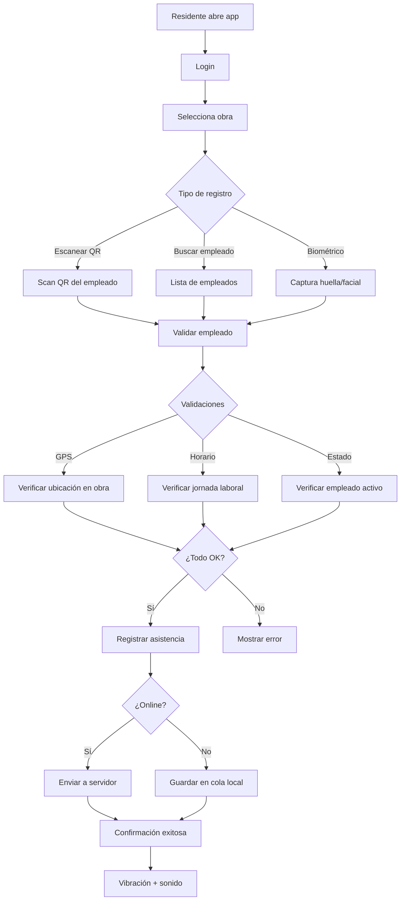

# _MAP: MAI-006 - RRHH, Asistencias y Nómina

**Épica:** MAI-006
**Nombre:** RRHH, Asistencias y Nómina
**Fase:** 1 - Alcance Inicial
**Presupuesto:** $25,000 MXN
**Story Points:** 50 SP
**Estado:** 🚧 Planificado
**Sprint:** Sprint 9-10 (Semanas 13.5-16)
**Prioridad:** P0 - Crítico
**Última actualización:** 2025-11-17

---

## 📋 Propósito

Implementar sistema completo de gestión de recursos humanos para obra con:
- Catálogo de empleados, cuadrillas y oficios
- **Asistencia biométrica desde app móvil** ⭐
- Costeo de mano de obra por obra/partida
- **Integración con IMSS e INFONAVIT** ⭐
- Exportación de archivos SUA para nómina

**Justificación:** RRHH es crítico para costeo de mano de obra y cumplimiento legal (IMSS/INFONAVIT) desde el inicio de cualquier obra.

**Reutilización GAMILIT:** 30% (concepto de tracking de usuarios, adaptado)

---

## 📁 Contenido

### Requerimientos Funcionales (5)

| ID | Archivo | Título | Estado |
|----|---------|--------|--------|
| RF-HR-001 | [RF-HR-001-empleados-cuadrillas.md](./requerimientos/RF-HR-001-empleados-cuadrillas.md) | Gestión de Empleados y Cuadrillas | 🚧 Planificado |
| RF-HR-002 | [RF-HR-002-asistencia-biometrica.md](./requerimientos/RF-HR-002-asistencia-biometrica.md) | Sistema de Asistencia con Biométrico | 🚧 Planificado |
| RF-HR-003 | [RF-HR-003-costeo-mano-obra.md](./requerimientos/RF-HR-003-costeo-mano-obra.md) | Costeo de Mano de Obra | 🚧 Planificado |
| RF-HR-004 | [RF-HR-004-integracion-imss.md](./requerimientos/RF-HR-004-integracion-imss.md) | Integración con IMSS | 🚧 Planificado |
| RF-HR-005 | [RF-HR-005-integracion-infonavit.md](./requerimientos/RF-HR-005-integracion-infonavit.md) | Integración con INFONAVIT | 🚧 Planificado |

### Especificaciones Técnicas (5)

| ID | Archivo | Título | RF | Estado |
|----|---------|--------|-------|--------|
| ET-HR-001 | [ET-HR-001-empleados-cuadrillas.md](./especificaciones/ET-HR-001-empleados-cuadrillas.md) | Implementación de Empleados y Cuadrillas | RF-HR-001 | 🚧 Planificado |
| ET-HR-002 | [ET-HR-002-asistencia-biometrica.md](./especificaciones/ET-HR-002-asistencia-biometrica.md) | Implementación de Asistencia Biométrica | RF-HR-002 | 🚧 Planificado |
| ET-HR-003 | [ET-HR-003-costeo-mano-obra.md](./especificaciones/ET-HR-003-costeo-mano-obra.md) | Implementación de Costeo de Mano de Obra | RF-HR-003 | 🚧 Planificado |
| ET-HR-004 | [ET-HR-004-integracion-imss.md](./especificaciones/ET-HR-004-integracion-imss.md) | Integración con API IMSS | RF-HR-004 | 🚧 Planificado |
| ET-HR-005 | [ET-HR-005-integracion-infonavit.md](./especificaciones/ET-HR-005-integracion-infonavit.md) | Integración con API INFONAVIT | RF-HR-005 | 🚧 Planificado |

### Historias de Usuario (6)

| ID | Archivo | Título | SP | Estado |
|----|---------|--------|----|--------|
| US-HR-001 | [US-HR-001-catalogo-empleados.md](./historias-usuario/US-HR-001-catalogo-empleados.md) | Catálogo de Empleados y Cuadrillas | 8 | 🚧 Planificado |
| US-HR-002 | [US-HR-002-asistencia-biometrica-app.md](./historias-usuario/US-HR-002-asistencia-biometrica-app.md) | Asistencia con Biométrico desde App | 15 | 🚧 Planificado |
| US-HR-003 | [US-HR-003-costeo-mano-obra.md](./historias-usuario/US-HR-003-costeo-mano-obra.md) | Costeo de Mano de Obra por Obra | 10 | 🚧 Planificado |
| US-HR-004 | [US-HR-004-integracion-nomina.md](./historias-usuario/US-HR-004-integracion-nomina.md) | Integración con Nómina Externa | 8 | 🚧 Planificado |
| US-HR-005 | [US-HR-005-exportacion-imss-infonavit.md](./historias-usuario/US-HR-005-exportacion-imss-infonavit.md) | Exportación IMSS/INFONAVIT | 12 | 🚧 Planificado |
| US-HR-006 | [US-HR-006-reportes-asistencia.md](./historias-usuario/US-HR-006-reportes-asistencia.md) | Reportes de Asistencia | 5 | 🚧 Planificado |

**Total Story Points:** 50 SP (12 SP más que GAMILIT por integraciones externas)

### Implementación

📊 **Inventarios de trazabilidad:**
- [TRACEABILITY.yml](./implementacion/TRACEABILITY.yml) - Matriz completa de trazabilidad
- [DATABASE.yml](./implementacion/DATABASE.yml) - Objetos de base de datos
- [BACKEND.yml](./implementacion/BACKEND.yml) - Módulos backend e integraciones
- [MOBILE.yml](./implementacion/MOBILE.yml) - Especificaciones de app móvil ⭐
- [INTEGRATIONS.yml](./implementacion/INTEGRATIONS.yml) - Integraciones IMSS/INFONAVIT ⭐

### Pruebas

📋 Documentación de testing:
- [TEST-PLAN.md](./pruebas/TEST-PLAN.md) - Plan de pruebas
- [TEST-CASES.md](./pruebas/TEST-CASES.md) - Casos de prueba
- [INTEGRATION-TESTS.md](./pruebas/INTEGRATION-TESTS.md) - Tests de integración IMSS/INFONAVIT ⭐

---

## 🔗 Referencias

- **README:** [README.md](./README.md) - Descripción detallada de la épica
- **Fase 1:** [../README.md](../README.md) - Información de la fase completa
- **Roadmap:** [../ROADMAP-DETALLADO.md](../ROADMAP-DETALLADO.md) - Sprints 9-10

---

## 📊 Métricas

| Métrica | Valor |
|---------|-------|
| **Presupuesto estimado** | $25,000 MXN |
| **Presupuesto target** | $25,000 MXN ±5% |
| **Story Points estimados** | 50 SP |
| **Duración estimada** | 2.5 semanas (12.5 días) |
| **Reutilización GAMILIT** | 30% |
| **Integraciones externas** | 2 (IMSS, INFONAVIT) |
| **RF a implementar** | 5/5 |
| **ET a implementar** | 5/5 |
| **US a completar** | 6/6 |

---

## 🎯 Módulos Afectados

### Base de Datos
- **Schemas:** `hr`, `attendance`, `payroll`
- **Tablas:** ~15 tablas
  - `employees`, `crews`, `trades`, `attendance_records`
  - `labor_costs`, `payroll_periods`, `imss_integration_log`, `infonavit_integration_log`
- **Funciones:** Cálculo de costeo, validaciones de asistencia
- **ENUMs:**
  - `employee_status` (active, suspended, terminated)
  - `trade_type` (mason, electrician, plumber, carpenter, etc.)
  - `attendance_method` (biometric, qr, manual, gps)

### Backend
- **Módulo:** `hr`
- **Path:** `apps/backend/src/modules/hr/`
- **Services:**
  - `EmployeeService` - CRUD de empleados
  - `AttendanceService` - Registro y validación de asistencia
  - `LaborCostService` - Cálculo de costeo
  - `IMSSIntegrationService` - Integración con IMSS ⭐
  - `INFONAVITIntegrationService` - Integración con INFONAVIT ⭐
  - `BiometricService` - Validación de datos biométricos ⭐
- **APIs Externas:**
  - IMSS SOAP/REST API
  - INFONAVIT REST API

### Frontend Web
- **Features:** `hr`, `attendance`, `payroll`
- **Path:** `apps/frontend/src/features/`
- **Componentes:**
  - Gestión de empleados y cuadrillas
  - Dashboard de asistencias
  - Reportes de costeo
  - Exportación IMSS/INFONAVIT
- **Guards:** AuthGuard, RoleGuard (solo HR y Finance)

### App Móvil (React Native) ⭐
- **Features:** `attendance-capture`
- **Path:** `apps/mobile/src/features/attendance/`
- **Componentes:**
  - Login de residente
  - Selector de obra
  - Scanner QR
  - Captura biométrica (huella/facial)
  - Lista de empleados
  - Confirmación de asistencia
  - Historial del día
- **Offline:** SQLite + sincronización automática
- **Biométrico:**
  - `react-native-biometrics` (huella)
  - `react-native-camera` (facial)
- **GPS:** `@react-native-community/geolocation`

---

## 📱 Funcionalidades de App Móvil

### Flujo de Asistencia



### Pantallas de App

1. **Login**
   - Email/password
   - Biométrico para login rápido (opcional)

2. **Selector de Obra**
   - Lista de obras asignadas al residente
   - Filtro por estatus

3. **Dashboard de Asistencia**
   - Botones: Check-in / Check-out
   - Resumen del día (empleados registrados)
   - Alertas (empleados faltantes, retrasos)

4. **Captura de Asistencia**
   - Tabs: QR | Lista | Biométrico
   - Foto del empleado
   - Timestamp y GPS
   - Notas opcionales

5. **Historial**
   - Asistencias del día
   - Filtros por cuadrilla/oficio
   - Estado de sincronización

### Validaciones en App

| Validación | Descripción | Acción si falla |
|------------|-------------|-----------------|
| **GPS** | Empleado debe estar dentro del radio de la obra (100m) | Advertencia, permitir override manual |
| **Horario** | Registro dentro de jornada laboral (6am-8pm típico) | Advertencia, permitir registro |
| **Estado empleado** | Empleado debe estar activo y asignado a obra | Bloquear registro |
| **Duplicado** | No permitir doble check-in sin check-out | Bloquear registro |
| **Biométrico** | Match con template almacenado (>70% confianza) | Fallback a foto |

### Modo Offline

**Capacidades:**
- Almacenar hasta 500 registros de asistencia en cola
- Cache de lista de empleados de la obra (actualizado diariamente)
- Cache de templates biométricos (encrypted)
- Indicador visual de registros pendientes de sincronización

**Sincronización:**
- Automática al detectar conexión
- Manual por botón "Sincronizar ahora"
- Resolución de conflictos (último gana)

---

## 🔌 Integraciones Externas

### 1. IMSS (Instituto Mexicano del Seguro Social)

**API:** SOAP/REST (depende de la región)
**Autenticación:** Certificado digital (.cer + .key)

**Funcionalidades:**
1. **Afiliación de trabajadores**
   - Alta de trabajador
   - Baja de trabajador
   - Modificación salarial
   - Reingreso

2. **Generación de SUA (Sistema Único de Autodeterminación)**
   - Archivo .SUA mensual
   - Cédulas de determinación
   - Cálculo de cuotas obrero-patronales

3. **Consultas**
   - Vigencia de derechos
   - Semanas cotizadas
   - Salario base de cotización

**Endpoints clave:**
```
POST /api/imss/afiliacion/alta
POST /api/imss/afiliacion/baja
POST /api/imss/afiliacion/modificacion
POST /api/imss/sua/generar
GET  /api/imss/vigencia/:nss
```

**Formato de Archivo SUA:**
```
Layout de 80 caracteres por línea
Secciones:
- Encabezado (registro patronal, período)
- Trabajadores (NSS, nombre, salario, días trabajados)
- Totales (suma de cuotas)
- Cierre (checksum)
```

---

### 2. INFONAVIT (Instituto del Fondo Nacional de la Vivienda)

**API:** REST
**Autenticación:** OAuth 2.0 + API Key

**Funcionalidades:**
1. **Registro patronal**
   - Alta de patrón
   - Actualización de datos

2. **Aportaciones**
   - Cálculo de aportaciones (5% del SBC)
   - Generación de archivo de pago
   - Pago referenciado

3. **Trabajadores acreditados**
   - Consulta de trabajadores con crédito
   - Descuentos de crédito INFONAVIT

**Endpoints clave:**
```
POST /api/infonavit/patron/registro
POST /api/infonavit/aportaciones/calcular
POST /api/infonavit/aportaciones/generar-archivo
GET  /api/infonavit/trabajadores/acreditados/:rfc
POST /api/infonavit/descuentos/aplicar
```

**Cálculo de Aportaciones:**
```javascript
// Ejemplo simplificado
const aportacionINFONAVIT = (salarioBaseCotizacion, diasTrabajados) => {
  const aportacionDiaria = salarioBaseCotizacion * 0.05; // 5%
  return aportacionDiaria * diasTrabajados;
};
```

---

## 🧪 Testing

### Unit Tests (Backend)

```typescript
describe('AttendanceService', () => {
  it('should register attendance with GPS validation')
  it('should prevent duplicate check-in')
  it('should calculate labor cost per work')
  it('should validate biometric data')
})

describe('IMSSIntegrationService', () => {
  it('should generate valid SUA file')
  it('should calculate IMSS contributions correctly')
  it('should handle API errors gracefully')
})

describe('INFONAVITIntegrationService', () => {
  it('should calculate 5% contributions')
  it('should fetch accredited workers')
  it('should generate payment file')
})
```

### E2E Tests (App Móvil)

```typescript
describe('Attendance Capture E2E', () => {
  it('should complete full check-in flow with QR')
  it('should complete check-in with biometric')
  it('should handle offline mode correctly')
  it('should sync pending records when online')
  it('should validate GPS within work radius')
})
```

### Integration Tests

```typescript
describe('IMSS Integration', () => {
  it('should connect to IMSS sandbox API')
  it('should register employee successfully')
  it('should generate valid SUA file')
})

describe('INFONAVIT Integration', () => {
  it('should connect to INFONAVIT sandbox API')
  it('should calculate contributions correctly')
  it('should fetch accredited workers list')
})
```

---

## 🚨 Riesgos Específicos

| Riesgo | Probabilidad | Impacto | Mitigación |
|--------|-------------|---------|------------|
| **APIs IMSS/INFONAVIT cambian** | Media | Alto | Monitoreo de cambios, abstracción de integraciones |
| **Biométrico no funciona en devices antiguos** | Media | Medio | Fallback a QR + foto |
| **GPS impreciso en obra** | Alta | Bajo | Radio amplio (100m), permitir override |
| **Sincronización offline falla** | Media | Alto | Cola persistente, retry automático |
| **Certificados IMSS expiran** | Baja | Alto | Alertas automáticas 30 días antes |

---

## 📋 Checklist de Implementación

### Backend
- [ ] CRUD de empleados, cuadrillas, oficios
- [ ] API de registro de asistencia con validaciones
- [ ] Servicio de cálculo de costeo de mano de obra
- [ ] Integración IMSS (sandbox → producción)
- [ ] Integración INFONAVIT (sandbox → producción)
- [ ] Generación de archivos SUA
- [ ] Exportación de reportes

### App Móvil
- [ ] Login y autenticación
- [ ] Selector de obra
- [ ] Scanner QR (react-native-qrcode-scanner)
- [ ] Captura biométrica (react-native-biometrics)
- [ ] GPS validation (@react-native-community/geolocation)
- [ ] Base de datos local (expo-sqlite)
- [ ] Cola de sincronización offline
- [ ] UI/UX optimizada para campo

### Frontend Web
- [ ] Gestión de empleados
- [ ] Dashboard de asistencias
- [ ] Reportes de costeo
- [ ] Exportación IMSS/INFONAVIT
- [ ] Logs de sincronización

### Database
- [ ] Schemas y tablas
- [ ] Funciones de cálculo
- [ ] Triggers de validación
- [ ] Índices optimizados

### Testing
- [ ] Unit tests >80% coverage
- [ ] E2E tests de flujo completo
- [ ] Integration tests con IMSS/INFONAVIT sandboxes
- [ ] Tests de app móvil (offline, GPS, biométrico)

### Despliegue
- [ ] Variables de entorno (API keys, certificados)
- [ ] Secrets management (certificados IMSS)
- [ ] Deploy de app a stores (TestFlight, Play Store)
- [ ] Configuración de monitoreo
- [ ] Documentación de integración

---

## 💡 Lessons Learned (a documentar post-implementación)

1. **Integraciones gubernamentales son complejas:** Requieren tiempo para validación y certificación
2. **Biométrico debe tener fallback:** No todos los dispositivos lo soportan
3. **Modo offline es crítico:** Obra no siempre tiene buena conexión
4. **UX simple es clave:** Residentes no son técnicos, UI debe ser intuitiva

---

## 🎯 Siguiente Paso

Completar documentos RF, ET y US de esta épica, con especial énfasis en:
- RF-HR-002: Especificaciones de biométrico
- ET-HR-004 y ET-HR-005: Detalles técnicos de integraciones
- US-HR-002: Flujos de usuario en app móvil

---

**Generado:** 2025-11-17
**Mantenedores:** @tech-lead @backend-team @mobile-team @integrations-team
**Estado:** 🚧 Planificado
**Prioridad:** P0 - Crítico para cumplimiento legal
