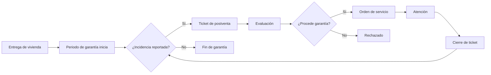

# _MAP: MAI-009 - Calidad, Postventa y Garantías

**Épica:** MAI-009
**Nombre:** Calidad, Postventa y Garantías
**Fase:** 1 - Alcance Inicial
**Presupuesto:** $25,000 MXN
**Story Points:** 40 SP
**Estado:** 📝 A crear
**Sprint:** Sprint 5 (Semanas 9-10)
**Última actualización:** 2025-11-17
**Prioridad:** P2

---

## 📋 Propósito

Gestión integral de calidad durante construcción y atención postventa:
- Control de no conformidades durante la obra (checklists de calidad)
- Registro de incidencias postventa por vivienda/lote
- Seguimiento de garantías (tiempos de respuesta, estatus)
- Historial por vivienda para auditorías y reclamaciones
- Sistema de tickets y órdenes de servicio

**Integración clave:** Se vincula con Control de Obra (MAI-005), CRM (MAI-010), INFONAVIT (MAI-011) y RRHH (MAI-007).

---

## 📁 Contenido

### Requerimientos Funcionales (Estimados: 5)

| ID | Título | Estado |
|----|--------|--------|
| RF-QUA-001 | Control de calidad durante construcción | 📝 A crear |
| RF-QUA-002 | Gestión de no conformidades y acciones correctivas | 📝 A crear |
| RF-QUA-003 | Sistema de tickets de postventa | 📝 A crear |
| RF-QUA-004 | Seguimiento de garantías y tiempos de respuesta | 📝 A crear |
| RF-QUA-005 | Historial de vivienda y reportes de calidad | 📝 A crear |

### Especificaciones Técnicas (Estimadas: 5)

| ID | Título | RF | Estado |
|----|--------|----|--------|
| ET-QUA-001 | Modelo de checklists de calidad dinámicos | RF-QUA-001 | 📝 A crear |
| ET-QUA-002 | Sistema de no conformidades y CAPA | RF-QUA-002 | 📝 A crear |
| ET-QUA-003 | Motor de tickets y órdenes de servicio | RF-QUA-003 | 📝 A crear |
| ET-QUA-004 | Sistema de SLA y alertas de garantía | RF-QUA-004 | 📝 A crear |
| ET-QUA-005 | Historial integrado de vivienda | RF-QUA-005 | 📝 A crear |

### Historias de Usuario (Estimadas: 8)

| ID | Título | SP | Estado |
|----|--------|----|--------|
| US-QUA-001 | Ejecutar checklist de calidad en vivienda | 5 | 📝 A crear |
| US-QUA-002 | Registrar no conformidad y acción correctiva | 5 | 📝 A crear |
| US-QUA-003 | Crear ticket de postventa desde app móvil | 5 | 📝 A crear |
| US-QUA-004 | Asignar y atender ticket de garantía | 5 | 📝 A crear |
| US-QUA-005 | Consultar historial completo de vivienda | 5 | 📝 A crear |
| US-QUA-006 | Dashboard de calidad y postventa | 5 | 📝 A crear |
| US-QUA-007 | Generar reporte de incidencias por proyecto | 5 | 📝 A crear |
| US-QUA-008 | Alertas de SLA y garantías por vencer | 5 | 📝 A crear |

**Total Story Points:** 40 SP

### Implementación

📊 **Inventarios de trazabilidad:**
- [TRACEABILITY.yml](./implementacion/TRACEABILITY.yml) - Matriz completa de trazabilidad
- [DATABASE.yml](./implementacion/DATABASE.yml) - Objetos de base de datos
- [BACKEND.yml](./implementacion/BACKEND.yml) - Módulos backend
- [FRONTEND.yml](./implementacion/FRONTEND.yml) - Componentes frontend

### Pruebas

📋 Documentación de testing:
- [TEST-PLAN.md](./pruebas/TEST-PLAN.md) - Plan de pruebas
- [TEST-CASES.md](./pruebas/TEST-CASES.md) - Casos de prueba

---

## 🔗 Referencias

- **README:** [README.md](./README.md) - Descripción detallada de la épica
- **Fase 1:** [../README.md](../README.md) - Información de la fase completa
- **Módulo relacionado MVP:** Módulo 9 - Calidad, Postventa y Garantías (MVP-APP.md)

---

## 📊 Métricas

| Métrica | Valor |
|---------|-------|
| **Presupuesto estimado** | $25,000 MXN |
| **Story Points estimados** | 40 SP |
| **Duración estimada** | 8 días |
| **Reutilización GAMILIT** | 40% (sistema de tickets similar) |
| **RF a implementar** | 5/5 |
| **ET a implementar** | 5/5 |
| **US a completar** | 8/8 |

---

## 🎯 Módulos Afectados

### Base de Datos
- **Schema:** `quality`, `after_sales`
- **Tablas principales:**
  * `quality_checklists` - Checklists de calidad
  * `quality_inspections` - Inspecciones realizadas
  * `non_conformities` - No conformidades detectadas
  * `corrective_actions` - Acciones correctivas (CAPA)
  * `after_sales_tickets` - Tickets de postventa
  * `warranty_claims` - Reclamaciones de garantía
  * `service_orders` - Órdenes de servicio
  * `unit_history` - Historial completo por vivienda
- **ENUMs:**
  * `inspection_type` (pre_delivery, intermediate, final, random)
  * `inspection_status` (scheduled, in_progress, completed, failed, approved)
  * `non_conformity_severity` (minor, major, critical)
  * `ticket_status` (open, assigned, in_progress, resolved, closed, rejected)
  * `ticket_priority` (low, normal, high, urgent)
  * `warranty_type` (construction_defect, installation, material, other)

### Backend
- **Módulo:** `quality`, `after-sales`
- **Path:** `apps/backend/src/modules/quality/`, `apps/backend/src/modules/after-sales/`
- **Services:** QualityService, InspectionService, TicketService, WarrantyService, SLAService
- **Controllers:** QualityController, AfterSalesController, WarrantyController
- **Middlewares:** TicketAccessGuard, SLAMonitorMiddleware

### Frontend
- **Features:** `quality`, `after-sales`, `warranties`
- **Path:** `apps/frontend/src/features/quality/`, `apps/frontend/src/features/after-sales/`
- **Componentes:**
  * QualityChecklistExecutor
  * NonConformityForm
  * CorrectiveActionTracker
  * TicketList
  * TicketForm (create from mobile/web)
  * TicketDetail
  * ServiceOrderManager
  * WarrantyDashboard
  * UnitHistoryViewer
  * QualityMetricsDashboard
- **Stores:** qualityStore, ticketStore, warrantyStore

### App Móvil
- **Features:** `quality-inspection`, `after-sales-tickets`
- **Componentes:**
  * ChecklistExecutor (offline capable)
  * PhotoEvidence (camera + geolocation)
  * TicketCreator (voice + photo + location)
  * TicketViewer

---

## ✅ Control de Calidad Durante Construcción

### Etapas de Inspección

| Etapa | Momento | Responsable | Elementos clave a verificar |
|-------|---------|-------------|----------------------------|
| **Pre-inicio** | Antes de arranque | Residente | Trazo, niveles, instalación de obra |
| **Cimentación** | Antes de colar | Ingeniero | Armado, profundidad, compactación |
| **Estructura** | Por cada elemento | Residente | Armado, cimbrado, colado |
| **Instalaciones** | Durante ejecución | Especialista | Rutas, diámetros, pendientes, pruebas |
| **Acabados** | Durante ejecución | Inspector | Alineación, nivel, acabado, limpieza |
| **Pre-entrega** | Antes de entrega | Equipo completo | Checklist integral de vivienda |
| **Entrega** | Al entregar | Cliente + empresa | Recorrido con cliente, acta de entrega |

---

### Checklists de Calidad

#### Checklist de Pre-entrega de Vivienda

```yaml
checklist:
  type: "pre_delivery"
  unit_id: "UUID"
  inspector: "Ing. Juan Pérez"
  date: "2025-11-15"
  categories:
    - name: "Acabados generales"
      items:
        - description: "Pisos: nivel, limpieza, sin fisuras"
          status: "approved"
          notes: "OK"
          photo_evidence: ["PHOTO-001"]

        - description: "Muros: alineación, aplanado, pintura uniforme"
          status: "approved"
          notes: "OK"

        - description: "Cancelería: operación, vidrios, herrajes"
          status: "non_conformity"
          notes: "Ventana de recámara 2 no cierra completamente"
          non_conformity_id: "NC-2025-045"

    - name: "Instalaciones eléctricas"
      items:
        - description: "Centros de carga: etiquetado, circuitos completos"
          status: "approved"

        - description: "Apagadores y contactos: funcionamiento, nivel"
          status: "approved"

        - description: "Lámparas: instaladas y funcionando"
          status: "approved"

    - name: "Instalaciones hidráulicas"
      items:
        - description: "Llaves de paso: operación, sin fugas"
          status: "non_conformity"
          notes: "Llave de paso de baño 1 con fuga menor"
          non_conformity_id: "NC-2025-046"

        - description: "Sanitarios: instalación, funcionamiento, sin fugas"
          status: "approved"

        - description: "Tinaco: capacidad, flotador, conexiones"
          status: "approved"

    - name: "Puertas y ventanas"
      items:
        - description: "Puertas: operación, cerraduras, acabado"
          status: "approved"

        - description: "Ventanas: operación, cristales, mosquiteros"
          status: "non_conformity"
          notes: "Falta mosquitero en cocina"
          non_conformity_id: "NC-2025-047"

  summary:
    total_items: 35
    approved: 32
    non_conformities: 3
    not_applicable: 0
    overall_status: "conditional_approval"
    next_steps: "Corregir 3 no conformidades antes de entrega"
```

---

### No Conformidades y Acciones Correctivas (CAPA)

**CAPA = Corrective And Preventive Actions**

#### Clasificación de No Conformidades

| Severidad | Descripción | Acción requerida | Plazo |
|-----------|-------------|------------------|-------|
| **Menor** | Detalle estético, sin impacto funcional | Corrección | 7 días |
| **Mayor** | Falla funcional, requiere reparación | Corrección + análisis de causa | 3 días |
| **Crítica** | Riesgo estructural o de seguridad | Corrección inmediata + auditoría | 24 horas |

#### Ejemplo de No Conformidad

```yaml
non_conformity:
  id: "NC-2025-045"
  inspection_id: "INS-2025-123"
  unit_id: "UNIT-A-12"
  detected_by: "Ing. Juan Pérez"
  detected_date: "2025-11-15"
  category: "Cancelería"
  description: "Ventana de recámara 2 no cierra completamente, desnivel de 5mm en marco"
  severity: "major"
  photo_evidence: ["PHOTO-045-1", "PHOTO-045-2"]
  root_cause_analysis:
    probable_cause: "Marco instalado fuera de nivel"
    verification: "Medición con nivel de burbuja confirmó desnivel"
    root_cause: "Falta de supervisión durante instalación de cancelería"
  corrective_action:
    description: "Retirar y reinstalar marco de ventana con nivel correcto"
    responsible: "Subcontratista de Cancelería XYZ"
    assigned_date: "2025-11-15"
    deadline: "2025-11-18"
    completed_date: "2025-11-17"
    verification: "Ventana opera correctamente, nivel verificado"
    status: "closed"
  preventive_action:
    description: "Reforzar inspección de nivel durante instalación de cancelería"
    responsible: "Residente de obra"
    implementation_date: "2025-11-16"
    status: "implemented"
  cost_impact: 1500.00  # $1,500 MXN costo de corrección
```

---

## 🏠 Sistema de Postventa

### Ciclo de Vida de la Garantía



---

### Tipos de Garantía

| Componente | Periodo de garantía | Responsable | Condiciones |
|------------|---------------------|-------------|-------------|
| **Vicios ocultos** | 2 años | Constructora | Defectos estructurales no visibles en entrega |
| **Instalaciones** | 1 año | Constructora | Instalaciones hidráulicas, eléctricas, gas |
| **Acabados** | 6 meses | Constructora | Pisos, muros, pintura, cancelería |
| **Electrodomésticos** | Según fabricante | Proveedor | Garantía del fabricante |
| **Muebles de cocina** | 1 año | Proveedor | Desgaste normal excluido |

---

### Tickets de Postventa

#### Flujo de Ticket

1. **Creación:**
   - Cliente reporta incidencia (app, web, WhatsApp, llamada)
   - Se crea ticket con información básica
   - Se asigna número de folio

2. **Clasificación:**
   - Tipo de incidencia (instalación, acabado, equipo)
   - Severidad (urgente, normal, menor)
   - ¿Procede garantía? (validación inicial)

3. **Asignación:**
   - Se asigna a técnico o subcontratista
   - SLA según prioridad
   - Notificación automática

4. **Atención:**
   - Técnico acude a domicilio
   - Diagnóstico
   - Reparación o escalamiento
   - Evidencia fotográfica

5. **Cierre:**
   - Validación con cliente
   - Firma de conformidad
   - Cierre de ticket

6. **Seguimiento:**
   - Encuesta de satisfacción
   - Verificación de no recurrencia

---

#### Estructura de Ticket

```yaml
ticket:
  id: "TKT-2025-00234"
  unit_id: "UNIT-A-12"
  client_id: "CLIENT-456"
  created_date: "2025-11-17T09:30:00Z"
  created_by: "client_portal"
  source: "mobile_app"

  classification:
    type: "plumbing"  # instalación hidráulica
    category: "leak"  # fuga
    priority: "high"
    warranty_applicable: true

  description:
    title: "Fuga de agua en lavabo de baño principal"
    details: "Goteo constante debajo del lavabo, se moja el mueble"
    location: "Baño principal, mueble de lavabo"
    photo_evidence: ["PHOTO-TKT-234-1", "PHOTO-TKT-234-2"]
    video_evidence: ["VIDEO-TKT-234-1"]

  assignment:
    assigned_to: "Plomería Rápida SA"
    assigned_date: "2025-11-17T10:00:00Z"
    technician: "José Ramírez"
    sla_response: "2025-11-17T14:00:00Z"  # 4 horas
    sla_resolution: "2025-11-18T18:00:00Z"  # 24 horas

  resolution:
    visit_date: "2025-11-17T13:30:00Z"
    diagnosis: "Conexión de manguera aflojada, empaque deteriorado"
    action_taken: "Reemplazo de empaque y ajuste de conexión"
    parts_used: ["Empaque de 1/2 pulgada", "Teflón"]
    cost: 350.00
    completed_date: "2025-11-17T14:15:00Z"
    photo_evidence: ["PHOTO-TKT-234-3-AFTER"]

  closure:
    closed_by: "technician"
    closed_date: "2025-11-17T14:20:00Z"
    client_signature: "SIGNATURE-TKT-234"
    satisfaction_rating: 5
    feedback: "Excelente servicio, muy rápido"
    status: "closed"
```

---

### SLA (Service Level Agreement)

#### Tiempos de Respuesta

| Prioridad | Tiempo de respuesta | Tiempo de resolución | Descripción |
|-----------|---------------------|----------------------|-------------|
| **Urgente** | 2 horas | 24 horas | Fuga de gas, problema eléctrico peligroso, sin agua |
| **Alta** | 4 horas | 48 horas | Fuga de agua, instalación sin funcionar |
| **Normal** | 24 horas | 5 días hábiles | Detalles de acabados, ajustes menores |
| **Baja** | 48 horas | 10 días hábiles | Consultas, solicitudes de información |

#### Alertas de SLA

```yaml
sla_alerts:
  - ticket_id: "TKT-2025-00234"
    alert_type: "response_time_warning"
    priority: "high"
    sla_deadline: "2025-11-17T14:00:00Z"
    current_time: "2025-11-17T13:00:00Z"
    time_remaining: "1 hour"
    assigned_to: "Plomería Rápida SA"
    notification_sent: true
```

---

## 📊 Dashboard de Calidad y Postventa

### KPIs Principales

| Métrica | Descripción | Meta | Cálculo |
|---------|-------------|------|---------|
| **Tasa de rechazo en pre-entrega** | % de viviendas con NC en pre-entrega | <15% | (Viviendas con NC / Total inspeccionadas) × 100 |
| **NC promedio por vivienda** | Promedio de no conformidades | <3 | Σ NC / Total viviendas |
| **Tiempo promedio de corrección** | Días para corregir NC | <5 días | Avg(Fecha cierre - Fecha detección) |
| **Tickets de postventa por vivienda** | Promedio de tickets post-entrega | <2 | Σ Tickets / Total viviendas entregadas |
| **Cumplimiento de SLA** | % de tickets resueltos en tiempo | >95% | (Tickets en SLA / Total tickets) × 100 |
| **Satisfacción del cliente** | Calificación promedio | >4.5/5 | Avg(Calificaciones de tickets cerrados) |
| **Tickets recurrentes** | % de tickets por misma causa | <10% | (Tickets recurrentes / Total tickets) × 100 |

### Reportes

1. **Reporte de calidad por proyecto:**
   - No conformidades por etapa constructiva
   - Principales causas raíz
   - Subcontratistas con más NC
   - Tendencias temporales

2. **Reporte de postventa:**
   - Tickets abiertos vs cerrados
   - Distribución por tipo de incidencia
   - Cumplimiento de SLA
   - Costos de atención

3. **Historial de vivienda:**
   - Todas las inspecciones realizadas
   - NC detectadas y corregidas
   - Tickets de postventa
   - Mantenimientos realizados
   - Modificaciones del cliente

---

## 💡 Casos de Uso Clave

### Inspección de Pre-entrega

**Contexto:**
- Vivienda tipo A en Lote 12, Manzana 3
- 200 viviendas idénticas en el desarrollo
- Checklist de 35 puntos de verificación

**Flujo:**

1. **Programación (1 semana antes de entrega):**
   - Se agenda inspección de pre-entrega
   - Notificación a residente y subcontratistas

2. **Ejecución (app móvil):**
   - Inspector realiza recorrido con tablet
   - Ejecuta checklist punto por punto
   - Captura evidencias fotográficas
   - Detecta 3 no conformidades menores

3. **Generación de NC:**
   - NC-001: Falta mosquitero en cocina
   - NC-002: Mancha en piso de recámara 2
   - NC-003: Contacto eléctrico flojo en sala

4. **Asignación de correcciones:**
   - NC-001 → Subcontratista de cancelería (3 días)
   - NC-002 → Cuadrilla de acabados (2 días)
   - NC-003 → Electricista (1 día)

5. **Seguimiento:**
   - Todas las NC corregidas en 3 días
   - Re-inspección confirma correcciones
   - Vivienda **APROBADA** para entrega

---

### Ticket de Garantía Urgente

**Contexto:**
- Cliente reporta fuga de gas en cocina
- Vivienda entregada hace 3 meses
- Prioridad: URGENTE

**Flujo:**

1. **Reporte (9:00 AM):**
   - Cliente crea ticket desde app con foto
   - Sistema detecta palabra "gas" → prioridad URGENTE
   - SLA: Respuesta en 2 horas

2. **Asignación automática (9:05 AM):**
   - Sistema asigna a técnico de guardia
   - Notificación push + SMS al técnico
   - Notificación al cliente: "Técnico en camino"

3. **Atención (10:30 AM):**
   - Técnico llega al domicilio
   - Diagnóstico: Manguera de estufa con fuga en conexión
   - Acción: Cambio de manguera + prueba de hermeticidad
   - Evidencia fotográfica del antes/después

4. **Cierre (11:00 AM):**
   - Cliente firma conformidad en app del técnico
   - Calificación: 5 estrellas
   - Ticket cerrado
   - **SLA cumplido:** 2 horas (meta: 2 horas)

---

## 🚨 Puntos Críticos

1. **Checklists estandarizados:** Mismos criterios para todas las viviendas
2. **Evidencia fotográfica:** Obligatoria para NC y tickets
3. **Seguimiento de SLA:** Alertas automáticas para evitar incumplimientos
4. **Análisis de causa raíz:** No solo corregir, prevenir recurrencia
5. **Integración con subcontratistas:** Acceso directo para atender tickets
6. **Historial completo:** Trazabilidad de toda la vida de la vivienda
7. **Satisfacción del cliente:** Medir y mejorar continuamente

---

## 🎯 Siguiente Paso

Crear documentación de requerimientos y especificaciones técnicas del módulo.

---

**Generado:** 2025-11-17
**Mantenedores:** @tech-lead @backend-team @frontend-team @quality-team @after-sales-team
**Estado:** 📝 A crear
