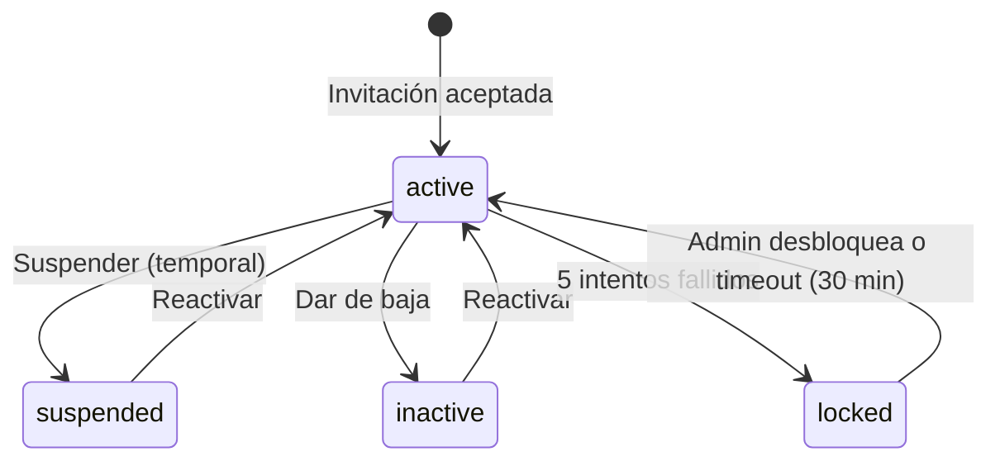

# RF-ADM-001: Gestión de Usuarios y Roles por Empresa/Obra

**ID:** RF-ADM-001
**Módulo:** MAI-013 - Administración & Seguridad
**Tipo:** Requerimiento Funcional
**Prioridad:** P0 (Crítica)
**Fecha de creación:** 2025-11-20
**Versión:** 1.0

---

## 📋 Descripción

El sistema debe permitir la **gestión completa de usuarios** con soporte multi-tenancy (múltiples empresas constructoras) y asignación de **7 roles especializados** en el sector construcción.

Cada usuario puede:
- Pertenecer a **una o más empresas constructoras** (multi-tenancy)
- Tener **diferentes roles** en cada empresa
- Acceder únicamente a **los datos de la empresa activa** (aislamiento total)
- Cambiar de empresa sin cerrar sesión

**Diferenciador vs GAMILIT:** GAMILIT tiene 3 roles académicos (student, teacher, admin); este sistema extiende a 7 roles especializados en construcción con permisos granulares por módulo.

---

## 🎯 Objetivos

### Objetivos de Negocio

1. **Multi-tenancy seguro:** Múltiples constructoras usan el mismo sistema sin ver datos ajenos
2. **Control de acceso por rol:** Cada usuario solo accede a funcionalidades según su rol
3. **Gestión centralizada:** Administradores gestionan usuarios desde un solo lugar
4. **Onboarding rápido:** Nuevos usuarios operan en < 5 minutos desde invitación
5. **Trazabilidad:** Auditoría completa de cambios en usuarios y permisos

### Objetivos Técnicos

1. **Row Level Security (RLS):** Filtrado automático de datos por `constructoraId`
2. **Invitación controlada:** No registro público, solo por invitación de administrador
3. **Estados de cuenta:** Manejo de usuarios activos, inactivos, suspendidos, bloqueados
4. **Validación en 3 capas:** Frontend → Backend → Database
5. **Performance:** Consultas de usuarios < 100ms

---

## 👥 Roles del Sistema

### 7 Roles Especializados

| Rol | Código | Nivel | Descripción Completa | Permisos Globales |
|-----|--------|-------|----------------------|-------------------|
| **Director General** | `director` | 🔴 Alto | Máxima autoridad de la empresa. Visión estratégica, aprobaciones finales, acceso total. | CRUD+Approve en todos los módulos |
| **Ingeniero/Planeación** | `engineer` | 🟠 Alto | Gestión técnica, planeación de obra, presupuestos, control de costos y avances. | CRUD en Proyectos, Presupuestos, Control Obra |
| **Residente de Obra** | `resident` | 🟡 Medio | Ejecución diaria en campo, supervisión de cuadrillas, captura de avances, evidencias. | CRUD en Control Obra, Compras, Avances |
| **Compras/Almacén** | `purchases` | 🟡 Medio | Gestión de compras, cotizaciones, órdenes de compra, inventarios, almacenes. | CRUD+Approve en Compras, Inventarios |
| **Administración/Finanzas** | `finance` | 🟠 Alto | Control financiero, flujo de efectivo, estimaciones, pagos, cuentas por cobrar/pagar. | CRUD+Approve en Estimaciones, Finanzas |
| **RRHH/Nómina** | `hr` | 🟡 Medio | Recursos humanos, asistencias, nómina, IMSS, INFONAVIT, control de personal. | CRUD+Approve en RRHH, Asistencias |
| **Postventa** | `post_sales` | 🟢 Bajo | Atención a clientes, garantías, calidad, CRM de derechohabientes. | CRUD en Postventa, Garantías, CRM |

### Comparación con GAMILIT

| GAMILIT | Inmobiliario | Cambios |
|---------|--------------|---------|
| `student` | - | No aplica (sistema B2B, no hay usuarios finales públicos) |
| `admin_teacher` | `engineer`, `resident`, `purchases`, `finance`, `hr` | Expansión a 5 roles especializados |
| `super_admin` | `director` | Similar, pero con permisos específicos de construcción |

---

## 🏢 Multi-Tenancy: Empresas Constructoras

### Modelo de Datos

```typescript
interface Constructora {
  id: string; // UUID
  code: string; // CONST-001, CONST-002 (auto-generado)
  name: string; // "Constructora ABC S.A. de C.V."
  legalName: string; // Razón social completa
  rfc: string; // RFC (México)
  taxRegime: string; // Régimen fiscal

  // Domicilio fiscal
  address: string;
  city: string;
  state: string;
  zipCode: string;
  country: string;

  // Contacto
  phone: string;
  email: string;
  website?: string;

  // Logo y branding
  logoUrl?: string;
  primaryColor?: string; // Hex color

  // Configuración
  status: 'active' | 'inactive' | 'suspended';
  createdAt: Date;
  updatedAt: Date;
}
```

### Relación Usuario - Constructora

Un usuario puede pertenecer a **múltiples constructoras** con **diferentes roles**:

```typescript
interface UserConstructora {
  userId: string; // UUID
  constructoraId: string; // UUID
  role: ConstructionRole; // director | engineer | resident | etc.
  status: 'active' | 'inactive';
  joinedAt: Date;

  // Permisos adicionales (opcional)
  customPermissions?: {
    module: string;
    permissions: ('create' | 'read' | 'update' | 'delete' | 'approve')[];
  }[];
}
```

**Ejemplo:**

```json
{
  "userId": "uuid-123",
  "userName": "Juan Pérez",
  "constructoras": [
    {
      "constructoraId": "uuid-A",
      "constructoraName": "Constructora ABC",
      "role": "director",
      "status": "active"
    },
    {
      "constructoraId": "uuid-B",
      "constructoraName": "Constructora XYZ",
      "role": "engineer",
      "status": "active"
    }
  ]
}
```

Juan Pérez es **Director** en Constructora ABC y **Ingeniero** en Constructora XYZ.

### Selector de Constructora

Al hacer login, si el usuario pertenece a múltiples constructoras:

1. Se muestra un **selector** con las constructoras activas
2. Usuario selecciona constructora de trabajo
3. Se guarda `constructoraId` en el token JWT
4. Todos los queries se filtran por `constructoraId` (RLS)
5. Usuario puede **cambiar de constructora** desde el menú sin re-login

---

## 👤 Gestión de Usuarios

### Modelo de Datos Completo

```typescript
interface User {
  // Identificación
  id: string; // UUID
  email: string; // Único a nivel sistema
  password: string; // Hash bcrypt

  // Datos personales
  firstName: string;
  lastName: string;
  fullName: string; // Concatenación automática
  phone?: string;
  mobilePhone?: string;

  // Avatar
  avatarUrl?: string;

  // Estado de cuenta
  status: AccountStatus; // active | inactive | suspended | locked
  emailVerified: boolean;
  emailVerifiedAt?: Date;

  // Seguridad
  lastLoginAt?: Date;
  lastLoginIp?: string;
  failedLoginAttempts: number; // Bloqueo tras 5 intentos
  lockedUntil?: Date; // Bloqueo temporal
  passwordChangedAt?: Date;
  mustChangePassword: boolean; // Primer login

  // Metadata
  createdAt: Date;
  updatedAt: Date;
  createdBy?: string; // Usuario que creó la invitación
  deletedAt?: Date; // Soft delete
}
```

### Estados de Cuenta

```typescript
enum AccountStatus {
  ACTIVE = 'active',           // Usuario activo, puede usar el sistema
  INACTIVE = 'inactive',       // Usuario dado de baja (puede reactivarse)
  SUSPENDED = 'suspended',     // Usuario temporalmente suspendido (sanción)
  LOCKED = 'locked'            // Bloqueado por intentos fallidos de login
}
```

#### Flujo de Estados



### Proceso de Creación de Usuario (Invitación)

**No hay registro público.** Solo invitación por administrador:

1. **Admin crea invitación:**
   - Email del nuevo usuario
   - Rol a asignar
   - Constructora(s) de pertenencia
   - Mensaje personalizado (opcional)

2. **Sistema genera token único:**
   - Token de invitación válido por 7 días
   - Link: `https://app.ejemplo.com/register?token=abc123xyz`

3. **Email enviado:**
   - Asunto: "Invitación a plataforma ERP - [Constructora ABC]"
   - Contiene link de registro

4. **Usuario completa registro:**
   - Click en link
   - Valida token (no expirado)
   - Completa perfil (nombre, teléfono, foto)
   - Define contraseña (requisitos de seguridad)
   - Acepta términos y condiciones
   - **Primer login automático**

5. **Usuario activo:**
   - Estado: `active`
   - Rol asignado: según invitación
   - `mustChangePassword: false`

### CRUD de Usuarios

#### Crear Usuario (solo por invitación)

**Endpoint:** `POST /api/admin/users/invite`

**Request:**
```json
{
  "email": "juan.perez@empresa.com",
  "firstName": "Juan",
  "lastName": "Pérez",
  "constructoraId": "uuid-A",
  "role": "engineer",
  "customMessage": "Bienvenido al equipo de Proyecto Los Pinos"
}
```

**Response:**
```json
{
  "invitationId": "uuid-inv-123",
  "email": "juan.perez@empresa.com",
  "token": "abc123xyz",
  "expiresAt": "2025-11-27T23:59:59Z",
  "invitationLink": "https://app.ejemplo.com/register?token=abc123xyz",
  "emailSent": true
}
```

**Validaciones:**
- Email no existe previamente en el sistema
- Email con formato válido
- Rol válido (uno de los 7 roles)
- Constructora existe y está activa
- Usuario invitador tiene rol `director` o es super admin

#### Leer Usuarios

**Endpoint:** `GET /api/admin/users?constructoraId={uuid}&status={active|inactive|all}&role={role}&search={text}`

**Filters:**
- `constructoraId`: UUID (obligatorio, RLS)
- `status`: active | inactive | suspended | locked | all (default: active)
- `role`: Filtrar por rol
- `search`: Búsqueda por nombre o email (full-text search)
- `page`, `limit`: Paginación

**Response:**
```json
{
  "users": [
    {
      "id": "uuid-123",
      "fullName": "Juan Pérez",
      "email": "juan.perez@empresa.com",
      "role": "engineer",
      "status": "active",
      "avatarUrl": "https://...",
      "lastLoginAt": "2025-11-20T10:30:00Z",
      "createdAt": "2025-11-01T08:00:00Z"
    }
  ],
  "pagination": {
    "total": 45,
    "page": 1,
    "limit": 20,
    "totalPages": 3
  }
}
```

#### Actualizar Usuario

**Endpoint:** `PATCH /api/admin/users/{userId}`

**Request:**
```json
{
  "firstName": "Juan Carlos",
  "phone": "+52 55 1234 5678",
  "avatarUrl": "https://..."
}
```

**Campos editables:**
- Datos personales (firstName, lastName, phone, mobilePhone, avatarUrl)
- Status (solo admins)
- Rol (solo admins, con auditoría)

**Campos NO editables:**
- Email (es unique identifier)
- Password (endpoint separado)
- createdAt, createdBy

#### Cambiar Rol de Usuario

**Endpoint:** `PATCH /api/admin/users/{userId}/role`

**Request:**
```json
{
  "constructoraId": "uuid-A",
  "newRole": "director"
}
```

**Validaciones:**
- Solo Director o super admin pueden cambiar roles
- Se registra en auditoría (acción crítica)
- Notificación al usuario del cambio

#### Cambiar Estado de Usuario

**Endpoint:** `PATCH /api/admin/users/{userId}/status`

**Request:**
```json
{
  "status": "suspended",
  "reason": "Violación de políticas de uso",
  "suspendedUntil": "2025-12-01T00:00:00Z" // Opcional
}
```

**Estados permitidos:**
- `active` → `suspended`
- `active` → `inactive`
- `suspended` → `active`
- `inactive` → `active`
- `locked` → `active` (solo admin)

**Auditoría:**
- Se registra quién, cuándo y por qué cambió el estado
- Notificación al usuario suspendido/bloqueado

#### Eliminar Usuario (Soft Delete)

**Endpoint:** `DELETE /api/admin/users/{userId}`

**Comportamiento:**
- No eliminación física
- Set `deletedAt = now()`
- Status → `inactive`
- Se desactivan todas las asignaciones a constructoras
- Se cierran todas las sesiones activas
- Se mantiene en auditoría

**Reactivación:**
- `POST /api/admin/users/{userId}/restore`

---

## 🔐 Row Level Security (RLS)

### Políticas en PostgreSQL

Todas las tablas sensibles tienen políticas RLS que **automáticamente** filtran por `constructoraId`:

```sql
-- Ejemplo: Tabla de proyectos
CREATE POLICY projects_isolation_policy ON projects
  USING (constructora_id = current_setting('app.current_constructora_id')::uuid);

-- Ejemplo: Tabla de usuarios (solo ven usuarios de su empresa)
CREATE POLICY users_isolation_policy ON user_constructoras
  USING (constructora_id = current_setting('app.current_constructora_id')::uuid);
```

### Configuración por Sesión

Al hacer login o cambiar de constructora:

```sql
-- Backend ejecuta al inicio de cada request
SET app.current_constructora_id = 'uuid-A';
SET app.current_user_id = 'uuid-123';
SET app.current_user_role = 'engineer';
```

**Resultado:** Todas las queries se filtran automáticamente.

```sql
-- El developer escribe:
SELECT * FROM projects;

-- PostgreSQL ejecuta (automático):
SELECT * FROM projects
WHERE constructora_id = 'uuid-A';
```

**Ventaja:** Imposible acceder a datos de otra empresa por error de código.

---

## 📊 Casos de Uso

### Caso 1: Invitar Nuevo Ingeniero

**Actor:** Director General de Constructora ABC

**Flujo:**
1. Director va a "Administración" → "Usuarios" → "Invitar usuario"
2. Completa formulario:
   - Email: `ing.carlos@empresa.com`
   - Nombre: Carlos Martínez
   - Rol: Ingeniero
   - Constructora: Constructora ABC
3. Click en "Enviar invitación"
4. Sistema genera token único
5. Email enviado a `ing.carlos@empresa.com`
6. Carlos recibe email, click en link
7. Carlos completa registro (nombre, teléfono, contraseña)
8. Acepta términos
9. **Login automático** → Dashboard de Ingeniero

**Resultado:**
- Carlos es usuario activo
- Rol: `engineer` en Constructora ABC
- Acceso a módulos: Proyectos, Presupuestos, Control de Obra (CRUD)

### Caso 2: Usuario Multi-Empresa

**Actor:** Juan Pérez (Director en Empresa A, Ingeniero en Empresa B)

**Flujo:**
1. Juan hace login con `juan@email.com`
2. Sistema detecta que pertenece a 2 empresas
3. Muestra selector:
   - 🏢 Constructora ABC (Director)
   - 🏢 Constructora XYZ (Ingeniero)
4. Juan selecciona "Constructora ABC"
5. **Token JWT contiene:**
   ```json
   {
     "userId": "uuid-123",
     "constructoraId": "uuid-A",
     "role": "director"
   }
   ```
6. Dashboard de Director (acceso completo)
7. Juan quiere revisar obra en Empresa B
8. Click en selector de empresa → "Constructora XYZ"
9. **Token se regenera:**
   ```json
   {
     "userId": "uuid-123",
     "constructoraId": "uuid-B",
     "role": "engineer"
   }
   ```
10. Dashboard de Ingeniero (acceso limitado)

**Resultado:**
- Sin re-login
- Datos completamente aislados entre empresas
- Permisos cambian según rol en cada empresa

### Caso 3: Suspensión Temporal

**Actor:** Director suspende a Residente

**Flujo:**
1. Director va a "Usuarios" → Busca "Pedro González (Residente)"
2. Click en "Acciones" → "Suspender usuario"
3. Modal de confirmación:
   - Razón: "Investigación por incidente en obra"
   - Suspender hasta: 2025-12-01
4. Click en "Confirmar"
5. Sistema:
   - Cambia status de Pedro a `suspended`
   - Cierra todas las sesiones activas
   - Envía email a Pedro notificando suspensión
   - Registra en auditoría (quién, cuándo, por qué)
6. Pedro intenta login → Error: "Cuenta suspendida temporalmente. Contacte al administrador."
7. 2025-12-01 00:00:00 → Cron job reactiva automáticamente
8. Pedro recibe email: "Tu cuenta ha sido reactivada"

**Resultado:**
- Suspensión temporal efectiva
- Trazabilidad completa
- Reactivación automática

---

## ✅ Criterios de Aceptación

### AC1: Invitación de Usuarios

**DADO** un Director de Constructora ABC
**CUANDO** invita a un nuevo usuario con email `nuevo@empresa.com` y rol `engineer`
**ENTONCES**
- ✅ Se genera token de invitación único
- ✅ Token válido por 7 días
- ✅ Email enviado con link de registro
- ✅ Usuario completa registro en < 5 minutos
- ✅ Primer login automático exitoso
- ✅ Usuario activo con rol `engineer`

### AC2: Multi-Tenancy Estricto

**DADO** dos usuarios de diferentes empresas (A y B)
**CUANDO** ambos hacen login simultáneamente
**ENTONCES**
- ✅ Usuario A solo ve datos de Empresa A
- ✅ Usuario B solo ve datos de Empresa B
- ✅ No es posible acceder a datos de otra empresa (bloqueado por RLS)
- ✅ Tests de penetración validan aislamiento

### AC3: Cambio de Empresa sin Re-Login

**DADO** un usuario que pertenece a 2 empresas
**CUANDO** cambia de empresa desde el selector
**ENTONCES**
- ✅ Token JWT se regenera con nuevo `constructoraId` y `role`
- ✅ Dashboard se actualiza mostrando datos de nueva empresa
- ✅ Permisos cambian según rol en nueva empresa
- ✅ No se requiere re-login
- ✅ Operación < 500ms

### AC4: Gestión de Estados de Cuenta

**DADO** un administrador
**CUANDO** suspende a un usuario
**ENTONCES**
- ✅ Estado cambia a `suspended`
- ✅ Todas las sesiones activas se cierran
- ✅ Usuario no puede hacer login
- ✅ Email de notificación enviado
- ✅ Auditoría registra la acción con razón
- ✅ Reactivación manual o automática funciona

### AC5: Bloqueo por Intentos Fallidos

**DADO** un usuario con contraseña incorrecta
**CUANDO** falla 5 veces consecutivas
**ENTONCES**
- ✅ Cuenta bloqueada automáticamente (`locked`)
- ✅ `lockedUntil` = now() + 30 minutos
- ✅ Mensaje: "Cuenta bloqueada. Intente en 30 minutos o contacte al administrador."
- ✅ Email de notificación al usuario
- ✅ Auditoría registra evento de seguridad
- ✅ Tras 30 min, desbloqueo automático

---

## 🧪 Escenarios de Prueba

### Test 1: Invitación Exitosa

```typescript
describe('RF-ADM-001: Invitación de usuarios', () => {
  it('debe crear invitación y enviar email', async () => {
    const director = await loginAs('director');

    const response = await api.post('/admin/users/invite', {
      email: 'test@empresa.com',
      firstName: 'Test',
      lastName: 'User',
      constructoraId: director.constructoraId,
      role: 'engineer'
    });

    expect(response.status).toBe(201);
    expect(response.data.invitationId).toBeDefined();
    expect(response.data.token).toBeDefined();
    expect(response.data.emailSent).toBe(true);

    // Validar que email fue enviado
    const emails = await getEmailsSent();
    expect(emails).toContainEqual(
      expect.objectContaining({
        to: 'test@empresa.com',
        subject: expect.stringContaining('Invitación')
      })
    );
  });

  it('debe permitir registro con token válido', async () => {
    const { token } = await createInvitation('nuevo@test.com', 'engineer');

    const response = await api.post('/auth/register-by-invitation', {
      token,
      firstName: 'Nuevo',
      lastName: 'Usuario',
      password: 'SecurePass123!',
      passwordConfirm: 'SecurePass123!'
    });

    expect(response.status).toBe(201);
    expect(response.data.user.status).toBe('active');
    expect(response.data.user.role).toBe('engineer');
    expect(response.data.accessToken).toBeDefined();
  });

  it('debe rechazar token expirado', async () => {
    const expiredToken = await createExpiredInvitation();

    const response = await api.post('/auth/register-by-invitation', {
      token: expiredToken,
      firstName: 'Test',
      lastName: 'User',
      password: 'SecurePass123!'
    });

    expect(response.status).toBe(400);
    expect(response.data.error).toBe('Invitation expired');
  });
});
```

### Test 2: Multi-Tenancy Aislamiento

```typescript
describe('RF-ADM-001: Multi-tenancy isolation', () => {
  it('debe aislar datos entre empresas', async () => {
    // Usuario A en Empresa A
    const userA = await loginAs('engineer', 'empresa-a');

    // Usuario B en Empresa B
    const userB = await loginAs('engineer', 'empresa-b');

    // Crear proyecto en Empresa A
    const projectA = await api.post('/projects', {
      name: 'Proyecto A',
      constructoraId: userA.constructoraId
    }, { headers: { Authorization: userA.token } });

    // Usuario B NO debe ver proyecto de A
    const projectsB = await api.get('/projects', {
      headers: { Authorization: userB.token }
    });

    expect(projectsB.data.projects).not.toContainEqual(
      expect.objectContaining({ id: projectA.data.id })
    );

    // Intentar acceso directo (debe fallar)
    const directAccess = await api.get(`/projects/${projectA.data.id}`, {
      headers: { Authorization: userB.token }
    });

    expect(directAccess.status).toBe(404); // RLS lo bloquea
  });
});
```

### Test 3: Cambio de Rol (Auditoría)

```typescript
describe('RF-ADM-001: Cambio de rol', () => {
  it('debe auditar cambio de rol', async () => {
    const director = await loginAs('director');
    const engineer = await createUser('engineer');

    // Cambiar rol de engineer a director
    const response = await api.patch(
      `/admin/users/${engineer.id}/role`,
      { newRole: 'director' },
      { headers: { Authorization: director.token } }
    );

    expect(response.status).toBe(200);

    // Validar auditoría
    const auditLogs = await api.get('/admin/audit-logs', {
      params: { entityId: engineer.id, action: 'role_change' },
      headers: { Authorization: director.token }
    });

    expect(auditLogs.data.logs).toContainEqual(
      expect.objectContaining({
        userId: director.id,
        action: 'role_change',
        changes: expect.arrayContaining([
          { field: 'role', oldValue: 'engineer', newValue: 'director' }
        ])
      })
    );
  });
});
```

---

## 🔗 Referencias

- **Especificación técnica:** [ET-ADM-001](../especificaciones/ET-ADM-001-rbac-multi-tenancy.md)
- **Historia de usuario:** [US-ADM-001](../historias-usuario/US-ADM-001-crear-usuarios.md), [US-ADM-002](../historias-usuario/US-ADM-002-asignar-roles-permisos.md)
- **Módulo base:** [README.md](../README.md)
- **Análisis GAMILIT:** [ANALISIS-REUTILIZACION-GAMILIT.md](../../ANALISIS-REUTILIZACION-GAMILIT.md)

---

**Generado:** 2025-11-20
**Versión:** 1.0
**Autor:** Sistema de Documentación Técnica
**Estado:** ✅ Completo
