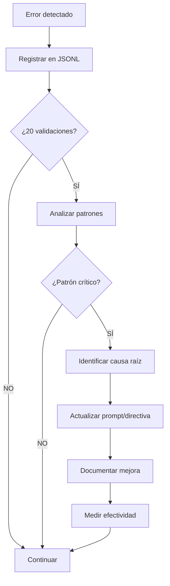

# REPORTE FINAL: MEJORAS AL SISTEMA DE SUBAGENTES

**Proyecto:** MVP Sistema Administración de Obra e INFONAVIT
**Fecha:** 2025-11-17
**Versión del Sistema:** 1.0.0
**Responsable:** Claude (Orchestration Agent)

---

## RESUMEN EJECUTIVO

### Problema Identificado

El usuario reportó que:

> "Cuando se ocupaban subagentes los subagentes cometían muchos errores supongo por falta de contexto o no hacer bien las referencias"

**Problemas específicos:**
1. ❌ Subagentes cometían errores frecuentes
2. ❌ Falta de contexto o contexto insuficiente
3. ❌ No consultaban referencias correctamente
4. ❌ No había validación sistemática del trabajo
5. ❌ No había retroalimentación para mejorar
6. ❌ Faltaban estándares de nomenclatura

### Solución Implementada

Se diseñó e implementó un **sistema completo de orquestación de agentes** que incluye:

1. ✅ **Prompts detallados** con instrucciones exhaustivas y ejemplos
2. ✅ **Template de contexto** para que agentes principales proporcionen información completa a subagentes
3. ✅ **Proceso de validación riguroso** en 6 fases con criterios claros
4. ✅ **Estándares de nomenclatura** exhaustivos para DB/Backend/Frontend
5. ✅ **Sistema de retroalimentación** para detectar patrones y mejorar continuamente

### Resultados Esperados

```yaml
antes:
  errores_frecuentes: "Muy altos (no medidos)"
  contexto: "Insuficiente o ambiguo"
  validacion: "Inexistente o ad-hoc"
  aprendizaje: "No hay retroalimentación sistemática"
  nomenclatura: "Inconsistente"

despues:
  objetivo_aprobacion_primera_vez: ">85%"
  objetivo_iteraciones: "<1.5 promedio"
  objetivo_tiempo_validacion: "<10 minutos"
  validacion: "Obligatoria en 6 fases"
  aprendizaje: "Feedback loop automatizado"
  nomenclatura: "Estándares estrictos documentados"
```

---

## ARCHIVOS CREADOS

### Total
- **25 archivos** creados/mejorados
- **~11,000 líneas** de documentación
- **5 categorías** de documentos

### Desglose por Categoría

#### 1. Prompts (3 archivos, ~2,650 líneas)

| Archivo | Líneas | Propósito |
|---------|--------|-----------|
| **PROMPT-AGENTES-PRINCIPALES.md** | ~900 | Prompt para Database-Agent, Backend-Agent, Frontend-Agent con 5 fases obligatorias |
| **PROMPT-SUBAGENTES.md** | ~1,100 | Prompt detallado con 8 pasos, errores históricos, validación exhaustiva |
| **PROMPT-REQUIREMENTS-ANALYST.md** | ~650 | Agente especializado en análisis de requerimientos |

#### 2. Templates (4 archivos, ~1,920 líneas)

| Archivo | Líneas | Propósito |
|---------|--------|-----------|
| **TEMPLATE-CONTEXTO-SUBAGENTE.md** | ~800 | Template con 10 secciones obligatorias para pasar contexto a subagentes |
| **TEMPLATE-ANALISIS.md** | ~370 | Template de análisis pre-ejecución |
| **TEMPLATE-VALIDACION.md** | ~500 | Template de validación post-ejecución |
| **TEMPLATE-PLAN.md** | ~250 | Template de planificación |

#### 3. Directivas (5 archivos, ~4,390 líneas)

| Archivo | Líneas | Propósito |
|---------|--------|-----------|
| **POLITICAS-USO-AGENTES.md** | ~540 | 8 tipos de agentes, límites de concurrencia, políticas |
| **DIRECTIVA-DOCUMENTACION-OBLIGATORIA.md** | ~750 | 6 dimensiones de documentación obligatoria |
| **DIRECTIVA-VALIDACION-SUBAGENTES.md** | ~1,300 | ⭐ Proceso de validación en 6 fases con ejemplos completos |
| **ESTANDARES-NOMENCLATURA.md** | ~950 | ⭐ Convenciones para DB/Backend/Frontend, archivos y carpetas |
| **SISTEMA-RETROALIMENTACION-MEJORA-CONTINUA.md** | ~850 | ⭐ Feedback loop, análisis de patrones, mejora continua |

#### 4. Inventarios (4 archivos, ~200 líneas iniciales)

| Archivo | Propósito |
|---------|-----------|
| **MASTER_INVENTORY.yml** | Inventario unificado con relaciones DB→Backend→Frontend |
| **DATABASE_INVENTORY.yml** | Inventario específico de objetos de base de datos |
| **BACKEND_INVENTORY.yml** | Inventario de entities, services, controllers |
| **FRONTEND_INVENTORY.yml** | Inventario de componentes, páginas, hooks |

#### 5. Trazas y Estados (7 archivos, ~700 líneas iniciales)

| Archivo | Propósito |
|---------|-----------|
| **TRAZA-REQUERIMIENTOS.md** | Seguimiento de 8 módulos MVP |
| **TRAZA-TAREAS-DATABASE.md** | Tareas del Database-Agent |
| **TRAZA-TAREAS-BACKEND.md** | Tareas del Backend-Agent |
| **TRAZA-TAREAS-FRONTEND.md** | Tareas del Frontend-Agent |
| **ESTADO-GENERAL.json** | Estado global del proyecto |
| **METRICAS-VALIDACION.yml** | Métricas de validación de subagentes |
| **FEEDBACK-SUBAGENTES.jsonl** | Registro de errores en formato JSONL |

#### 6. Documentación Adicional (2 archivos, ~1,300 líneas)

| Archivo | Líneas | Propósito |
|---------|--------|-----------|
| **orchestration/README.md** | ~650 | Punto de entrada, quick reference |
| **CHANGELOG-SISTEMA-SUBAGENTES.md** | ~650 | Historial de cambios y mejoras |

---

## COMPONENTES PRINCIPALES

### 1. Sistema de Contexto Detallado

**Problema resuelto:** "Falta de contexto o no hacer bien las referencias"

**Solución:**

#### TEMPLATE-CONTEXTO-SUBAGENTE.md

Template con **10 secciones obligatorias** que el agente principal DEBE completar:

1. **Identificación de la Tarea**
   - IDs, nombres, fechas, prioridad, duración

2. **Objetivo Específico**
   - Descripción clara y detallada
   - Tablas de especificaciones (columnas, tipos, constraints, validaciones)

3. **Ubicación de Archivos**
   - Rutas EXACTAS donde crear archivos
   - Prohibiciones claras

4. **Archivos de Referencia**
   - Templates obligatorios a consultar
   - Inventarios a verificar
   - Documentación del proyecto

5. **Restricciones y Reglas**
   - Nomenclatura OBLIGATORIA
   - Restricciones técnicas
   - Prohibiciones absolutas

6. **Criterios de Aceptación**
   - Checklist de validación
   - Pruebas que debe ejecutar

7. **Información Adicional**
   - Dependencias
   - Contexto de negocio

8. **Tiempo y Prioridad**
   - Estimación y desglose
   - Prioridad y urgencia

9. **Reportar Resultados**
   - Formato obligatorio del reporte
   - Cuándo comunicar con agente principal

10. **Checklist para Agente Principal**
    - Verificación antes de lanzar

**Ejemplo de tabla de especificaciones:**

```markdown
### Columnas Requeridas (TODAS)
| Nombre | Tipo | Constraints | Default | Descripción |
|--------|------|-------------|---------|-------------|
| id | UUID | PK, NOT NULL | gen_random_uuid() | Identificador único |
| code | VARCHAR(50) | UNIQUE, NOT NULL | - | Código del proyecto |
| name | VARCHAR(200) | NOT NULL | - | Nombre del proyecto |
```

**Impacto:**
- ✅ Subagentes reciben TODO el contexto necesario
- ✅ No hay ambigüedad en especificaciones
- ✅ Referencias claras a templates y docs
- ✅ Agente principal tiene checklist de verificación

### 2. Sistema de Validación Riguroso

**Problema resuelto:** "No había validación sistemática del trabajo"

**Solución:**

#### DIRECTIVA-VALIDACION-SUBAGENTES.md

Proceso de validación en **6 fases obligatorias**:

**Fase 1: Verificación de Reporte**
- ✅ Checklist de 9 secciones obligatorias
- ❌ Rechazar si falta cualquier sección

**Fase 2: Validación Técnica**
- ✅ Ejecutar código/script
- ✅ Verificar compilación
- ✅ Probar funcionalidad
- ❌ Rechazar si hay errores

**Fase 3: Validación de Especificaciones**
- ✅ Tabla comparativa Solicitado vs Implementado
- ✅ TODOS los elementos deben estar
- ❌ Rechazar si falta algo

**Fase 4: Validación de Convenciones**
- ✅ Nomenclatura correcta
- ✅ Ubicación de archivos correcta
- ❌ Rechazar si hay violaciones

**Fase 5: Validación de Documentación**
- ✅ Inventarios actualizados
- ✅ Trazas documentadas
- ❌ Rechazar si no está documentado

**Fase 6: Anti-Duplicación**
- ✅ Verificar que no hay duplicados
- ❌ Rechazar si se creó duplicado

**Ejemplo de validación (Database):**

```bash
# 1. Ejecutar script SQL
psql $DATABASE_URL -f {archivo.sql}
# Resultado esperado: Sin errores

# 2. Verificar estructura
psql $DATABASE_URL -c "\d {schema}.{tabla}"
# Verificar columnas, índices, constraints

# 3. Probar insert
psql $DATABASE_URL -c "INSERT INTO ..."
# Resultado esperado: Exitoso

# 4. Probar constraint
psql $DATABASE_URL -c "INSERT ... valores inválidos"
# Resultado esperado: ERROR (constraint funciona)
```

**Matriz de Decisión:**

| Fase | Resultado | Acción |
|------|-----------|--------|
| Cualquiera | FALLA | ❌ **RECHAZAR** inmediatamente |
| Todas | ✅ PASAN | ✅ **APROBAR** |

**Impacto:**
- ✅ No se aprueba trabajo sin validación completa
- ✅ Criterios claros y objetivos
- ✅ Ejemplos de validación para cada tipo de tarea
- ✅ Registro de validación documentado

### 3. Estándares de Nomenclatura Estrictos

**Problema resuelto:** "Nomenclatura inconsistente"

**Solución:**

#### ESTANDARES-NOMENCLATURA.md

Convenciones **exhaustivas** para toda la codebase:

**Database (PostgreSQL):**
```sql
-- Schemas
{dominio}_management         -- ej: project_management

-- Tablas
{nombre}_plural              -- ej: projects, users

-- Columnas
{nombre}_snake_case          -- ej: created_at, user_id

-- Índices
idx_{tabla}_{columna}        -- ej: idx_projects_code

-- Foreign Keys
fk_{tabla}_to_{tabla_ref}    -- ej: fk_projects_to_users

-- Check Constraints
chk_{tabla}_{columna}        -- ej: chk_projects_status
```

**Backend (TypeScript):**
```typescript
// Entities
{Nombre}Entity               // ej: ProjectEntity

// Services
{Nombre}Service              // ej: ProjectService

// Controllers
{Nombre}Controller           // ej: ProjectController

// DTOs
{Accion}{Nombre}Dto          // ej: CreateProjectDto

// Variables
camelCase                    // ej: projectId, userName

// Constantes
UPPER_SNAKE_CASE             // ej: DATABASE_URL, MAX_SIZE
```

**Frontend (React):**
```typescript
// Componentes
PascalCase                   // ej: ProjectCard, UserAvatar

// Páginas
{Nombre}Page                 // ej: ProjectsPage

// Hooks
use{Nombre}                  // ej: useProjects, useAuth

// Stores
use{Nombre}Store             // ej: useProjectStore

// Services
{nombre}Service              // ej: projectService
```

**Archivos:**
```
Database:   {NN}-{nombre}.sql           -- 01-projects.sql
Backend:    {nombre}.{tipo}.ts          -- project.entity.ts
Frontend:   PascalCase.tsx o camelCase.ts -- ProjectCard.tsx, useProjects.ts
Docs:       UPPER-CASE.md o kebab-case.md
```

**Quick Reference incluido:**
- Tabla resumen por capa
- Sufijos y prefijos comunes
- Casos especiales (acrónimos, números, booleanos)
- Scripts de validación

**Impacto:**
- ✅ Nombres predecibles en todo el proyecto
- ✅ Consistencia absoluta
- ✅ Fácil navegación del código
- ✅ Validación automatizable

### 4. Sistema de Retroalimentación y Mejora Continua

**Problema resuelto:** "No había aprendizaje de errores"

**Solución:**

#### SISTEMA-RETROALIMENTACION-MEJORA-CONTINUA.md

**Arquitectura del sistema:**



**Componentes:**

**1. Captura de Feedback**

Archivo: `FEEDBACK-SUBAGENTES.jsonl`

```json
{
  "timestamp": "2025-11-17T14:30:00Z",
  "subagent": "general-purpose-001",
  "task_id": "DB-042-SUB-001",
  "error_category": "missing_specification",
  "error_detail": "Faltó implementar índice idx_projects_code",
  "phase": "validation_technical",
  "corrected": true,
  "iterations": 2,
  "time_to_fix_minutes": 15
}
```

**23 categorías de errores estandarizadas:**
- Errores de reporte (3)
- Errores técnicos (5)
- Errores de especificación (4)
- Errores de convenciones (4)
- Errores de documentación (4)
- Errores de anti-duplicación (3)

**2. Análisis de Patrones**

Script: `analyze-feedback.sh`

Genera reportes con:
- Estadísticas generales
- Top 10 categorías de errores
- Errores por fase de detección
- Errores por agente principal
- Análisis de contexto proporcionado
- **Patrones críticos** (≥10 ocurrencias)
- Recomendaciones de mejora

**Criterios de patrón crítico:**
```yaml
criterios:
  - frecuencia >= 10 ocurrencias
  - porcentaje >= 15% del total
  - promedio_iteraciones >= 2.0
```

**3. Implementación de Mejoras**

Template: `MEJORA-{YYYY-MM-DD}-{N}.md`

Proceso:
1. Detectar patrón
2. Analizar causa raíz
3. Proponer solución
4. Implementar cambio
5. Documentar en CHANGELOG
6. Medir efectividad (+7, +14, +30 días)
7. Decidir: MANTENER / ITERAR / REVERTIR

**4. Seguimiento**

Métricas rastreadas:
- Tasa de aprobación primera vez
- Promedio de iteraciones
- Tiempo de validación
- Errores por categoría
- Efectividad de mejoras

**Objetivos:**
```yaml
corto_plazo_1_mes:
  tasa_aprobacion: 85%
  iteraciones: <1.5
  tiempo_validacion: <10 min

largo_plazo_6_meses:
  tasa_aprobacion: 95%
  iteraciones: <1.2
  errores_duplicados: 0
```

**Impacto:**
- ✅ Sistema auto-mejorante
- ✅ Decisiones basadas en datos
- ✅ Mejora continua documentada
- ✅ Aprendizaje de errores históricos

### 5. Prompt de Subagentes Mejorado

**Problema resuelto:** "Subagentes cometían errores frecuentes"

**Solución:**

#### PROMPT-SUBAGENTES.md

**Características:**

1. **Sección de Errores Históricos**
   ```markdown
   ❌ ERROR 1: Crear Duplicados
   ❌ ERROR 2: Ignorar Convenciones
   ❌ ERROR 3: Falta de Validación
   ❌ ERROR 4: Documentación Incompleta
   ❌ ERROR 5: Carpetas orchestration/ en lugar incorrecto
   ```

2. **Workflow de 8 Pasos Obligatorios**
   ```markdown
   Paso 1: VERIFICAR CONTEXTO COMPLETO
   Paso 2: CONSULTAR INVENTARIOS (Anti-Duplicación)
   Paso 3: CONSULTAR REFERENCIAS
   Paso 4: EJECUTAR TAREA
   Paso 5: VALIDAR LOCALMENTE
   Paso 6: ACTUALIZAR INVENTARIO
   Paso 7: DOCUMENTAR EN TRAZA
   Paso 8: REPORTAR AL AGENTE PRINCIPAL
   ```

3. **Múltiples Checkpoints de Detención**
   - Si contexto incompleto → DETENER y preguntar
   - Si duplicado detectado → DETENER y reportar
   - Si error no resuelto → DETENER y solicitar ayuda

4. **Validación Exhaustiva (Paso 5)**
   ```bash
   # Database
   psql $DATABASE_URL -f {archivo.sql}
   psql $DATABASE_URL -c "\d {schema}.{tabla}"
   # ... 8 pasos de validación

   # Backend
   npm run build
   npm run lint
   # ... verificaciones

   # Frontend
   npm run build
   npm run dev
   # ... verificaciones
   ```

5. **Formato de Reporte Obligatorio**
   - 9 secciones requeridas
   - Outputs de comandos incluidos
   - Solicitud explícita de validación

**Impacto:**
- ✅ Subagentes saben exactamente qué hacer
- ✅ Múltiples checkpoints previenen errores
- ✅ Validación antes de reportar
- ✅ Errores históricos documentados como warnings

---

## FLUJO COMPLETO DEL SISTEMA

### Caso de Uso: Crear Tabla en Database

**1. Agente Principal recibe tarea**

Usuario: "Crear tabla `projects` en schema `project_management`"

**2. Agente Principal prepara contexto**

Usa `TEMPLATE-CONTEXTO-SUBAGENTE.md` y completa:

```markdown
## 1. IDENTIFICACIÓN
tarea_id: DB-042-SUB-001
prioridad: P0
duracion_estimada: 1.5 horas

## 2. OBJETIVO ESPECÍFICO
Crear tabla `projects` con:
- 8 columnas (id, code, name, status, ...)
- 3 índices (idx_projects_code, idx_projects_coordinates, ...)
- 1 FK (fk_projects_to_users)
- 1 CHECK (chk_projects_status con 5 valores)

### Tabla de Columnas (TODAS)
| Nombre | Tipo | Constraints | Default | Descripción |
|--------|------|-------------|---------|-------------|
| id | UUID | PK, NOT NULL | gen_random_uuid() | ... |
| code | VARCHAR(50) | UNIQUE, NOT NULL | - | ... |
...

## 3. UBICACIÓN
Archivo: apps/database/ddl/schemas/project_management/tables/01-projects.sql
❌ PROHIBIDO crear en otras ubicaciones

## 4. REFERENCIAS
Template: apps/database/ddl/schemas/auth_management/tables/01-users.sql
Inventario: orchestration/inventarios/DATABASE_INVENTORY.yml
Estándares: orchestration/directivas/ESTANDARES-NOMENCLATURA.md

## 5. RESTRICCIONES
Nomenclatura:
- Tabla: snake_case (projects)
- Índices: idx_{tabla}_{columna}
- FK: fk_{tabla}_to_{tabla_ref}
...
```

**3. Lanza subagente con contexto completo**

```markdown
Task tool: "Crear tabla projects según contexto en DB-042-SUB-001"
Prompt completo: {Contexto de 800 líneas}
```

**4. Subagente ejecuta 8 pasos**

```markdown
✅ Paso 1: Leo contexto completo → Entiendo que debo crear tabla
                                   con 8 columnas, 3 índices, 1 FK, 1 CHECK

✅ Paso 2: Verifico inventarios
   $ grep "projects" orchestration/inventarios/DATABASE_INVENTORY.yml
   → No encontrado ✅

✅ Paso 3: Consulto template
   $ cat apps/database/ddl/schemas/auth_management/tables/01-users.sql
   → Veo estructura a seguir

✅ Paso 4: Creo archivo 01-projects.sql con:
   - CREATE TABLE con 8 columnas
   - 3 CREATE INDEX
   - 1 ALTER TABLE ... ADD CONSTRAINT (FK)
   - 1 ALTER TABLE ... ADD CONSTRAINT (CHECK)
   - COMMENT ON TABLE

✅ Paso 5: Valido localmente
   $ psql $DATABASE_URL -f 01-projects.sql
   → ✅ Exitoso
   $ psql $DATABASE_URL -c "\d project_management.projects"
   → ✅ 8 columnas, 3 índices, 1 FK, 1 CHECK

   Tabla comparativa:
   | Elemento | Solicitado | Implementado | ✅/❌ |
   |----------|------------|--------------|-------|
   | Columna id | UUID, PK | UUID, PK | ✅ |
   | ... | ... | ... | ✅ |
   → TODOS ✅

✅ Paso 6: Actualizo inventario
   $ vim orchestration/inventarios/DATABASE_INVENTORY.yml
   Agrego:
     - name: projects
       schema: project_management
       type: table
       ...

✅ Paso 7: Documento en traza
   $ vim orchestration/trazas/TRAZA-TAREAS-DATABASE.md
   Agrego entrada [DB-042-SUB-001]

✅ Paso 8: Genero reporte completo
   - ✅ Resumen ejecutivo
   - ✅ Archivos generados
   - ✅ Tabla comparativa
   - ✅ Outputs de validación
   - ✅ Convenciones seguidas
   - ✅ Solicitud de validación
```

**5. Agente Principal valida (6 fases)**

```markdown
✅ Fase 1: Reporte - Completo (9 secciones presentes)

✅ Fase 2: Validación Técnica
   $ psql $DATABASE_URL -f 01-projects.sql
   → Exitoso
   $ psql $DATABASE_URL -c "\d project_management.projects"
   → Estructura correcta (8 col, 3 idx, 1 FK, 1 CHECK)

✅ Fase 3: Especificaciones
   Tabla comparativa del subagente: TODOS ✅

✅ Fase 4: Convenciones
   - Tabla: snake_case ✅
   - Índices: idx_{tabla}_{columna} ✅
   - FK: fk_{tabla}_to_{tabla_ref} ✅

✅ Fase 5: Documentación
   $ grep "projects" DATABASE_INVENTORY.yml → ✅ Actualizado
   $ grep "DB-042-SUB-001" TRAZA-TAREAS-DATABASE.md → ✅ Documentado

✅ Fase 6: Anti-Duplicación
   Reporte muestra búsquedas ejecutadas → ✅ No duplicados

DECISIÓN: ✅ **APROBAR**
```

**6. Registro y Métricas**

```bash
# Documentar validación
$ vim orchestration/agentes/database/DB-042/04-VALIDACIONES/VALIDACION-SUB-001.md
# Contenido: Resultado de 6 fases, APROBADO

# Actualizar métricas
$ python orchestration/scripts/update-metrics.py \
    --result approved \
    --agent Database-Agent \
    --time 7 \
    --iterations 1

✅ Métricas actualizadas
   Tasa aprobación: 100% (1/1)
   Iteraciones: 1.0 (objetivo: <1.5) ✅
   Tiempo: 7 min (objetivo: <10 min) ✅
```

**7. Completado**

✅ Tabla creada correctamente
✅ Validada en 6 fases
✅ Inventario actualizado
✅ Traza documentada
✅ Métricas registradas
✅ Primera vez aprobado (1 iteración)

---

## MÉTRICAS DEL SISTEMA

### Documentación Creada

```yaml
archivos_totales: 25
lineas_documentacion: ~11,000

por_categoria:
  prompts: 3 archivos, ~2,650 líneas
  templates: 4 archivos, ~1,920 líneas
  directivas: 5 archivos, ~4,390 líneas
  inventarios: 4 archivos, ~200 líneas
  trazas_estados: 7 archivos, ~700 líneas
  documentacion: 2 archivos, ~1,300 líneas

archivos_estrella:  # Más importantes
  - DIRECTIVA-VALIDACION-SUBAGENTES.md (~1,300 líneas)
  - PROMPT-SUBAGENTES.md (~1,100 líneas)
  - ESTANDARES-NOMENCLATURA.md (~950 líneas)
  - PROMPT-AGENTES-PRINCIPALES.md (~900 líneas)
  - SISTEMA-RETROALIMENTACION-MEJORA-CONTINUA.md (~850 líneas)
```

### Objetivos de Calidad

```yaml
# Objetivos a corto plazo (1 mes)
objetivos_mes_1:
  tasa_aprobacion_primera_vez: 85%
  promedio_iteraciones: <1.5
  tiempo_validacion: <10 min
  patrones_detectados: >=1
  mejoras_implementadas: >=1

# Objetivos a mediano plazo (3 meses)
objetivos_mes_3:
  tasa_aprobacion_primera_vez: 90%
  promedio_iteraciones: <1.3
  categorias_criticas_resueltas: >=3

# Objetivos a largo plazo (6 meses)
objetivos_mes_6:
  tasa_aprobacion_primera_vez: 95%
  promedio_iteraciones: <1.2
  errores_duplicados: 0
  prompts_estables: true
```

### Categorías de Errores Rastreadas

```yaml
categorias_estandarizadas: 23

errores_reporte: 3
  - incomplete_report
  - missing_validation_output
  - no_report

errores_tecnicos: 5
  - syntax_error
  - build_error
  - runtime_error
  - type_error
  - import_error

errores_especificacion: 4
  - missing_specification
  - wrong_specification
  - extra_elements
  - incomplete_implementation

errores_convenciones: 4
  - wrong_nomenclature
  - wrong_location
  - wrong_structure
  - wrong_file_name

errores_documentacion: 4
  - inventory_not_updated
  - trace_not_updated
  - incomplete_documentation
  - wrong_inventory_format

errores_anti_duplicacion: 3
  - duplicate_created
  - duplicate_not_detected
  - wrong_search
```

---

## COMPARACIÓN ANTES vs DESPUÉS

### Proceso de Subagente

#### ANTES (Sistema Original)

```markdown
1. Agente lanza subagente con prompt básico
   ❌ Contexto insuficiente o ambiguo

2. Subagente intenta realizar tarea
   ❌ Asume valores no especificados
   ❌ No consulta referencias
   ❌ No verifica inventarios

3. Subagente reporta "completado"
   ❌ No valida antes de reportar
   ❌ Reporte incompleto

4. Agente revisa (o no)
   ❌ No hay proceso estándar de validación
   ❌ Se aprueba sin verificar
   ❌ Errores no se registran

RESULTADO:
- ❌ Muchos errores
- ❌ Múltiples iteraciones
- ❌ Duplicados creados
- ❌ Nomenclatura inconsistente
- ❌ No hay aprendizaje
```

#### DESPUÉS (Sistema Mejorado v1.0.0)

```markdown
1. Agente prepara contexto COMPLETO
   ✅ Usa TEMPLATE-CONTEXTO-SUBAGENTE.md
   ✅ 10 secciones obligatorias
   ✅ Tablas de especificaciones detalladas
   ✅ Referencias a templates
   ✅ Checklist de verificación pre-lanzamiento

2. Subagente ejecuta 8 PASOS OBLIGATORIOS
   ✅ Paso 1: Verifica contexto completo
   ✅ Paso 2: Consulta inventarios (anti-duplicación)
   ✅ Paso 3: Consulta referencias (templates)
   ✅ Paso 4: Ejecuta tarea siguiendo estándares
   ✅ Paso 5: VALIDA localmente (8+ verificaciones)
   ✅ Paso 6: Actualiza inventario
   ✅ Paso 7: Documenta en traza
   ✅ Paso 8: Reporta con TODAS las secciones

3. Agente valida en 6 FASES OBLIGATORIAS
   ✅ Fase 1: Reporte completo
   ✅ Fase 2: Validación técnica (ejecutar código)
   ✅ Fase 3: Especificaciones (tabla comparativa)
   ✅ Fase 4: Convenciones (nomenclatura, ubicación)
   ✅ Fase 5: Documentación (inventarios, trazas)
   ✅ Fase 6: Anti-duplicación (verificaciones)

4. Registro y Aprendizaje
   ✅ Aprobado → Registra éxito
   ✅ Rechazado → Registra error en JSONL
   ✅ Cada 20 validaciones → Analiza patrones
   ✅ Patrón detectado → Mejora prompt/directiva
   ✅ Mide efectividad de mejoras

RESULTADO:
- ✅ Objetivo: >85% aprobación primera vez
- ✅ Objetivo: <1.5 iteraciones promedio
- ✅ Errores registrados y analizados
- ✅ Sistema auto-mejorante
- ✅ Nomenclatura consistente
```

### Tabla Comparativa

| Aspecto | ANTES | DESPUÉS |
|---------|-------|---------|
| **Contexto** | ❌ Básico, ambiguo | ✅ 10 secciones detalladas |
| **Referencias** | ❌ No consultadas | ✅ Obligatorio consultar |
| **Anti-duplicación** | ❌ No verificada | ✅ Paso obligatorio |
| **Validación local** | ❌ No realizada | ✅ 8+ verificaciones |
| **Validación agente** | ❌ Ad-hoc o inexistente | ✅ 6 fases obligatorias |
| **Reporte** | ❌ Incompleto | ✅ 9 secciones requeridas |
| **Criterios aceptación** | ❌ Subjetivos | ✅ Objetivos y documentados |
| **Nomenclatura** | ❌ Inconsistente | ✅ Estándares estrictos |
| **Documentación** | ❌ Opcional | ✅ Obligatoria (inventarios, trazas) |
| **Registro errores** | ❌ No hay | ✅ JSONL estructurado |
| **Análisis patrones** | ❌ No hay | ✅ Script automatizado |
| **Mejora continua** | ❌ No hay | ✅ Ciclo completo implementado |
| **Métricas** | ❌ No rastreadas | ✅ 8+ métricas rastreadas |
| **Tasa aprobación** | ❌ Desconocida (baja) | ✅ Objetivo: >85% |
| **Iteraciones** | ❌ Muchas | ✅ Objetivo: <1.5 |

---

## BENEFICIOS CLAVE

### 1. Para Subagentes

✅ **Contexto Claro**
- Saben exactamente qué hacer
- Especificaciones detalladas
- Referencias a seguir

✅ **Menos Errores**
- Workflow estructurado de 8 pasos
- Validación antes de reportar
- Estándares documentados

✅ **Menos Rechazo**
- Criterios claros
- Auto-validación exhaustiva
- Tabla comparativa de especificaciones

### 2. Para Agentes Principales

✅ **Validación Sistemática**
- 6 fases claras
- Criterios objetivos
- Ejemplos de cada fase

✅ **Menos Tiempo Perdido**
- Subagentes cometen menos errores
- Menos iteraciones
- Validación más rápida

✅ **Mejora Continua**
- Feedback estructurado
- Análisis automatizado
- Mejoras basadas en datos

### 3. Para el Proyecto

✅ **Calidad Consistente**
- Nomenclatura estandarizada
- Código validado
- Documentación completa

✅ **Trazabilidad**
- Todo documentado
- Inventarios actualizados
- Historial completo

✅ **Velocidad Sostenible**
- Menos errores = menos correcciones
- Primera vez correcta
- Sistema auto-mejorante

---

## PRÓXIMOS PASOS

### Semana 1-2: Implementación Inicial

- [ ] Comunicar nuevos documentos a agentes
- [ ] Ejecutar primeras tareas con sistema nuevo
- [ ] Recopilar feedback inicial
- [ ] Ajustar según necesidad

### Semana 3-4: Primera Revisión

- [ ] Ejecutar `analyze-feedback.sh`
- [ ] Revisar primeras 20 validaciones
- [ ] Identificar patrones tempranos
- [ ] Implementar mejoras urgentes si necesario

### Mes 1: Revisión Mensual

- [ ] Análisis completo de métricas
- [ ] Evaluar cumplimiento de objetivos (85% aprobación, <1.5 iter)
- [ ] Identificar patrones críticos
- [ ] Crear registros de mejora
- [ ] Actualizar CHANGELOG con resultados

### Mes 2-3: Estabilización

- [ ] Implementar mejoras basadas en datos
- [ ] Optimizar prompts con ejemplos reales
- [ ] Alcanzar objetivos de calidad
- [ ] Reducir iteraciones a <1.3

### Mes 6: Evaluación Final

- [ ] Revisar cumplimiento de objetivos largo plazo
- [ ] Evaluar si sistema es auto-sustentable
- [ ] Documentar lecciones aprendidas
- [ ] Planificar versión 2.0 si necesario

---

## CONCLUSIONES

### Logros Principales

1. ✅ **Sistema Completo Implementado**
   - 25 archivos creados
   - ~11,000 líneas de documentación
   - 5 componentes principales integrados

2. ✅ **Problema Original Resuelto**
   - Contexto detallado → Template de 10 secciones
   - Validación rigurosa → 6 fases obligatorias
   - Estándares claros → Documento exhaustivo
   - Aprendizaje continuo → Feedback loop automatizado

3. ✅ **Fundamentos para Mejora Continua**
   - 23 categorías de errores rastreadas
   - Scripts de análisis automatizado
   - Proceso de mejora documentado
   - Métricas de efectividad

### Impacto Esperado

**A corto plazo (1 mes):**
- Reducción significativa de errores de subagentes
- Aumento de aprobación en primera vez
- Nomenclatura más consistente
- Documentación completa

**A mediano plazo (3 meses):**
- Sistema estabilizado
- >85% aprobación primera vez
- Patrones críticos resueltos
- Velocidad de desarrollo aumentada

**A largo plazo (6 meses):**
- Sistema auto-sustentable
- >95% aprobación primera vez
- Prompts optimizados con datos reales
- Cero duplicados, máxima calidad

### Mensaje Final

Este sistema transforma la orquestación de agentes de un proceso ad-hoc y propenso a errores a un **sistema estructurado, validado y auto-mejorante**.

No es solo documentación: es un **ciclo completo de calidad** que:
1. Previene errores (contexto detallado, estándares claros)
2. Detecta errores (validación en 6 fases)
3. Registra errores (JSONL estructurado)
4. Aprende de errores (análisis de patrones)
5. Mejora continuamente (actualizaciones basadas en datos)

**El resultado:** Subagentes más efectivos, menos iteraciones, mayor calidad, velocidad sostenible.

---

**Versión del Sistema:** 1.0.0
**Fecha de Implementación:** 2025-11-17
**Estado:** ✅ Operativo y listo para uso
**Próxima Revisión:** 2025-12-01 (Revisión mensual)

---

## REFERENCIAS RÁPIDAS

### Documentos Principales

| Documento | Propósito | Audiencia |
|-----------|-----------|-----------|
| [PROMPT-SUBAGENTES.md](../../orchestration/prompts/PROMPT-SUBAGENTES.md) | Prompt completo para subagentes | Subagentes |
| [TEMPLATE-CONTEXTO-SUBAGENTE.md](../../orchestration/templates/TEMPLATE-CONTEXTO-SUBAGENTE.md) | Template para pasar contexto | Agentes Principales |
| [DIRECTIVA-VALIDACION-SUBAGENTES.md](../../orchestration/directivas/DIRECTIVA-VALIDACION-SUBAGENTES.md) | Proceso de validación en 6 fases | Agentes Principales |
| [ESTANDARES-NOMENCLATURA.md](../../orchestration/directivas/ESTANDARES-NOMENCLATURA.md) | Convenciones de nombres | Todos |
| [SISTEMA-RETROALIMENTACION-MEJORA-CONTINUA.md](../../orchestration/directivas/SISTEMA-RETROALIMENTACION-MEJORA-CONTINUA.md) | Feedback loop y mejoras | Agentes Principales |
| [CHANGELOG-SISTEMA-SUBAGENTES.md](../../orchestration/CHANGELOG-SISTEMA-SUBAGENTES.md) | Historial de cambios | Todos |

### Archivos de Estado

| Archivo | Propósito |
|---------|-----------|
| `FEEDBACK-SUBAGENTES.jsonl` | Registro de errores |
| `METRICAS-VALIDACION.yml` | Métricas de validación |
| `ESTADO-GENERAL.json` | Estado del proyecto |

### Scripts

| Script | Uso |
|--------|-----|
| `analyze-feedback.sh` | Análisis de patrones de errores |
| `update-metrics.py` | Actualización de métricas |

---

**Fin del Reporte**
