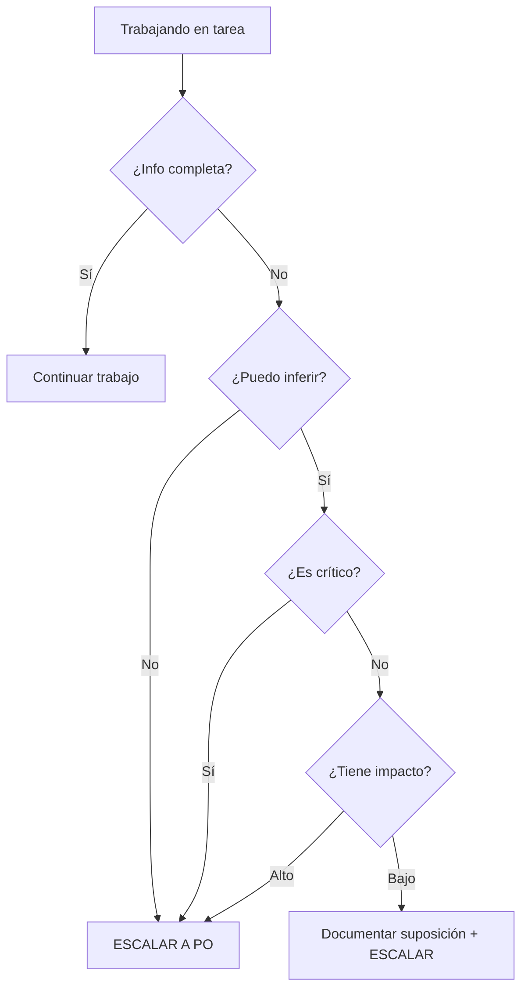

# PROTOCOLO: ESCALAMIENTO AL PRODUCT OWNER

**Proyecto:** MVP Sistema Administración de Obra e INFONAVIT
**Versión:** 1.0.0
**Fecha:** 2025-11-20
**Ámbito:** Todos los agentes (Database-Agent, Backend-Agent, Frontend-Agent) y subagentes
**Tipo:** Protocolo Obligatorio

---

## 🎯 PROPÓSITO

Establecer un proceso claro para que los agentes escalen preguntas al Product Owner cuando:
- **Información faltante** en documentación
- **Ambigüedad** en requerimientos
- **Contradicciones** entre documentos
- **Decisiones de negocio** que requieren autoridad del PO

---

## 🚫 PRINCIPIO FUNDAMENTAL

```yaml
REGLA DE ORO:
  "Si no está definido en la documentación, NO asumir. PREGUNTAR."

Prohibido:
  - ❌ Asumir valores/comportamientos no documentados
  - ❌ Inventar requisitos
  - ❌ Tomar decisiones de negocio sin autorización
  - ❌ Implementar "lo que parece lógico" sin confirmación

Obligatorio:
  - ✅ Detener trabajo cuando falta información crítica
  - ✅ Documentar pregunta claramente
  - ✅ Escalar al Product Owner
  - ✅ Esperar respuesta antes de continuar
  - ✅ Documentar decisión del PO antes de implementar
```

---

## 📋 CUÁNDO ESCALAR AL PRODUCT OWNER

### 1. Información Faltante en Documentación

**Escalar cuando:**

```yaml
Casos:
  - Tabla/entidad mencionada pero sin definición de columnas
  - Endpoint mencionado pero sin especificación de payload
  - Página mencionada pero sin definición de componentes
  - Regla de negocio ambigua o incompleta
  - Valores de enum no especificados
  - Validaciones no documentadas
  - Comportamiento de error no definido
```

**✅ Ejemplo correcto de escalamiento**

```markdown
## CONSULTA AL PRODUCT OWNER

**Fecha:** 2025-11-20 14:30
**Agente:** Database-Agent
**Tarea:** [DB-042] Crear módulo de Proyectos
**Fase:** Análisis

### Contexto

Estoy trabajando en la tabla `projects` según MVP-APP.md sección 4.1.
La documentación menciona que los proyectos tienen un "status" pero
no especifica los valores posibles.

### Información Encontrada

- MVP-APP.md línea 250: "Los proyectos tienen un status que cambia a lo largo del ciclo de vida"
- No hay especificación de valores válidos de status

### Pregunta Específica

**¿Cuáles son los valores válidos para el campo `status` de la tabla `projects`?**

Opciones que considero (para tu evaluación):
1. draft, active, completed, archived
2. planning, in_progress, paused, completed, cancelled
3. Otro conjunto de valores

### Impacto de la Decisión

- Definirá el CHECK constraint en la tabla
- Afectará validaciones en Backend
- Afectará UI de filtros en Frontend
- Se reflejará en reportes y dashboards

### Acción Tomada

⏸️ TRABAJO DETENIDO en tabla projects hasta recibir respuesta.
✅ Puedo continuar con otras tablas no dependientes mientras espero.

### Solicitud

Por favor, especificar valores válidos de status para poder:
1. Crear CHECK constraint correcto
2. Documentar en comentario SQL
3. Actualizar inventario
4. Continuar con implementación
```

**❌ Ejemplo incorrecto (asumir sin preguntar)**

```sql
-- ❌ Agente asume valores sin confirmar
CREATE TABLE projects (
  id UUID PRIMARY KEY DEFAULT gen_random_uuid(),
  status VARCHAR(20) NOT NULL,

  -- ❌ Valores asumidos sin documentación
  CONSTRAINT chk_projects_status
    CHECK (status IN ('draft', 'active', 'completed'))
);

-- ⚠️ PROBLEMA: PO quería incluir 'paused' y 'archived'
-- ⚠️ PROBLEMA: Ahora hay que modificar constraint y migrar datos
```

---

### 2. Ambigüedad en Requerimientos

**Escalar cuando:**

```yaml
Casos:
  - Documento dice una cosa, otro dice otra
  - Término usado inconsistentemente
  - Lógica de negocio no clara
  - Múltiples interpretaciones posibles
```

**✅ Ejemplo correcto**

```markdown
## CONSULTA AL PRODUCT OWNER - AMBIGÜEDAD

**Fecha:** 2025-11-20 15:00
**Agente:** Backend-Agent
**Tarea:** [BE-015] Implementar servicio de Proyectos

### Ambigüedad Detectada

Hay inconsistencia entre documentos sobre el comportamiento al eliminar un proyecto:

**MVP-APP.md sección 4.1:**
> "Cuando se elimina un proyecto, se debe hacer soft delete para preservar histórico"

**ADR-005-Data-Deletion.md:**
> "Los proyectos completados no se pueden eliminar, solo archivar"

### Pregunta Específica

**¿Cuál es el comportamiento correcto al intentar eliminar un proyecto?**

A) Soft delete siempre (deleted_at)
B) No permitir eliminar si está completado, solo archivar (status='archived')
C) Soft delete solo si no está completado, archivar si está completado
D) Otra opción

### Impacto

- Definirá implementación de ProjectService.delete()
- Afectará validaciones y permisos
- Determinará si necesitamos endpoint /archive separado

### Acción Tomada

⏸️ DETENIDO método delete() hasta aclaración.
✅ Continuando con otros métodos (create, update, findAll).
```

---

### 3. Contradicción Entre Documentos

**Escalar cuando:**

```yaml
Casos:
  - Dos documentos dan información contradictoria
  - Requerimiento contradice ADR (decisión arquitectónica)
  - Especificación técnica contradice regla de negocio
```

**✅ Ejemplo correcto**

```markdown
## CONSULTA AL PRODUCT OWNER - CONTRADICCIÓN

**Fecha:** 2025-11-20 16:00
**Agente:** Database-Agent
**Tarea:** [DB-042] Crear tabla projects

### Contradicción Detectada

**Documento 1:** docs/01-requerimientos/REQ-001-Proyectos.md
> "El código del proyecto debe tener formato PRJ-YYYY-NNN (ej: PRJ-2025-001)"

**Documento 2:** orchestration/directivas/ESTANDARES-NOMENCLATURA.md
> "Códigos de proyecto: formato PRJ-NNNN (ej: PRJ-0001)"

### Pregunta Específica

**¿Cuál es el formato correcto del código de proyecto?**

A) PRJ-YYYY-NNN (incluye año)
B) PRJ-NNNN (solo número secuencial)
C) Otro formato

### Implicaciones

- Longitud de columna code (VARCHAR(50) vs VARCHAR(15))
- Validación de formato (regex diferente)
- Generación automática de códigos
- Migración si hay datos existentes

### Sugerencia

Recomiendo opción A (PRJ-YYYY-NNN) porque:
- Facilita identificar proyectos por año
- Evita confusión al reiniciar numeración anualmente
- Estándar en industria de construcción

### Acción Tomada

⏸️ DETENIDO creación de tabla projects.
📝 Documentaré formato definitivo antes de implementar.
```

---

### 4. Decisiones de Negocio

**Escalar cuando:**

```yaml
Casos:
  - Priorización de features
  - Cambio de alcance
  - Trade-offs técnicos con impacto de negocio
  - Definición de reglas de negocio nuevas
  - Excepciones a estándares establecidos
```

**✅ Ejemplo correcto**

```markdown
## CONSULTA AL PRODUCT OWNER - DECISIÓN DE NEGOCIO

**Fecha:** 2025-11-20 17:00
**Agente:** Frontend-Agent
**Tarea:** [FE-008] Crear página de Proyectos

### Contexto

Implementando página de listado de proyectos. Necesito decidir
comportamiento de filtros con implicación de performance vs UX.

### Trade-off Identificado

**Opción A: Filtros en cliente (mejor UX)**
- ✅ Respuesta instantánea al filtrar
- ✅ No requiere llamadas adicionales al API
- ❌ Carga inicial más lenta (traer todos los proyectos)
- ❌ Problema con +1000 proyectos

**Opción B: Filtros en servidor (mejor performance)**
- ✅ Carga inicial rápida (paginado)
- ✅ Escala bien con muchos proyectos
- ❌ Latencia al cambiar filtros (nueva llamada API)
- ❌ UX menos fluida

**Opción C: Híbrido**
- Cargar 100 proyectos más frecuentes en cliente
- Si filtro no da resultados, consultar servidor
- Más complejo de implementar

### Pregunta Específica

**¿Cuál opción prefieres considerando que:**
- MVP tendrá ~50 proyectos inicialmente
- Proyección de 500 proyectos en 1 año
- Usuarios filtran frecuentemente por status

### Recomendación

Opción B (servidor) porque:
- Escala mejor a largo plazo
- MVP puede tolerar latencia mínima
- Evita refactorización futura

### Solicitud

Por favor confirmar enfoque para:
- Implementar filtros correctamente desde inicio
- Documentar decisión en ADR
- Evitar refactorización posterior
```

---

## 📝 FORMATO DE CONSULTA AL PO

### Template Obligatorio

```markdown
## CONSULTA AL PRODUCT OWNER - {TIPO}

**Fecha:** {YYYY-MM-DD HH:MM}
**Agente:** {Database-Agent | Backend-Agent | Frontend-Agent}
**Tarea:** [{TAREA-ID}] {Nombre de tarea}
**Fase:** {Análisis | Planeación | Ejecución}

### Contexto

{Descripción del contexto en 2-3 oraciones}

### {Información Faltante | Ambigüedad Detectada | Contradicción | Trade-off}

{Descripción específica del problema}

### Pregunta Específica

**{Pregunta clara y directa}**

{Opciones si aplica}

### Impacto de la Decisión

- {Impacto 1}
- {Impacto 2}
- {Impacto N}

### Acción Tomada

⏸️ {Qué se detuvo}
✅ {Qué se puede continuar mientras esperas}

### Solicitud

{Qué necesitas específicamente del PO}
```

### Ubicación del Archivo

```yaml
Ubicación obligatoria:
  orchestration/agentes/{grupo}/{TAREA-ID}/CONSULTA-PO-{N}.md

Ejemplos:
  - orchestration/agentes/database/DB-042/CONSULTA-PO-001.md
  - orchestration/agentes/backend/BE-015/CONSULTA-PO-001.md
  - orchestration/agentes/frontend/FE-008/CONSULTA-PO-002.md

Numeración: Secuencial por tarea (001, 002, 003...)
```

---

## 🔄 FLUJO DE ESCALAMIENTO

### Paso 1: Identificar Necesidad



### Paso 2: Detener Trabajo en Área Afectada

```yaml
Al identificar necesidad de escalamiento:
  1. ⏸️ Detener trabajo en área que depende de respuesta
  2. 📝 Documentar punto exacto donde se detuvo
  3. ✅ Identificar trabajo paralelo que se puede hacer
  4. 🚀 Continuar con trabajo no bloqueado mientras esperas
```

**Ejemplo:**

```markdown
## Estado al Detener por Consulta a PO

**Tarea:** [DB-042] Crear módulo de Proyectos

**Bloqueado:**
- ❌ Tabla projects (falta definición de status)
- ❌ Constraints de status
- ❌ Comentarios SQL de status

**Puedo continuar:**
- ✅ Tabla developments (no depende de status)
- ✅ Tabla phases
- ✅ Tabla units
- ✅ Relaciones FK entre tablas

**Al recibir respuesta:**
- Completar tabla projects
- Continuar con validación completa del módulo
```

### Paso 3: Crear Consulta Formateada

```bash
# Crear archivo de consulta
cd orchestration/agentes/{grupo}/{TAREA-ID}/
touch CONSULTA-PO-001.md

# Usar template obligatorio
# Completar TODAS las secciones
```

### Paso 4: Notificar en Canal Apropiado

```yaml
Métodos de notificación (según proyecto):
  - Comentario en tarea/issue del PM tool
  - Mensaje en canal Slack/Teams designado
  - Email al PO con referencia a archivo
  - Tag @product-owner en commit/PR

Incluir en notificación:
  - Link/ruta al archivo CONSULTA-PO-{N}.md
  - ID de tarea afectada
  - Urgencia (bloqueante, puede esperar)
  - Contexto breve (1 línea)
```

**Ejemplo de notificación:**

```markdown
@product-owner Consulta bloqueante en [DB-042]

📋 Archivo: orchestration/agentes/database/DB-042/CONSULTA-PO-001.md
❓ Pregunta: Valores válidos para campo status en tabla projects
⏸️ Trabajo detenido en tabla projects
⏱️ Urgencia: Media (puedo continuar con otras tablas)
📅 Esperando respuesta para continuar
```

### Paso 5: Esperar Respuesta

```yaml
Mientras esperas:
  - ✅ Trabajar en tareas no bloqueadas
  - ✅ Documentar progreso en áreas no afectadas
  - ✅ Preparar implementación para cuando llegue respuesta
  - ✅ Revisar otras áreas que puedan tener dudas similares

NO hacer:
  - ❌ Asumir respuesta e implementar
  - ❌ Cambiar de tarea completamente sin documentar bloqueo
  - ❌ Inventar workaround temporal sin autorización
```

### Paso 6: Documentar Respuesta del PO

```markdown
## RESPUESTA DEL PRODUCT OWNER

**Fecha respuesta:** 2025-11-20 18:00
**Respondió:** {Nombre del PO}

### Decisión

{Transcripción exacta o resumen de la decisión del PO}

**Para campo status de projects:**
Valores válidos son: 'draft', 'planning', 'active', 'paused', 'completed', 'archived'

### Justificación (si la dio)

{Razón de la decisión}

El status 'planning' es importante porque proyectos pasan tiempo
en planeación antes de activarse. 'paused' permite suspender
temporalmente proyectos sin completarlos.

### Documentación Actualizada

- [ ] MVP-APP.md actualizado con definición
- [ ] ADR creado si es decisión arquitectónica
- [ ] Inventario actualizado
- [ ] ESTANDARES actualizados si aplica

### Implementación Autorizada

✅ Proceder con implementación según decisión del PO.

**Responsable:** Database-Agent
**Continuar en:** Fase de Ejecución - Tabla projects
```

### Paso 7: Actualizar Documentación

```yaml
Antes de implementar, OBLIGATORIO:
  1. Actualizar MVP-APP.md con definición clara
  2. Crear ADR si es decisión arquitectónica
  3. Actualizar estándares si define nuevo patrón
  4. Actualizar inventario si aplica
  5. Commitear cambios de documentación
```

**Ejemplo de commit:**

```bash
git add docs/MVP-APP.md
git commit -m "[DB-042] docs: Documentar valores de status según decisión PO

Agregada definición de status para tabla projects según
CONSULTA-PO-001.md respondida por PO el 2025-11-20.

Valores: draft, planning, active, paused, completed, archived"
```

### Paso 8: Implementar con Decisión Documentada

```sql
-- Ahora sí, implementar con decisión documentada
CREATE TABLE projects (
  id UUID PRIMARY KEY DEFAULT gen_random_uuid(),
  code VARCHAR(50) UNIQUE NOT NULL,
  name VARCHAR(200) NOT NULL,
  status VARCHAR(20) NOT NULL DEFAULT 'draft',

  -- Constraint con valores autorizados por PO
  CONSTRAINT chk_projects_status
    CHECK (status IN ('draft', 'planning', 'active', 'paused', 'completed', 'archived')),

  created_at TIMESTAMPTZ NOT NULL DEFAULT now(),
  updated_at TIMESTAMPTZ NOT NULL DEFAULT now()
);

-- Documentar decisión en comentario
COMMENT ON COLUMN projects.status IS
'Status del proyecto. Valores definidos por PO en CONSULTA-PO-001.md (2025-11-20):
draft: Proyecto en borrador inicial
planning: En fase de planeación (pre-activo)
active: Proyecto activo en ejecución
paused: Suspendido temporalmente
completed: Finalizado exitosamente
archived: Archivado (histórico)';
```

---

## ⏱️ TIEMPOS DE RESPUESTA

### Expectativas de Urgencia

```yaml
Crítico/Bloqueante (respuesta esperada: mismo día):
  - Definición necesaria para continuar
  - Bloqueante para múltiples tareas
  - Impacta deadline inmediato

Importante (respuesta esperada: 1-2 días):
  - Definición necesaria pero hay trabajo alternativo
  - Afecta diseño pero no bloquea todo
  - Impacta planificación

Normal (respuesta esperada: 3-5 días):
  - Clarificación para mejorar implementación
  - Optimización o mejora
  - No afecta funcionalidad core
```

### Indicar Urgencia en Consulta

```markdown
## CONSULTA AL PRODUCT OWNER

...

### Urgencia

**Nivel:** 🔴 Crítico | 🟡 Importante | 🟢 Normal

**Razón:**
{Por qué tiene ese nivel de urgencia}

**Impacto si no se responde:**
- {Consecuencia 1}
- {Consecuencia 2}

**Tiempo estimado de bloqueo:**
{Cuánto trabajo se detiene sin respuesta}
```

---

## 📊 REGISTRO DE CONSULTAS

### Mantener Log de Consultas

```yaml
Ubicación:
  orchestration/agentes/{grupo}/{TAREA-ID}/LOG-CONSULTAS-PO.md

Contenido:
  - Lista de todas las consultas
  - Estado (Pendiente, Respondida, Implementada)
  - Fecha de consulta y respuesta
  - Link a archivo de consulta
  - Resumen breve de decisión
```

**Template LOG-CONSULTAS-PO.md:**

```markdown
# LOG DE CONSULTAS AL PRODUCT OWNER

**Tarea:** [{TAREA-ID}] {Nombre}
**Agente:** {Database-Agent | Backend-Agent | Frontend-Agent}

---

## Resumen

| ID | Fecha | Tema | Estado | Respondida |
|----|-------|------|--------|------------|
| 001 | 2025-11-20 | Valores status projects | ✅ Implementada | 2025-11-20 |
| 002 | 2025-11-21 | Formato código proyecto | 🔄 Pendiente | - |

---

## [CONSULTA-001] Valores de status para projects

**Fecha consulta:** 2025-11-20 14:30
**Fecha respuesta:** 2025-11-20 18:00
**Estado:** ✅ Respondida e Implementada

### Pregunta

¿Cuáles son los valores válidos para el campo status de la tabla projects?

### Decisión del PO

Valores: 'draft', 'planning', 'active', 'paused', 'completed', 'archived'

### Documentación Actualizada

- ✅ MVP-APP.md sección 4.1.3
- ✅ Comentario en SQL
- ✅ Inventario actualizado

### Implementado En

- apps/database/ddl/schemas/project_management/tables/01-projects.sql:15

---

## [CONSULTA-002] Formato de código de proyecto

**Fecha consulta:** 2025-11-21 09:00
**Estado:** 🔄 Pendiente respuesta

### Pregunta

¿Formato de código: PRJ-YYYY-NNN o PRJ-NNNN?

### Urgencia

🟡 Importante - Hay trabajo alternativo disponible

---
```

---

## ✅ CHECKLIST AL ESCALAR

```markdown
Antes de escalar al PO, verificar:

**Investigación Previa:**
- [ ] ¿Revisé MVP-APP.md completo?
- [ ] ¿Revisé ADRs relacionados?
- [ ] ¿Revisé requerimientos del módulo?
- [ ] ¿Revisé estándares y directivas?
- [ ] ¿Busqué en inventarios/trazas?
- [ ] ¿Consulté con agente principal (si soy subagente)?

**Preparación de Consulta:**
- [ ] Usé template obligatorio
- [ ] Contexto claro en 2-3 oraciones
- [ ] Pregunta específica y directa
- [ ] Opciones evaluadas si aplica
- [ ] Impacto documentado
- [ ] Urgencia indicada
- [ ] Archivo en ubicación correcta

**Gestión de Bloqueo:**
- [ ] Identifiqué qué se bloquea
- [ ] Identifiqué trabajo alternativo
- [ ] Documenté punto de detención
- [ ] Notifiqué al PO apropiadamente

**Post-Respuesta:**
- [ ] Documenté respuesta del PO
- [ ] Actualicé documentación correspondiente
- [ ] Commiteé cambios de docs
- [ ] Implementé según decisión
- [ ] Actualicé LOG-CONSULTAS-PO.md
```

---

## 🎓 EJEMPLOS COMPLETOS

### Ejemplo 1: Database-Agent - Información Faltante

[Ver ejemplo completo en sección "1. Información Faltante en Documentación"]

### Ejemplo 2: Backend-Agent - Ambigüedad

[Ver ejemplo completo en sección "2. Ambigüedad en Requerimientos"]

### Ejemplo 3: Frontend-Agent - Decisión de Negocio

[Ver ejemplo completo en sección "4. Decisiones de Negocio"]

---

## 📚 REFERENCIAS

- DIRECTIVA-DOCUMENTACION-OBLIGATORIA.md
- TEMPLATE-CONTEXTO-SUBAGENTE.md
- PROMPT-AGENTES-PRINCIPALES.md

---

**Versión:** 1.0.0
**Fecha:** 2025-11-20
**Próxima revisión:** Al identificar necesidad de mejoras
**Responsable:** Todos los agentes
