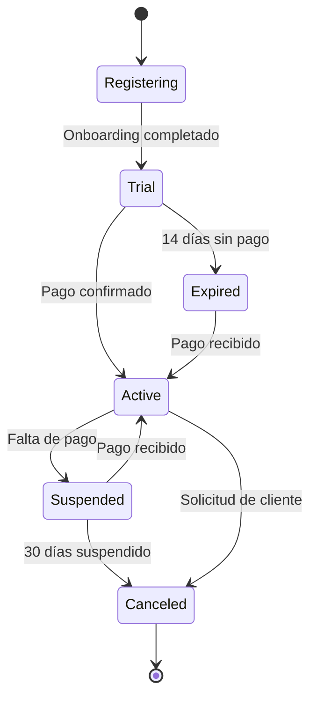

# Arquitectura SaaS Multi-tenant - ERP Construcción

**Versión:** 2.0 SaaS
**Fecha:** 2025-11-17
**Modelo:** SaaS Multi-tenant B2B

---

## 📋 Resumen Ejecutivo

**De desarrollo a medida → Plataforma SaaS**

El sistema evoluciona de un ERP a medida a una **plataforma SaaS multi-tenant** tipo SAP Cloud, donde:

✅ **Un solo código base** sirve a múltiples empresas constructoras
✅ **Módulos activables** por cliente según su plan de suscripción
✅ **Portal de administración** para gestionar tenants, usuarios y configuraciones
✅ **Marketplace de extensiones** para customizaciones específicas sin tocar el core
✅ **Onboarding automatizado** en minutos vs semanas de implementación
✅ **Pricing por módulos** con planes Básico/Profesional/Enterprise

---

## 🏗️ Arquitectura Multi-tenant

### Modelo de Aislamiento

**Enfoque: Row-Level Security (RLS) con discriminador `constructora_id`**

```
┌─────────────────────────────────────┐
│   Capa de Aplicación (Stateless)   │
│                                     │
│  ┌─────────┐  ┌─────────┐         │
│  │  API 1  │  │  API 2  │  ...    │
│  └─────────┘  └─────────┘         │
└──────────────┬──────────────────────┘
               │
┌──────────────▼──────────────────────┐
│        PostgreSQL Database          │
│                                     │
│  ┌──────────────────────────────┐  │
│  │ Schema: constructoras        │  │
│  │  - constructoras (tenant)    │  │
│  │  - user_constructoras        │  │
│  └──────────────────────────────┘  │
│                                     │
│  ┌──────────────────────────────┐  │
│  │ Schema: projects             │  │
│  │  - projects                  │  │
│  │    ├─ constructora_id (FK)   │  │  ← Discriminador
│  │    └─ RLS Policy             │  │
│  │  - budgets                   │  │
│  │    ├─ constructora_id (FK)   │  │
│  │    └─ RLS Policy             │  │
│  └──────────────────────────────┘  │
│                                     │
│  ┌──────────────────────────────┐  │
│  │ Schema: auth_management      │  │
│  │  - profiles                  │  │
│  │    ├─ constructora_id (FK)   │  │
│  │    └─ RLS Policy             │  │
│  └──────────────────────────────┘  │
│                                     │
│  Contexto por sesión:              │
│  app.current_constructora_id = X   │
│  app.current_user_role = Y         │
└─────────────────────────────────────┘
```

**Ventajas:**
- ✅ Escalabilidad ilimitada (millones de constructoras)
- ✅ Migraciones simples (un solo schema por dominio)
- ✅ Queries cross-tenant posibles (analytics globales)
- ✅ Menor overhead de gestión y mantenimiento
- ✅ **90% de reutilización de código de GAMILIT**
- ✅ Aislamiento lógico robusto mediante RLS policies

**Mitigación de riesgos:**
- Seguridad: RLS policies a nivel de BD (no bypasseable desde aplicación)
- Performance: Índices en `constructora_id` (sin degradación)
- Compliance: Audit logging detallado por constructora
- Testing: Tests de aislamiento en CI/CD (validar RLS)

---

### Identificación de Constructora (Tenant)

**1. Por Subdominio:**

```
https://constructora-abc.erp-construccion.com  → constructora: constructora-abc
https://viviendas-xyz.erp-construccion.com     → constructora: viviendas-xyz
```

**2. Por JWT Claim (principal):**

```json
// Token JWT contiene
{
  "userId": "uuid-...",
  "constructoraId": "uuid-abc-123",
  "role": "engineer",
  "email": "usuario@constructora-abc.com"
}
```

**3. Por Header HTTP (API externa):**

```http
GET /api/projects
Host: api.erp-construccion.com
X-Constructora-ID: uuid-abc-123
Authorization: Bearer <JWT>
```

**Middleware de Constructora Resolver:**

```typescript
// apps/backend/src/middleware/constructora-resolver.middleware.ts

export class ConstructoraResolverMiddleware implements NestMiddleware {
  constructor(
    private constructoraService: ConstructoraService,
    private dataSource: DataSource
  ) {}

  async use(req: Request, res: Response, next: NextFunction) {
    // Extraer constructora desde:
    // 1. JWT claim (más común, ya autenticado)
    const constructoraId = req.user?.constructoraId;

    // 2. Header (para APIs externas)
    const headerConstructoraId = req.headers['x-constructora-id'];

    // 3. Subdomain (UX amigable, requiere lookup)
    let subdomain = null;
    if (req.hostname.includes('erp-construccion.com')) {
      subdomain = req.hostname.split('.')[0];
    }

    const finalConstructoraId = constructoraId || headerConstructoraId;

    if (!finalConstructoraId && !subdomain) {
      throw new UnauthorizedException('Constructora not identified');
    }

    // Validar que constructora existe y está activa
    let constructora;
    if (subdomain) {
      constructora = await this.constructoraService.findBySubdomain(subdomain);
    } else {
      constructora = await this.constructoraService.findById(finalConstructoraId);
    }

    if (!constructora || !constructora.active) {
      throw new UnauthorizedException('Invalid or inactive constructora');
    }

    // Verificar que usuario tiene acceso a esta constructora
    if (req.user?.userId) {
      const hasAccess = await this.constructoraService.userHasAccess(
        req.user.userId,
        constructora.id
      );
      if (!hasAccess) {
        throw new ForbiddenException('User does not have access to this constructora');
      }
    }

    // Inyectar en contexto de request
    req.constructora = constructora;

    // ⭐ CRÍTICO: Configurar contexto RLS en la sesión de BD
    await this.setRLSContext(constructora.id, req.user?.role);

    next();
  }

  private async setRLSContext(constructoraId: string, role?: string) {
    // Establecer variables de sesión para RLS policies
    await this.dataSource.query(`
      SELECT
        set_config('app.current_constructora_id', $1, true),
        set_config('app.current_user_role', $2, true)
    `, [constructoraId, role || 'guest']);
  }
}
```

**Políticas RLS en Base de Datos:**

```sql
-- Ejemplo: Tabla projects.projects
CREATE POLICY "projects_select_own_constructora" ON projects.projects
    FOR SELECT
    TO authenticated
    USING (
        constructora_id::text = current_setting('app.current_constructora_id', true)
    );

CREATE POLICY "projects_insert_own_constructora" ON projects.projects
    FOR INSERT
    TO authenticated
    WITH CHECK (
        constructora_id::text = current_setting('app.current_constructora_id', true)
    );

-- Similar para UPDATE y DELETE
```

---

### Contexto RLS por Request

**Interceptor NestJS (aplicado globalmente):**

```typescript
// apps/backend/src/interceptors/set-rls-context.interceptor.ts

@Injectable()
export class SetRlsContextInterceptor implements NestInterceptor {
  constructor(private dataSource: DataSource) {}

  intercept(context: ExecutionContext, next: CallHandler): Observable<any> {
    const request = context.switchToHttp().getRequest();
    const user = request.user;
    const constructora = request.constructora;

    if (!constructora?.id) {
      // Contexto público o sin autenticación
      return next.handle();
    }

    // Establecer contexto RLS al inicio del request
    return from(
      this.dataSource.query(`
        SELECT
          set_config('app.current_constructora_id', $1, true),
          set_config('app.current_user_id', $2, true),
          set_config('app.current_user_role', $3, true)
      `, [
        constructora.id,
        user?.userId || null,
        user?.role || 'guest'
      ])
    ).pipe(
      switchMap(() => next.handle()),
      // El contexto se limpia automáticamente al finalizar la transacción
    );
  }
}

// Registro global en main.ts
app.useGlobalInterceptors(new SetRlsContextInterceptor(dataSource));
```

**Funciones Helper en PostgreSQL:**

```sql
-- apps/database/ddl/schemas/public/functions/

-- Obtener constructora del contexto actual
CREATE OR REPLACE FUNCTION public.get_current_constructora_id()
RETURNS UUID AS $$
BEGIN
  RETURN current_setting('app.current_constructora_id', true)::UUID;
EXCEPTION
  WHEN OTHERS THEN
    RETURN NULL;
END;
$$ LANGUAGE plpgsql STABLE;

-- Obtener user_id del contexto actual
CREATE OR REPLACE FUNCTION public.get_current_user_id()
RETURNS UUID AS $$
BEGIN
  RETURN current_setting('app.current_user_id', true)::UUID;
EXCEPTION
  WHEN OTHERS THEN
    RETURN NULL;
END;
$$ LANGUAGE plpgsql STABLE;

-- Obtener rol del contexto actual
CREATE OR REPLACE FUNCTION public.get_current_user_role()
RETURNS TEXT AS $$
BEGIN
  RETURN current_setting('app.current_user_role', true);
EXCEPTION
  WHEN OTHERS THEN
    RETURN 'guest';
END;
$$ LANGUAGE plpgsql STABLE;

-- Verificar si usuario tiene acceso a constructora
CREATE OR REPLACE FUNCTION public.user_has_access_to_constructora(
  p_user_id UUID,
  p_constructora_id UUID
)
RETURNS BOOLEAN AS $$
BEGIN
  RETURN EXISTS (
    SELECT 1
    FROM auth_management.user_constructoras
    WHERE user_id = p_user_id
      AND constructora_id = p_constructora_id
      AND active = true
  );
END;
$$ LANGUAGE plpgsql STABLE;
```

**Ventajas de este enfoque:**
- ✅ Un solo pool de conexiones (eficiente)
- ✅ Contexto por request, no por conexión
- ✅ Compatible con transacciones
- ✅ Fácil de testear (mock del contexto)
- ✅ Reutilización directa de código GAMILIT

---

## 🎛️ Portal de Administración SaaS

### Roles del Portal

| Rol | Descripción | Accesos |
|-----|-------------|---------|
| **Super Admin** | Administrador de la plataforma | Todos los tenants, configuración global |
| **Tenant Admin** | Administrador de empresa cliente | Su tenant, usuarios, módulos, configuración |
| **Support** | Soporte técnico | Ver datos, ayudar clientes (no modificar) |
| **Billing** | Facturación y cobranza | Ver uso, generar facturas, suspender por falta de pago |

---

### Funcionalidades del Portal

#### 1. Gestión de Tenants

**Dashboard Principal:**

| Tenant | Plan | Usuarios | Módulos Activos | Estado | MRR | Acciones |
|--------|------|----------|-----------------|--------|-----|----------|
| constructora-abc | Enterprise | 45/50 | 15/18 | 🟢 Activo | $1,500 | Ver · Editar · Facturar |
| viviendas-xyz | Profesional | 18/25 | 10/18 | 🟢 Activo | $750 | Ver · Editar · Facturar |
| obras-norte | Básico | 8/10 | 6/18 | 🟡 Prueba | $0 | Ver · Editar · Convertir |
| desarrollos-sur | Enterprise | 12/100 | 18/18 | 🔴 Suspendido | $2,000 | Ver · Editar · Reactivar |

**Métricas Globales:**
- Total tenants: 234
- Activos: 198 (84.6%)
- En prueba: 28 (12%)
- Suspendidos: 8 (3.4%)
- MRR Total: $156,780
- Usuarios totales: 4,523

---

#### 2. Onboarding de Nuevo Tenant

**Flujo Automatizado (5 minutos):**

```yaml
onboarding_steps:
  - step: 1
    name: "Registro inicial"
    fields:
      - company_name: "Constructora ABC SA de CV"
      - rfc: "CABC850101AAA"
      - industry: "Construcción de vivienda"
      - employees_count: "50-100"
      - subdomain: "constructora-abc"  # Auto-sugerido
      - admin_email: "admin@constructora-abc.com"
      - admin_name: "Juan Pérez"
      - phone: "+52 442 123 4567"
    duration: "2 min"

  - step: 2
    name: "Selección de plan"
    options:
      - plan: "Básico"
        price: "$399/mes"
        users: "10"
        modules: "6 módulos core"
      - plan: "Profesional"  # ← Seleccionado
        price: "$799/mes"
        users: "25"
        modules: "12 módulos"
      - plan: "Enterprise"
        price: "$1,499/mes"
        users: "100"
        modules: "Todos (18)"
    duration: "1 min"

  - step: 3
    name: "Configuración de módulos"
    modules_selected:
      - MAI-001: "Fundamentos" (incluido)
      - MAI-002: "Proyectos" (incluido)
      - MAI-003: "Presupuestos" (incluido)
      - MAI-004: "Compras" (incluido)
      - MAI-005: "Control de Obra" (incluido)
      - MAI-006: "Reportes" (incluido)
      - MAI-007: "RRHH" ($100/mes adicional)
      - MAI-008: "Estimaciones" (incluido)
      - MAI-009: "Calidad" ($50/mes adicional)
      - MAI-010: "CRM" (incluido)
    duration: "1 min"

  - step: 4
    name: "Provisioning automático"
    actions:
      - "Crear registro en tabla constructoras.constructoras"
      - "Generar UUID único para constructora"
      - "Crear usuario admin con relación a constructora"
      - "Insertar registro en user_constructoras (rol admin)"
      - "Activar módulos seleccionados (feature flags)"
      - "Configurar subdomain DNS (CNAME a aplicación)"
      - "Generar datos seed (catálogos base)"
      - "Generar datos demo (opcional)"
      - "Enviar email de bienvenida con credenciales"
    duration: "< 1 min (background job)"

  - step: 5
    name: "Primer login"
    url: "https://constructora-abc.erp-construccion.com"
    credentials:
      - email: "admin@constructora-abc.com"
      - temp_password: "xxxxxx" (cambiar en primer login)
    welcome_tour: true
    sample_data: true
    duration: "Inmediato"

total_time: "5 minutos"
status: "✅ Tenant activo"
```

---

#### 3. Configuración de Módulos por Tenant

**Panel de Módulos:**

```
┌─────────────────────────────────────────────────────┐
│ Módulos Activos: constructora-abc (Plan Profesional)│
├─────────────────────────────────────────────────────┤
│                                                     │
│  FASE 1: ALCANCE INICIAL                           │
│  ┌─────────────────────────────────────┐           │
│  │ ✅ MAI-001 Fundamentos       Incluido│ [●]      │
│  │ ✅ MAI-002 Proyectos          Incluido│ [●]      │
│  │ ✅ MAI-003 Presupuestos       Incluido│ [●]      │
│  │ ✅ MAI-004 Compras            Incluido│ [●]      │
│  │ ✅ MAI-005 Control de Obra    Incluido│ [●]      │
│  │ ✅ MAI-006 Reportes           Incluido│ [●]      │
│  │ ✅ MAI-007 RRHH              +$100/mes│ [●]      │
│  │ ✅ MAI-008 Estimaciones       Incluido│ [●]      │
│  │ ⚪ MAI-009 Calidad           +$50/mes │ [ ]  ←   │
│  │ ✅ MAI-010 CRM                Incluido│ [●]      │
│  │ ⚪ MAI-011 INFONAVIT         +$75/mes │ [ ]      │
│  │ ⚪ MAI-012 Contratos         +$75/mes │ [ ]      │
│  │ ⚪ MAI-013 Administración    Incluido │ [ ]      │
│  └─────────────────────────────────────┘           │
│                                                     │
│  FASE 2: ENTERPRISE                                │
│  ┌─────────────────────────────────────┐           │
│  │ ⚪ MAE-014 Finanzas          +$200/mes│ [ ]      │
│  │ ⚪ MAE-015 Activos           +$150/mes│ [ ]      │
│  │ ⚪ MAE-016 DMS               +$100/mes│ [ ]      │
│  └─────────────────────────────────────┘           │
│                                                     │
│  FASE 3: AVANZADA                                  │
│  ┌─────────────────────────────────────┐           │
│  │ ⚪ MAA-017 HSE + IA          +$300/mes│ [ ]      │
│  └─────────────────────────────────────┘           │
│                                                     │
│  Subtotal Plan Profesional:        $799/mes        │
│  Add-ons activados:                 +$100/mes      │
│  ─────────────────────────────────────────         │
│  Total mensual:                     $899/mes        │
│                                                     │
│  [Guardar Cambios]  [Vista Previa]                 │
└─────────────────────────────────────────────────────┘
```

**Al activar/desactivar módulos:**
- Se ejecuta migration específica del módulo
- Se actualizan permisos de usuarios
- Se calcula nuevo pricing
- Se notifica a tenant admin
- Cambios efectivos en <5 minutos

---

#### 4. Gestión de Usuarios por Tenant

**Vista de Tenant Admin:**

| Usuario | Email | Rol | Módulos | Último acceso | Estado | Acciones |
|---------|-------|-----|---------|---------------|--------|----------|
| Juan Pérez | admin@const-abc.com | Admin | Todos | Hace 2 hrs | 🟢 Activo | Editar · Desactivar |
| María López | maria@const-abc.com | Engineer | 8 módulos | Hace 1 día | 🟢 Activo | Editar · Desactivar |
| Pedro Martínez | pedro@const-abc.com | Resident | 6 módulos | Hace 3 hrs | 🟢 Activo | Editar · Desactivar |
| ... | ... | ... | ... | ... | ... | ... |

**Usuarios: 18 / 25 (72% de capacidad)**

[+ Invitar Usuario]  [Importar CSV]  [Exportar]

---

#### 5. Configuración de Tenant

**Categorías de configuración:**

**General:**
- Nombre de empresa
- Logo (usado en reportes y emails)
- Zona horaria
- Idioma (ES/EN)
- Moneda (MXN/USD)

**Personalización:**
- Colores de marca (primary, secondary)
- Email remitente personalizado
- Dominio custom (opcional): `erp.constructora-abc.com`

**Seguridad:**
- 2FA obligatorio (sí/no)
- Política de contraseñas
- Sesiones concurrentes
- IP whitelisting

**Integraciones:**
- SAP/CONTPAQi (credenciales)
- WhatsApp Business API
- SMS provider
- Storage (AWS S3 / Azure Blob)

**Facturación:**
- Método de pago
- Datos fiscales
- Historial de facturas
- Uso mensual

---

## 💳 Modelo de Pricing

### Planes Base

| Plan | Precio/mes | Usuarios | Módulos Incluidos | Almacenamiento | Soporte |
|------|------------|----------|-------------------|----------------|---------|
| **Básico** | $399 USD | 10 | 6 core | 10 GB | Email (48h) |
| **Profesional** | $799 USD | 25 | 12 módulos | 50 GB | Email + Chat (24h) |
| **Enterprise** | $1,499 USD | 100 | Todos (18) | 200 GB | Dedicado (4h) |
| **Enterprise Plus** | Custom | Ilimitado | Todos + Custom | Ilimitado | Dedicado (1h) |

---

### Módulos Add-on (por módulo/mes)

| Módulo | Precio/mes | Disponible en |
|--------|------------|---------------|
| MAI-007 RRHH Avanzado | $100 | Todos los planes |
| MAI-009 Calidad y Postventa | $50 | Profesional+ |
| MAI-011 INFONAVIT | $75 | Profesional+ |
| MAI-012 Contratos | $75 | Profesional+ |
| MAE-014 Finanzas | $200 | Enterprise |
| MAE-015 Activos | $150 | Enterprise |
| MAE-016 DMS | $100 | Profesional+ |
| MAA-017 HSE + IA | $300 | Enterprise |

---

### Usuarios Adicionales

| Plan | Precio/usuario/mes |
|------|--------------------|
| Básico | $20 USD |
| Profesional | $15 USD |
| Enterprise | $10 USD |

---

### Cálculo de Ejemplo

**Constructora ABC (Plan Profesional):**

```
Plan Profesional base:             $799/mes
  - 25 usuarios incluidos
  - 12 módulos

Add-ons activados:
  + MAI-007 RRHH                   $100/mes
  + MAI-011 INFONAVIT              $75/mes

Usuarios adicionales:
  + 5 usuarios × $15               $75/mes

Almacenamiento adicional:
  + 20 GB × $2/GB                  $40/mes

─────────────────────────────────────────
Total mensual:                     $1,089/mes
Anual (15% descuento):             $11,107/año ($925/mes)
```

---

### Costos de Contratación Inicial (One-Time)

Además de la suscripción mensual, existe un **costo único de implementación inicial** que cubre:

✅ **Migración de datos** desde sistemas legacy (Excel, ERP anterior, etc.)
✅ **Capacitación** a usuarios (sesiones remotas + material)
✅ **Adaptación al negocio** (configuración de workflows, catálogos, permisos)
✅ **Implementaciones dentro de configuraciones** (reportes personalizados, dashboards, etc.)

---

#### Paquetes de Onboarding

| Paquete | Precio | Usuarios | Registros a Migrar | Horas Capacitación | Horas Configuración | Ideal para |
|---------|--------|----------|-------------------|-------------------|---------------------|------------|
| **Starter** | $2,500 USD | <10 | <5,000 | 4 horas | 8 horas | Empresas pequeñas con datos simples |
| **Profesional** | $7,500 USD | 10-50 | <50,000 | 12 horas | 20 horas | Empresas medianas con procesos establecidos |
| **Enterprise** | $15,000 USD | 50-100 | <200,000 | 24 horas | 40 horas | Constructoras grandes con ERP previo |
| **Enterprise Plus** | Custom | 100+ | Ilimitado | Custom | Custom | Corporativos multinacionales |

---

#### Desglose del Servicio de Onboarding

**1. Migración de Datos (30% del tiempo)**

Incluye:
- Análisis de datos fuente (Excel, CSVs, base de datos legacy)
- Limpieza y normalización de datos
- Mapping de campos a esquema del ERP
- Importación automatizada con validaciones
- Verificación de integridad post-migración

**Entregables:**
- Plan de migración documentado
- Scripts de importación
- Reporte de validación con discrepancias
- Backup de datos originales

**Datos migrados típicos:**
- Catálogo de clientes/proveedores
- Proyectos históricos (últimos 2 años)
- Presupuestos y estimaciones
- Personal y nóminas
- Inventarios de almacén
- Documentos y planos (opcional)

---

**2. Capacitación (25% del tiempo)**

**Metodología:**
- Sesiones remotas por Zoom/Teams
- Grabaciones disponibles 1 año
- Material didáctico en PDF
- Certificado de participación

**Programa:**

| Sesión | Audiencia | Duración | Contenido |
|--------|-----------|----------|-----------|
| **Sesión 1: Administradores** | Admins de sistema | 3 hrs | Portal admin, usuarios, módulos, configuración |
| **Sesión 2: Operaciones** | Residentes de obra, almacén | 3 hrs | Proyectos, control de obra, compras, inventarios |
| **Sesión 3: Finanzas** | Contadores, finanzas | 2 hrs | Presupuestos, estimaciones, reportes financieros |
| **Sesión 4: RRHH** | Recursos humanos | 2 hrs | Nóminas, asistencias, incidencias |
| **Sesión 5: Ejecutivos** | Directores, gerentes | 2 hrs | Dashboards, analytics, reportes ejecutivos |

**Material incluido:**
- Manual de usuario por módulo (PDF)
- Videos tutoriales (10-15 min c/u)
- FAQs y troubleshooting
- Acceso a knowledge base

---

**3. Adaptación al Negocio (25% del tiempo)**

Configuraciones personalizadas sin código:

**Catálogos maestros:**
- Tipos de proyecto específicos (residencial, industrial, etc.)
- Catálogo de conceptos de obra (partidas estándar)
- Plantillas de presupuesto por tipo de obra
- Roles y permisos personalizados
- Centros de costo / áreas organizacionales

**Workflows de aprobación:**
- Flujo de aprobación de compras (niveles, montos)
- Flujo de estimaciones (revisión, autorización)
- Flujo de requisiciones de almacén
- Flujo de incidencias de calidad

**Branding:**
- Logo de empresa en sistema
- Colores corporativos
- Plantillas de reportes con membrete
- Emails transaccionales personalizados

---

**4. Implementaciones de Configuración (20% del tiempo)**

Desarrollo de reportes y dashboards personalizados:

**Reportes custom:**
- Reporte ejecutivo mensual (formato específico del cliente)
- Reporte de avance de obra para clientes finales
- Formatos oficiales (INFONAVIT, CFE, etc.)
- Reporte de rentabilidad por proyecto

**Dashboards:**
- Dashboard ejecutivo C-level
- Dashboard de obra para residentes
- Dashboard financiero para contadores

**Integraciones:**
- Configuración de integración SAP/CONTPAQi
- Configuración de WhatsApp Business API
- Configuración de storage (S3/Azure)

---

#### Calendario de Implementación

**Paquete Starter (2-3 semanas):**

```
Semana 1:
  - Día 1-2: Kickoff + análisis de datos
  - Día 3-4: Migración de datos
  - Día 5: Validación de migración

Semana 2:
  - Día 1-2: Configuración de catálogos y workflows
  - Día 3-4: Capacitación usuarios (2 sesiones)
  - Día 5: Ajustes finales

Semana 3:
  - Día 1-2: Configuración de reportes
  - Día 3: Sesión final y go-live
  - Día 4-5: Soporte post go-live
```

**Paquete Profesional (4-6 semanas):**

```
Semana 1-2: Migración de datos + validación
Semana 3: Configuración avanzada
Semana 4-5: Capacitación (4-5 sesiones)
Semana 6: Reportes custom + go-live
```

**Paquete Enterprise (8-12 semanas):**

```
Semana 1-3: Análisis y migración de datos complejos
Semana 4-6: Configuración enterprise + integraciones
Semana 7-9: Capacitación intensiva (6+ sesiones)
Semana 10-11: Desarrollo de reportes y dashboards
Semana 12: UAT, ajustes y go-live
```

---

#### Soporte Post-Onboarding

**Incluido en el onboarding (primeros 30 días):**
- Soporte prioritario vía email/chat
- Webinars de Q&A semanales
- Ajustes menores de configuración
- Resolución de dudas operativas

**Posterior (según plan de suscripción):**
- Plan Básico: Email (48h)
- Plan Profesional: Email + Chat (24h)
- Plan Enterprise: Soporte dedicado (4h)

---

#### Servicios Adicionales (Opcionales)

| Servicio | Precio | Descripción |
|----------|--------|-------------|
| **Capacitación on-site** | $3,000 USD/día + viáticos | Sesiones presenciales en oficinas del cliente |
| **Migración de documentos** | $0.10 USD/documento | Digitalización y clasificación de planos/contratos |
| **Desarrollo de extensión custom** | $150 USD/hora | Funcionalidad no disponible en configuración estándar |
| **Consultoría de procesos** | $200 USD/hora | Optimización de workflows y mejores prácticas |
| **Integración legacy custom** | Desde $5,000 USD | Integración con sistemas propietarios complejos |
| **Auditoría de datos** | $2,000 USD | Validación exhaustiva de integridad de datos migrados |

---

#### Garantía de Onboarding

**Compromiso:**
- Sistema funcional al 100% al término del onboarding
- Usuarios capacitados y productivos
- Datos migrados con >98% de precisión

**Si no se cumple:**
- Extensión de soporte sin costo hasta lograrlo
- Reembolso parcial si no se alcanza funcionalidad mínima acordada
- Consultoría adicional sin cargo

---

#### Ejemplo de Presupuesto Completo

**Constructora ABC (50 empleados, 15,000 registros, ERP previo):**

```
INVERSIÓN INICIAL (One-time):
  Paquete Profesional Onboarding:     $7,500 USD
    ✓ Migración 15,000 registros
    ✓ 12 horas capacitación (4 sesiones)
    ✓ 20 horas configuración
    ✓ Soporte 30 días post go-live

  Servicios adicionales:
    + Migración 2,000 planos PDF         $200 USD
    + Integración CONTPAQi            $5,000 USD
    ───────────────────────────────────────────
  Subtotal inicial:                  $12,700 USD


SUSCRIPCIÓN MENSUAL:
  Plan Profesional base:                $799/mes
    ✓ 25 usuarios incluidos
    ✓ 12 módulos
    ✓ 50 GB almacenamiento
    ✓ Soporte 24h

  Add-ons activados:
    + MAI-007 RRHH Avanzado             $100/mes
    + MAI-011 INFONAVIT                  $75/mes
    + MAI-012 Contratos                  $75/mes

  Usuarios adicionales:
    + 5 usuarios × $15                   $75/mes
    ───────────────────────────────────────────
  Total mensual:                      $1,124/mes


COSTO TOTAL AÑO 1:
  Inversión inicial:                 $12,700 USD
  Suscripción 12 meses:              $13,488 USD (1,124 × 12)
  ───────────────────────────────────────────
  Total año 1:                       $26,188 USD

COSTO TOTAL AÑOS SUBSECUENTES:
  Suscripción 12 meses:              $13,488 USD/año
  (sin costo de onboarding)


ROI vs ERP Tradicional:
  SAP/Oracle implementación:     $150K-$500K inicial
  SAP/Oracle suscripción:         $50K-$150K/año

  Ahorro año 1:                   $123K-$473K (vs SAP mínimo)
  Payback:                        Inmediato
```

---

## 🔌 Marketplace de Extensiones

### Tipos de Extensiones

| Tipo | Descripción | Ejemplo |
|------|-------------|---------|
| **Integraciones** | Conectores a sistemas externos | Integración con WhatsApp Business, Slack, Zoom |
| **Reportes Custom** | Plantillas de reportes específicas | Reporte para licitaciones CFE, reporte INFONAVIT especial |
| **Módulos Verticales** | Funcionalidad específica de industria | Módulo de Obra Civil Pesada, Módulo de Edificación Alta |
| **Workflows Custom** | Flujos de aprobación personalizados | Workflow de estimaciones 5 niveles |
| **Dashboards** | Dashboards temáticos | Dashboard Ejecutivo C-Level |
| **Templates** | Plantillas de documentos | Contratos tipo, formatos oficiales |

---

### Catálogo de Marketplace

```
┌────────────────────────────────────────────────┐
│  🛒 Marketplace de Extensiones                │
├────────────────────────────────────────────────┤
│                                                │
│  INTEGRACIONES                                 │
│  ┌──────────────────────────────────┐         │
│  │ 📱 WhatsApp Business API         │         │
│  │ Notificaciones automáticas       │         │
│  │ ⭐⭐⭐⭐⭐ (45 reviews)         │         │
│  │ Gratis | [Instalar]              │         │
│  └──────────────────────────────────┘         │
│                                                │
│  ┌──────────────────────────────────┐         │
│  │ 💼 SAP S/4HANA Connector         │         │
│  │ Export de pólizas contables      │         │
│  │ ⭐⭐⭐⭐ (23 reviews)            │         │
│  │ $99/mes | [Instalar]             │         │
│  └──────────────────────────────────┘         │
│                                                │
│  REPORTES CUSTOM                               │
│  ┌──────────────────────────────────┐         │
│  │ 📊 Reporte INFONAVIT EVC         │         │
│  │ Formato oficial actualizado 2025 │         │
│  │ ⭐⭐⭐⭐⭐ (89 reviews)         │         │
│  │ $49 único | [Comprar]            │         │
│  └──────────────────────────────────┘         │
│                                                │
│  MÓDULOS VERTICALES                            │
│  ┌──────────────────────────────────┐         │
│  │ 🏗️ Obra Civil Pesada             │         │
│  │ Puentes, carreteras, presas      │         │
│  │ ⭐⭐⭐⭐ (12 reviews)            │         │
│  │ $299/mes | [Ver Demo]            │         │
│  └──────────────────────────────────┘         │
│                                                │
│  [Explorar Más]  [Mis Extensiones]           │
└────────────────────────────────────────────────┘
```

---

### Desarrollo de Extensiones

**SDK de Extensiones:**

```typescript
// apps/extensions/ejemplo-extension/index.ts

import { Extension, Hook, MenuItem } from '@erp-construccion/sdk';

@Extension({
  id: 'whatsapp-notifier',
  name: 'WhatsApp Notifier',
  version: '1.0.0',
  author: 'ERP Construcción',
  description: 'Envía notificaciones por WhatsApp',
  permissions: ['notifications.send', 'users.read'],
  pricing: {
    type: 'free',
  },
})
export class WhatsAppNotifierExtension {

  // Hook: Se ejecuta cuando se crea una estimación
  @Hook('estimations.created')
  async onEstimationCreated(estimation: Estimation) {
    const tenant = this.context.tenant;
    const users = await this.api.users.findByRole('finance');

    for (const user of users) {
      if (user.phone && user.notificationsEnabled) {
        await this.sendWhatsApp(user.phone, {
          template: 'estimation_created',
          params: {
            estimationNumber: estimation.number,
            amount: estimation.amount,
            project: estimation.project.name,
          },
        });
      }
    }
  }

  // Agregar ítem al menú lateral
  @MenuItem({
    section: 'settings',
    label: 'Configurar WhatsApp',
    icon: 'whatsapp',
    route: '/settings/whatsapp',
  })
  menuItem() {
    return {
      component: WhatsAppSettingsPage,
    };
  }

  private async sendWhatsApp(phone: string, message: any) {
    // Implementación...
  }
}
```

---

## 🔄 Ciclo de Vida del Tenant

### Estados de Tenant



| Estado | Descripción | Acceso | Duración |
|--------|-------------|--------|----------|
| **Registering** | Alta en proceso | No | <5 min |
| **Trial** | Período de prueba | Completo | 14 días |
| **Active** | Suscripción activa | Completo | Indefinido |
| **Suspended** | Falta de pago | Solo lectura | Hasta 30 días |
| **Expired** | Trial vencido | Login deshabilitado | Hasta reactivación |
| **Canceled** | Cancelado por cliente o sistema | No | Soft-delete 90 días |

---

### Políticas de Cancelación

**Cancelación por Cliente:**
1. Cliente solicita cancelación desde portal
2. Confirmación con razón (opcional: encuesta)
3. Export de datos ofrecido (formato SQL/Excel)
4. Tenant pasa a estado `Canceled`
5. Datos retenidos 90 días (compliance)
6. Eliminación permanente tras 90 días

**Suspensión por Falta de Pago:**
1. Intento de cargo fallido (día 1)
2. Reintento automático (día 3)
3. Email de recordatorio (día 5)
4. Último reintento (día 7)
5. **Suspensión** (día 8): Solo lectura
6. Email de suspensión con link de pago
7. Cancelación automática si no paga en 30 días

---

## 🛠️ Gestión de Configuraciones

### Niveles de Configuración

```
1. Global (Platform-level)
   ├── Configuración de infraestructura
   ├── Límites globales
   └── Features flags

2. Tenant-level
   ├── Módulos activados
   ├── Usuarios y permisos
   ├── Branding
   ├── Integraciones
   └── Datos maestros

3. User-level
   ├── Preferencias personales
   ├── Dashboard layout
   └── Notificaciones
```

---

### Feature Flags

Permiten activar/desactivar funcionalidades sin deploy:

```typescript
// apps/backend/src/config/feature-flags.service.ts

export class FeatureFlagsService {
  async isFeatureEnabled(
    featureName: string,
    tenantId?: string
  ): Promise<boolean> {
    // 1. Verificar a nivel global
    const globalFlag = await this.getGlobalFlag(featureName);
    if (globalFlag === false) return false;

    // 2. Verificar a nivel tenant (si aplica)
    if (tenantId) {
      const tenantFlag = await this.getTenantFlag(featureName, tenantId);
      if (tenantFlag !== null) return tenantFlag;
    }

    // 3. Default
    return globalFlag;
  }
}

// Uso en controlador
@Get('ai-insights')
@UseGuards(FeatureGuard('ai_risk_prediction'))
async getAIInsights() {
  // Solo accesible si feature está habilitada para el tenant
  // ...
}
```

**Casos de uso:**
- Gradual rollout de nuevas features
- A/B testing
- Deprecación controlada de features
- Habilitación por plan (Enterprise features)

---

## 📊 Métricas SaaS

### KPIs del Negocio

| Métrica | Descripción | Target |
|---------|-------------|--------|
| **MRR** | Monthly Recurring Revenue | Crecimiento 15% M/M |
| **ARR** | Annual Recurring Revenue | $2M año 1 |
| **Churn Rate** | % de clientes que cancelan | <5% mensual |
| **CAC** | Customer Acquisition Cost | <$1,500 |
| **LTV** | Lifetime Value | >$18,000 (12× CAC) |
| **Activation Rate** | % que activan módulos en 7 días | >80% |
| **NPS** | Net Promoter Score | >50 |

---

### Métricas Técnicas

| Métrica | Target | Monitoreo |
|---------|--------|-----------|
| **Uptime** | 99.9% | StatusPage.io |
| **API Response Time** | p95 <200ms | DataDog |
| **Database Query Time** | p95 <100ms | pg_stat_statements |
| **Onboarding Time** | <5 min | Analytics |
| **Time to First Value** | <1 hr | Mixpanel |

---

## 🚀 Roadmap SaaS

### Fase 1: MVP SaaS (Semanas 1-8)
- ✅ Arquitectura multi-tenant
- ✅ Portal de admin básico
- ✅ Onboarding automatizado
- ✅ 6 módulos core
- ✅ Pricing y billing

### Fase 2: Enterprise Features (Semanas 9-16)
- ✅ 12 módulos adicionales
- ✅ Módulos activables dinámicamente
- ✅ Marketplace MVP
- ✅ Extensiones SDK
- ✅ Custom domains

### Fase 3: Scale & Growth (Semanas 17-24)
- ⏳ IA predictiva
- ⏳ Analytics avanzado
- ⏳ Integraciones nativas (SAP, WhatsApp)
- ⏳ Mobile app completa
- ⏳ API pública para partners

### Fase 4: Expansión (Semanas 25+)
- 📋 Marketplace público
- 📋 White-label para partners
- 📋 Internacionalización (US, LATAM)
- 📋 Cumplimiento (SOC2, ISO 27001)

---

## 🔐 Seguridad Multi-tenant

### Aislamiento de Datos

1. **Row-level security (RLS)**: Aislamiento lógico mediante políticas PostgreSQL
2. **Columna discriminadora**: `constructora_id` en todas las tablas multi-tenant
3. **Contexto por sesión**: `app.current_constructora_id` configurado por request
4. **API-level validation**: Validación de acceso a constructora en middleware
5. **Audit logging**: Registro de accesos con constructora_id en cada operación
6. **Testing de aislamiento**: Tests automáticos que validan RLS policies

### Prevención de Data Leakage

```typescript
// Guard que previene acceso cross-constructora
@Injectable()
export class ConstructoraGuard implements CanActivate {
  constructor(private constructoraService: ConstructoraService) {}

  async canActivate(context: ExecutionContext): Promise<boolean> {
    const request = context.switchToHttp().getRequest();
    const user = request.user;
    const constructora = request.constructora;

    if (!user || !constructora) {
      throw new UnauthorizedException('User or constructora not identified');
    }

    // Validar que el usuario tiene acceso a esta constructora
    const hasAccess = await this.constructoraService.userHasAccess(
      user.userId,
      constructora.id
    );

    if (!hasAccess) {
      // Intentó acceder a datos de otra constructora
      await this.auditService.logSecurityViolation({
        userId: user.userId,
        attemptedConstructoraId: constructora.id,
        event: 'cross_constructora_access_denied',
        ip: request.ip,
      });

      throw new ForbiddenException('Access denied to this constructora');
    }

    return true;
  }
}

// Uso en controlador
@Controller('projects')
@UseGuards(JwtAuthGuard, ConstructoraGuard)
export class ProjectsController {
  // Todos los endpoints requieren acceso válido a constructora
}
```

**Tests de Aislamiento:**

```typescript
// apps/backend/test/security/rls-isolation.spec.ts

describe('RLS Isolation Tests', () => {
  it('should prevent cross-constructora data access', async () => {
    // Setup: Crear 2 constructoras y usuarios
    const constructoraA = await createConstructora('Constructora A');
    const constructoraB = await createConstructora('Constructora B');

    const userA = await createUser({ constructoraId: constructoraA.id });
    const userB = await createUser({ constructoraId: constructoraB.id });

    // Crear proyecto para constructora A
    const projectA = await createProject({
      name: 'Proyecto A',
      constructoraId: constructoraA.id
    });

    // Login como usuario B
    const tokenB = await loginAs(userB);

    // Intentar acceder a proyecto de constructora A (debe fallar)
    const response = await request(app)
      .get(`/api/projects/${projectA.id}`)
      .set('Authorization', `Bearer ${tokenB}`)
      .expect(403);

    expect(response.body.message).toContain('Access denied');
  });

  it('should enforce RLS at database level', async () => {
    // Setup similar...

    // Intentar query directo con constructora incorrecta en contexto
    await dataSource.query(`
      SELECT set_config('app.current_constructora_id', $1, true)
    `, [constructoraB.id]);

    // Query debe retornar 0 resultados (RLS bloquea)
    const projects = await dataSource.query(`
      SELECT * FROM projects.projects WHERE id = $1
    `, [projectA.id]);

    expect(projects).toHaveLength(0); // RLS bloqueó el acceso
  });
});
```

---

## 📝 Conclusión

Esta arquitectura SaaS multi-tenant permite:

✅ **Escalabilidad**: De 10 a 10,000 tenants sin cambios arquitectónicos
✅ **Time-to-market**: Onboarding de clientes en minutos
✅ **Flexibilidad**: Módulos activables, extensiones, customización
✅ **Economía**: Costo operativo distribuido, mejor margen
✅ **Innovación**: Feature flags, A/B testing, rollout gradual

**Próximo paso:** Implementar la transformación en el MVP-APP.md principal.

---

**Generado:** 2025-11-17
**Versión:** 2.0 SaaS
**Modelo:** Multi-tenant B2B SaaS
