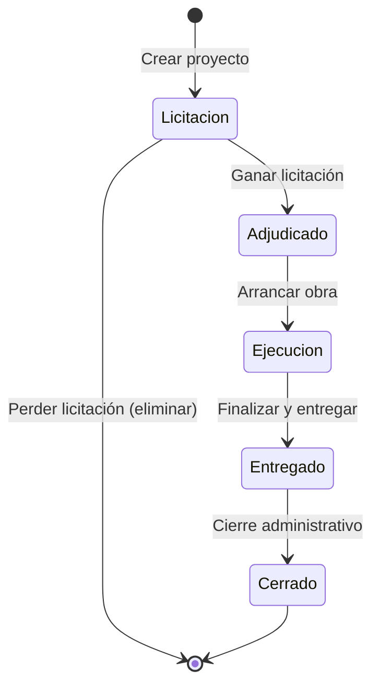

# RF-PROJ-001: Catálogo de Proyectos

**Epic:** MAI-002 - Proyectos y Estructura de Obra
**Tipo:** Requerimiento Funcional
**Prioridad:** Crítica (P0)
**Estado:** 📋 Pendiente
**Última actualización:** 2025-11-17

---

## 📋 Descripción

El sistema debe permitir la gestión completa de proyectos de construcción inmobiliaria, incluyendo fraccionamientos horizontales, conjuntos habitacionales y edificios verticales. Cada proyecto debe mantener información general, ubicación, datos del cliente, permisos legales y estados del ciclo de vida.

---

## 🎯 Objetivos

1. **Centralizar información:** Consolidar todos los datos del proyecto en un único registro
2. **Trazabilidad:** Rastrear el ciclo de vida completo desde licitación hasta cierre
3. **Multi-proyecto:** Permitir gestión simultánea de múltiples proyectos por constructora
4. **Clasificación:** Organizar proyectos por tipo, tamaño, ubicación y estado
5. **Compliance:** Registrar información legal y permisos requeridos

---

## 📐 Alcance Funcional

### 1. Tipos de Proyectos

El sistema debe soportar los siguientes tipos de proyectos inmobiliarios:

#### 1.1 Fraccionamiento Horizontal
- **Descripción:** Desarrollo de viviendas unifamiliares en terreno extenso
- **Características:**
  - Dividido en etapas y manzanas
  - Lotes individuales con área de terreno
  - Viviendas independientes (casas)
  - Áreas comunes (vialidades, áreas verdes, caseta)
  - Urbanización completa (agua, luz, drenaje, pavimentación)
- **Ejemplo:** Fraccionamiento "Villas del Sol" con 250 viviendas en 15 hectáreas

#### 1.2 Conjunto Habitacional
- **Descripción:** Desarrollo mixto con viviendas adosadas o en condominio horizontal
- **Características:**
  - Viviendas dúplex, tríplex o adosadas
  - Régimen de condominio
  - Amenidades compartidas (alberca, gym, salón de usos múltiples)
  - Áreas comunes más extensas que fraccionamiento
- **Ejemplo:** Conjunto "Residencial Alameda" con 80 dúplex y amenidades

#### 1.3 Edificio Vertical
- **Descripción:** Torre o edificio multifamiliar de departamentos
- **Características:**
  - Múltiples niveles (pisos)
  - Departamentos por nivel
  - Elevadores y cuarto de máquinas
  - Estacionamiento (subterráneo o en niveles)
  - Amenidades en azotea o planta baja
- **Ejemplo:** Torre "Skyline Residences" con 15 niveles y 120 departamentos

#### 1.4 Proyecto Mixto
- **Descripción:** Combinación de tipos (ej: torre + casas, comercial + residencial)
- **Características:**
  - Múltiples tipologías en un mismo desarrollo
  - Zonificación por uso (residencial, comercial, servicios)
  - Mayor complejidad en permisos y normativa
- **Ejemplo:** "Plaza Urbana" con torre de departamentos, casas dúplex y locales comerciales

### 2. Datos Generales del Proyecto

Cada proyecto debe registrar la siguiente información:

#### 2.1 Información Básica
```yaml
Nombre del proyecto: "Fraccionamiento Villas del Sol"
Tipo de proyecto: fraccionamiento_horizontal | conjunto_habitacional | edificio_vertical | mixto
Código interno: PROJ-2025-001 (generado automáticamente)
Descripción: Desarrollo de 250 viviendas de interés social en 15 hectáreas
Estado actual: licitacion | adjudicado | ejecucion | entregado | cerrado
Constructora: UUID de la constructora responsable
```

#### 2.2 Datos del Cliente
```yaml
Tipo de cliente: publico | privado | mixto
Nombre del cliente: "INFONAVIT Estatal"
RFC del cliente: INFXXXXXX123
Contacto principal:
  Nombre: "Ing. Roberto Martínez"
  Email: "rmartinez@infonavit.gob.mx"
  Teléfono: "+52 55 1234 5678"
Tipo de contrato: llave_en_mano | precio_alzado | administracion | mixto
Monto contratado: $125,000,000 MXN
```

#### 2.3 Ubicación Geográfica
```yaml
Dirección completa: "Carretera Federal 200 Km 45, Municipio de San Juan"
Estado: Jalisco
Municipio: San Juan del Río
Código postal: 76800
Coordenadas GPS:
  Latitud: 19.4326
  Longitud: -99.1332
Superficie total: 150,000 m² (15 hectáreas)
Superficie construible: 120,000 m² (80%)
```

#### 2.4 Fechas Clave
```yaml
Fecha de licitación: 2024-03-15
Fecha de adjudicación: 2024-04-30
Fecha de inicio contractual: 2024-05-15
Fecha de inicio real: 2024-05-20
Plazo contractual: 24 meses
Fecha de terminación programada: 2026-05-15
Fecha de terminación real: null (aún no concluye)
Fecha de entrega: null
Fecha de cierre administrativo: null
```

#### 2.5 Información Legal y Permisos
```yaml
Número de licencia de construcción: LIC-2024-SJR-0456
Fecha de emisión licencia: 2024-04-15
Vigencia de licencia: 2026-04-14
Número de manifestación de impacto ambiental: MIA-2024-045
Uso de suelo aprobado: H4 (Habitacional densidad media)
Número de plano autorizado: PLANO-SJR-2024-145
Número INFONAVIT (si aplica): INF-2024-JL-0123
Número FOVISSSTE (si aplica): null
```

### 3. Estados del Proyecto

El proyecto debe transitar por los siguientes estados:

#### 3.1 Licitación 📋
- **Descripción:** Proyecto en proceso de concurso o licitación
- **Acciones permitidas:**
  - Crear proyecto
  - Editar información general
  - Subir documentación de licitación
  - Calcular presupuesto preliminar
- **Transición:** → Adjudicado (cuando se gana la licitación)

#### 3.2 Adjudicado ✅
- **Descripción:** Proyecto ganado, pendiente de inicio de obra
- **Acciones permitidas:**
  - Asignar equipo de obra (residente, ingeniero, supervisores)
  - Crear estructura jerárquica (etapas, manzanas, lotes)
  - Cargar presupuesto definitivo
  - Registrar contrato firmado
  - Tramitar permisos y licencias
- **Transición:** → Ejecución (cuando se arranca obra)

#### 3.3 Ejecución 🚧
- **Descripción:** Obra en construcción activa
- **Acciones permitidas:**
  - Registrar avances físicos
  - Generar estimaciones
  - Gestionar compras e inventarios
  - Registrar asistencias de personal
  - Subir evidencias fotográficas
  - Gestionar incidencias
  - Modificar presupuesto (con aprobación)
- **Transición:** → Entregado (cuando obra finaliza y se entrega al cliente)

#### 3.4 Entregado 📦
- **Descripción:** Obra terminada y entregada al cliente, periodo de garantía
- **Acciones permitidas:**
  - Registrar acta de entrega
  - Gestionar postventa (garantías, defectos, bitácora)
  - Generar finiquito
  - Cerrar presupuesto final
- **Transición:** → Cerrado (cuando se cierra administrativamente)

#### 3.5 Cerrado 🔒
- **Descripción:** Proyecto cerrado administrativamente, solo consulta
- **Acciones permitidas:**
  - Solo lectura de información histórica
  - Exportar reportes finales
  - Consultar lecciones aprendidas
- **Transición:** No hay (estado final)

### 4. Métricas y KPIs por Proyecto

Cada proyecto debe calcular y mostrar las siguientes métricas:

#### 4.1 Métricas Físicas
```yaml
Total de viviendas: 250
Viviendas entregadas: 187 (74.8%)
Viviendas en proceso: 63 (25.2%)
Superficie total construida: 18,750 m² (75 m² × 250)
Avance físico general: 78.5%
```

#### 4.2 Métricas Financieras
```yaml
Presupuesto total: $125,000,000
Costo ejercido: $97,125,000 (77.7%)
Disponible: $27,875,000 (22.3%)
Desviación presupuestal: +2.5% (sobre presupuesto)
Estimaciones cobradas: $95,000,000 (76%)
```

#### 4.3 Métricas de Tiempo
```yaml
Plazo contractual: 24 meses
Tiempo transcurrido: 18 meses (75%)
Avance programado (curva S): 80%
Desviación temporal: -1.5% (atrasado)
Días hábiles restantes: 120
```

#### 4.4 Métricas de Recursos
```yaml
Personal asignado: 85 empleados
Equipos asignados: 12 (excavadoras, revolvedoras, etc.)
Proveedores activos: 32
Órdenes de compra emitidas: 287
```

### 5. Documentación del Proyecto

El sistema debe permitir gestionar los siguientes documentos:

#### 5.1 Documentos Contractuales
- Contrato firmado (PDF)
- Anexos técnicos
- Convenios modificatorios
- Fianzas (anticipo, cumplimiento, vicios ocultos)

#### 5.2 Documentos Técnicos
- Proyecto ejecutivo (planos arquitectónicos, estructurales, instalaciones)
- Especificaciones técnicas
- Catálogo de conceptos
- Estudios de mecánica de suelos

#### 5.3 Documentos Legales
- Licencia de construcción
- Manifestación de impacto ambiental
- Uso de suelo
- Permisos de CONAGUA, CFE, etc.
- Escrituras del terreno

#### 5.4 Documentos de Cierre
- Actas de entrega-recepción
- Finiquito
- Planos as-built (como quedó construido)
- Manuales de operación y mantenimiento

### 6. Relaciones del Proyecto

Un proyecto se relaciona con las siguientes entidades:

#### 6.1 Estructura Jerárquica (RF-PROJ-002)
- **Etapas:** Proyecto dividido en fases constructivas
- **Manzanas:** Agrupación de lotes (solo fraccionamientos)
- **Lotes:** Terrenos individuales con viviendas
- **Viviendas:** Unidades habitacionales (basadas en prototipos)

#### 6.2 Equipo Asignado (RF-PROJ-004)
- **Director de Obra:** Responsable general del proyecto
- **Residente de Obra:** Supervisor en sitio
- **Ingenieros:** Especialistas (estructural, instalaciones, etc.)
- **Personal RRHH:** Cuadrillas asignadas al proyecto

#### 6.3 Presupuesto (MAI-003)
- **Presupuesto maestro:** Costo total del proyecto
- **Presupuestos por etapa:** Desglose por fase
- **Precios unitarios:** Matriz de insumos por concepto

#### 6.4 Compras e Inventarios (MAI-004)
- **Almacén del proyecto:** Inventario en obra
- **Requisiciones:** Solicitudes de materiales
- **Órdenes de compra:** Compras autorizadas

#### 6.5 Control de Obra (MAI-005)
- **Avances físicos:** Progreso de actividades
- **Estimaciones:** Generación de cobros
- **Incidencias:** Problemas registrados

---

## 🔄 Flujo de Vida del Proyecto



---

## 💼 Casos de Uso

### CU-PROJ-001: Crear Proyecto de Fraccionamiento

**Actor:** Director de Constructora

**Precondiciones:**
- Usuario autenticado con rol `director`
- Constructora activa en el sistema

**Flujo Principal:**
1. Usuario accede a "Proyectos" > "Nuevo Proyecto"
2. Selecciona tipo: "Fraccionamiento Horizontal"
3. Ingresa datos generales:
   - Nombre: "Villas del Sol Etapa 2"
   - Cliente: INFONAVIT Estatal
   - Ubicación: Jalisco, San Juan del Río
   - Superficie: 10 hectáreas
4. Carga documentos contractuales:
   - Contrato firmado (PDF, 2.5 MB)
   - Licencia de construcción
5. Define fechas clave:
   - Inicio: 2025-06-01
   - Plazo: 18 meses
   - Fin programado: 2026-11-30
6. Asigna monto contratado: $85,000,000 MXN
7. Guarda proyecto con estado: "Adjudicado"
8. Sistema genera código: PROJ-2025-002
9. Usuario recibe confirmación: "Proyecto creado exitosamente"

**Resultado:** Proyecto creado, visible en catálogo, listo para configuración de estructura jerárquica

### CU-PROJ-002: Transitar Proyecto a Ejecución

**Actor:** Residente de Obra

**Precondiciones:**
- Proyecto en estado "Adjudicado"
- Equipo de obra asignado
- Presupuesto cargado
- Permisos completos

**Flujo Principal:**
1. Usuario accede a proyecto "Villas del Sol Etapa 2"
2. Verifica checklist de pre-arranque:
   - ✅ Equipo asignado
   - ✅ Presupuesto aprobado
   - ✅ Licencia vigente
   - ✅ Estructura jerárquica definida
   - ✅ Contrato firmado
3. Hace clic en "Iniciar Obra"
4. Sistema solicita confirmación con fecha de inicio real
5. Usuario confirma: 2025-06-15 (5 días después del contractual)
6. Sistema cambia estado a "Ejecución"
7. Activa módulos de obra:
   - Control de avances
   - Compras e inventarios
   - Asistencias de personal
8. Genera primera estimación: #001

**Resultado:** Proyecto en ejecución, módulos activos, listo para operación diaria

### CU-PROJ-003: Consultar Dashboard del Proyecto

**Actor:** Ingeniero Residente

**Precondiciones:**
- Proyecto en estado "Ejecución"
- Avances registrados

**Flujo Principal:**
1. Usuario accede a proyecto
2. Ve dashboard con:
   - **Avance físico:** 78.5% (curva S vs plan)
   - **Avance financiero:** 77.7% ejercido
   - **Personal:** 85 empleados activos
   - **Alertas:**
     - 🔴 3 partidas con desviación > 15%
     - 🟡 5 materiales con stock bajo
     - 🟢 Estimación #12 cobrada
3. Hace clic en "Curva S"
4. Ve gráfica comparativa:
   - Línea azul: Programado (80%)
   - Línea verde: Real (78.5%)
   - Línea roja: Proyección (97% al cierre)
5. Identifica retraso de -1.5%
6. Genera reporte semanal en PDF

**Resultado:** Información clave del proyecto visualizada, reporte generado

### CU-PROJ-004: Cerrar Proyecto Administrativamente

**Actor:** Director de Constructora

**Precondiciones:**
- Proyecto en estado "Entregado"
- Acta de entrega firmada
- Finiquito generado
- Sin pendientes legales o financieros

**Flujo Principal:**
1. Usuario accede a proyecto "Villas del Sol Etapa 2"
2. Verifica checklist de cierre:
   - ✅ Todas las viviendas entregadas (250/250)
   - ✅ Acta de entrega firmada
   - ✅ Finiquito generado y firmado
   - ✅ Garantías activadas (12 meses)
   - ✅ Sin adeudos con proveedores
   - ✅ Personal desasignado
3. Hace clic en "Cerrar Proyecto"
4. Sistema solicita confirmación
5. Usuario confirma con contraseña
6. Sistema:
   - Cambia estado a "Cerrado"
   - Congela todos los datos (no editables)
   - Genera reporte final automático
   - Archiva documentos en storage
   - Libera recursos (almacén, equipo)
7. Envía notificación a equipo de proyecto

**Resultado:** Proyecto cerrado, datos históricos preservados, recursos liberados

---

## 🧪 Casos de Prueba

### TC-PROJ-001: Crear Proyecto de Fraccionamiento ✅

**Entrada:**
```json
{
  "name": "Fraccionamiento Jardines del Norte",
  "projectType": "fraccionamiento_horizontal",
  "clientName": "INFONAVIT Jalisco",
  "clientRFC": "INF850101ABC",
  "contractAmount": 95000000,
  "surfaceArea": 120000,
  "address": "Carretera a Tesistán Km 12",
  "state": "Jalisco",
  "municipality": "Zapopan",
  "startDate": "2025-07-01",
  "contractDuration": 20
}
```

**Salida Esperada:**
```json
{
  "id": "uuid-generated",
  "projectCode": "PROJ-2025-003",
  "status": "adjudicado",
  "createdAt": "2025-11-17T10:30:00Z",
  "message": "Proyecto creado exitosamente"
}
```

### TC-PROJ-002: Validar Transición de Estados ✅

**Escenario 1:** Licitación → Adjudicado
- **Input:** Estado actual = "licitacion", Acción = "adjudicar"
- **Output:** Estado = "adjudicado" ✅

**Escenario 2:** Adjudicado → Licitación (inválido)
- **Input:** Estado actual = "adjudicado", Acción = "regresar a licitacion"
- **Output:** Error 400 "Transición no permitida" ❌

**Escenario 3:** Ejecución → Cerrado (inválido, falta estado Entregado)
- **Input:** Estado actual = "ejecucion", Acción = "cerrar"
- **Output:** Error 400 "Debe entregar el proyecto antes de cerrar" ❌

### TC-PROJ-003: Validar Campos Obligatorios ❌

**Entrada:**
```json
{
  "name": "",
  "projectType": "fraccionamiento_horizontal",
  "contractAmount": -5000
}
```

**Salida Esperada:**
```json
{
  "errors": [
    {
      "field": "name",
      "message": "El nombre del proyecto es obligatorio"
    },
    {
      "field": "contractAmount",
      "message": "El monto contratado debe ser mayor a 0"
    },
    {
      "field": "clientName",
      "message": "El nombre del cliente es obligatorio"
    }
  ]
}
```

### TC-PROJ-004: Cálculo de Métricas ✅

**Entrada:**
- Viviendas totales: 200
- Viviendas entregadas: 150
- Presupuesto: $100,000,000
- Costo ejercido: $78,000,000

**Salida Esperada:**
```json
{
  "metrics": {
    "physicalProgress": 75.0,
    "financialProgress": 78.0,
    "budgetDeviation": 4.0,
    "status": "green"
  }
}
```

---

## 🔐 Seguridad y Permisos

### Permisos por Rol

| Acción | Director | Engineer | Resident | Purchases | Finance | HR |
|--------|----------|----------|----------|-----------|---------|-----|
| Crear proyecto | ✅ | ✅ | ❌ | ❌ | ❌ | ❌ |
| Editar info general | ✅ | ✅ | ✅ | ❌ | ❌ | ❌ |
| Ver dashboard | ✅ | ✅ | ✅ | ✅ | ✅ | ✅ |
| Transitar estados | ✅ | ✅ | ✅ | ❌ | ❌ | ❌ |
| Subir documentos | ✅ | ✅ | ✅ | ❌ | ❌ | ❌ |
| Eliminar proyecto | ✅ | ❌ | ❌ | ❌ | ❌ | ❌ |
| Cerrar proyecto | ✅ | ❌ | ❌ | ❌ | ❌ | ❌ |

### Row Level Security (RLS)

Todos los proyectos deben estar filtrados por `constructoraId`:

```sql
CREATE POLICY project_isolation ON projects.projects
  USING (constructora_id = current_setting('app.current_constructora_id')::uuid);
```

---

## 📊 Reportes Requeridos

### 1. Catálogo General de Proyectos
- Lista paginada con filtros
- Ordenable por fecha, estado, monto
- Exportable a Excel

### 2. Dashboard Ejecutivo por Proyecto
- Resumen de avances físico/financiero
- Curva S (plan vs real)
- Alertas críticas

### 3. Reporte de Cierre de Proyecto
- Datos finales consolidados
- Lecciones aprendidas
- Comparativo presupuesto vs real

---

## 📋 Validaciones

### Validaciones de Negocio

1. **Nombre único por constructora:** No puede haber dos proyectos con el mismo nombre en la misma constructora
2. **Fecha inicio < fecha fin:** La fecha de inicio debe ser anterior a la fecha programada de terminación
3. **Monto > 0:** El monto contratado debe ser mayor a cero
4. **Superficie > 0:** La superficie total debe ser mayor a cero
5. **Transiciones válidas:** Solo se permiten transiciones de estado según el diagrama de estados

### Validaciones Técnicas

1. **RFC válido:** El RFC del cliente debe tener formato válido (12-13 caracteres)
2. **Coordenadas GPS:** Latitud entre -90 y 90, Longitud entre -180 y 180
3. **Código postal:** 5 dígitos numéricos
4. **Archivos:** PDF, JPG, PNG, DWG permitidos, máximo 10 MB por archivo

---

## 🔗 Dependencias

### Dependencias de Otros RFs

- **RF-AUTH-002:** Sistema de roles y permisos (MAI-001)
- **RF-AUTH-003:** Multi-tenancy por constructora (MAI-001)
- **RF-PROJ-002:** Estructura jerárquica de obra (siguiente RF)
- **RF-BUD-001:** Presupuesto maestro (MAI-003)

### Dependencias Técnicas

- PostgreSQL 15+ con soporte de JSONB para metadata
- S3-compatible storage para documentos
- PostGIS para coordenadas geográficas (opcional)

---

## 📈 Métricas de Éxito

- ✅ 100% de proyectos con información completa (0 campos nulos en obligatorios)
- ✅ Tiempo promedio de creación de proyecto: < 10 minutos
- ✅ 95% de transiciones de estado exitosas en primer intento
- ✅ 0 proyectos con datos inconsistentes (validaciones activas)

---

**Fecha de creación:** 2025-11-17
**Versión:** 1.0
**Autor:** Equipo de Producto
**Revisado por:** Arquitecto de Software
