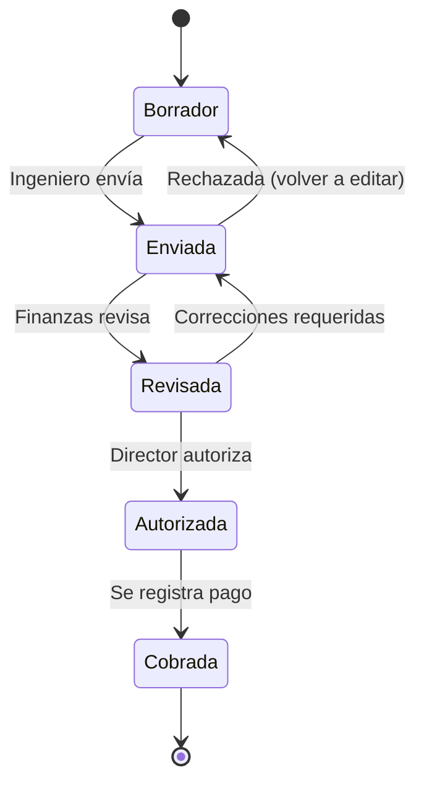

# RF-EST-001: Estimaciones hacia Cliente

**ID:** RF-EST-001  
**Módulo:** MAI-008  
**Prioridad:** Alta  
**Story Points:** 13 SP

---

## 📋 Descripción

Sistema para generar estimaciones de obra ejecutada hacia clientes institucionales (INFONAVIT, fideicomisos, Gobierno) basadas en avances físicos verificados, con cálculo automático de amortizaciones de anticipo y retenciones.

---

## 🎯 Objetivos

1. Generar estimaciones desde avances de obra validados
2. Calcular automáticamente anticipos, amortizaciones y retenciones según contrato
3. Mantener trazabilidad completa entre avances físicos y cobros
4. Workflow de autorización multinivel
5. Generación de documentos oficiales para cliente

---

## 📐 Reglas de Negocio

### RN-EST-001: Cálculo de Monto Bruto

```typescript
montoBruto = Σ (conceptos_ejecutados × precio_unitario)

// Ejemplo para viviendas:
montoBruto = viviendas_terminadas × precio_por_vivienda
```

**Validaciones:**
- Solo conceptos con avance >= umbral_estimacion (default 100%)
- Precios del catálogo vigente del contrato
- Validar que no exceda monto contratado

### RN-EST-002: Amortización de Anticipo

```typescript
// Si hay anticipo pendiente:
porcentaje_amortizacion = configurado_en_contrato  // Ejemplo: 25%
saldo_anticipo = anticipo_inicial - Σ(amortizaciones_previas)

amortizacion_actual = min(
  saldo_anticipo,
  (monto_bruto - acumulado_estimaciones_anteriores) × (porcentaje_amortizacion / 100)
)
```

**Ejemplo:**
- Contrato: $50M, Anticipo 20% = $10M
- Amortización: 25% por estimación
- Estimación 1: $12.5M bruto → Amortiza $2.5M (25% × $10M)
- Estimación 2: $10M bruto → Amortiza $2.5M
- Etc hasta agotar $10M

### RN-EST-003: Retenciones

```typescript
base_retenciones = monto_bruto - amortizacion

retenciones = {
  fondo_garantia: base_retenciones × 0.05,  // 5% típico
  isr: base_retenciones × (tasa_isr / 100) || 0,
  iva_retenido: base_retenciones × (tasa_iva_ret / 100) || 0,
  otras: monto_fijo || 0
}

total_retenciones = Σ(retenciones)
```

**Reglas:**
- Fondo de garantía: Configurable por contrato (típico 5-10%)
- ISR retenido: Solo si aplica según contrato
- IVA retenido: Casos específicos
- Se acumulan hasta finiquito/liberación

### RN-EST-004: Cálculo de Monto Neto

```typescript
monto_neto = monto_bruto - amortizacion_anticipo - total_retenciones
```

**Validaciones:**
- monto_neto >= 0
- Si monto_neto < 0 → Alerta, revisar cálculos

### RN-EST-005: Numeración Consecutiva

```
EST-[PROYECTO]-[TIPO]-[AÑO]-[CONSECUTIVO]

Ejemplos:
- EST-PRJ001-CLI-2025-001  (Primera estimación a cliente)
- EST-PRJ001-CLI-2025-002  (Segunda estimación a cliente)
```

**Reglas:**
- Consecutivo reinicia cada año
- No se saltan números
- Único por proyecto

### RN-EST-006: Validaciones de Negocio

1. **No duplicar conceptos:**
   - Un concepto/vivienda no puede estimarse 2 veces al mismo cliente
   - Validar vs estimaciones anteriores

2. **Límite del contrato:**
   ```typescript
   acumulado_estimaciones + monto_actual <= monto_contrato_total
   ```

3. **Avances verificados:**
   - Solo incluir conceptos con avance validado por residente/supervisor
   - Estado del avance: "verificado" o "autorizado"

4. **Periodo de estimación:**
   - Típico: Mensual, Quincenal
   - No solapar periodos
   - No generar 2 estimaciones del mismo periodo

---

## 🏛️ Estructura de Datos

### Estimación hacia Cliente

```typescript
interface EstimacionCliente {
  id: string;
  numero: string;  // EST-PRJ001-CLI-2025-001
  
  // Relaciones
  proyectoId: string;
  contratoId: string;
  clienteId: string;
  
  // Periodo
  periodoInicio: Date;
  periodoFin: Date;
  numeroEstimacion: number;  // 1, 2, 3...
  
  // Montos
  montoBruto: number;
  amortizacionAnticipo: number;
  totalRetenciones: number;
  montoNeto: number;
  
  // Desglose retenciones
  retencionFondoGarantia: number;
  retencionISR: number;
  retencionIVA: number;
  otrasRetenciones: number;
  
  // Estado
  status: EstimationStatus;  // draft, submitted, authorized, paid
  
  // Fechas
  fechaCreacion: Date;
  fechaEnvio: Date;
  fechaAutorizacion: Date;
  fechaCobro: Date;
  fechaCobroEstimada: Date;
  
  // Workflow
  creadoPor: string;
  autorizadoPor: string;
  observaciones: string;
  
  // Metadata
  documentosPDF: string[];  // URLs
  documentosExcel: string[];
}
```

### Detalle de Partidas

```typescript
interface EstimacionItem {
  id: string;
  estimacionId: string;
  
  // Concepto
  conceptoCatalogoId: string;
  descripcion: string;
  unidad: string;
  precioUnitario: number;
  
  // Cantidades
  cantidadContratada: number;
  cantidadEstimadaAnterior: number;
  cantidadEstimadaActual: number;
  cantidadAcumulada: number;
  porcentajeAvance: number;
  
  // Importes
  importeActual: number;  // cantidad_actual × precio
  importeAcumulado: number;
  
  // Trazabilidad
  avanceObraId: string;  // Link a MAI-005
  verificadoPor: string;
  fechaVerificacion: Date;
}
```

---

## 🔄 Estados del Workflow



**Transiciones:**
- `draft → submitted`: Ingeniero valida y envía
- `submitted → reviewed`: Finanzas valida cálculos
- `reviewed → authorized`: Director autoriza (si >$100K)
- `authorized → paid`: Se registra cobro de cliente

---

## 📊 Casos de Uso

### CU-001: Generar Estimación Mensual de Viviendas

**Actor:** Ingeniero de Proyecto

**Precondiciones:**
- Existe proyecto con contrato vigente
- Hay avances de obra verificados del periodo
- No existe estimación para el mismo periodo

**Flujo:**
1. Ingeniero selecciona proyecto y periodo
2. Sistema carga avances verificados del periodo
3. Sistema identifica viviendas 100% terminadas en el periodo
4. Sistema calcula monto bruto (viviendas × precio)
5. Sistema calcula amortización de anticipo
6. Sistema calcula retenciones
7. Sistema muestra resumen y desglose
8. Ingeniero revisa y confirma
9. Sistema genera estimación en estado "Borrador"

**Postcondiciones:**
- Estimación creada vinculada a avances
- Disponible para revisión

### CU-002: Estimar por Avance de Partidas

**Actor:** Ingeniero

**Precondiciones:**
- Proyecto con catálogo de conceptos
- Avances parciales registrados por partida

**Flujo:**
1. Ingeniero selecciona partidas con avance >= 100%
2. Sistema valida que no estén estimadas previamente
3. Sistema multiplica cantidad × precio unitario
4. Sistema aplica factor de amortización y retenciones
5. Sistema genera detalle item por item
6. Ingeniero ajusta si necesario
7. Sistema guarda borrador

---

## 🧮 Ejemplo Completo

### Contexto
- **Proyecto:** Desarrollo 100 viviendas
- **Contrato:** $50,000,000 MXN
- **Precio unitario:** $500,000/vivienda
- **Anticipo:** 20% = $10,000,000
- **Amortización:** 25% por estimación
- **Retención:** 5% fondo garantía

### Estimación 1

**Avance:** 25 viviendas terminadas (25%)

```
Monto bruto:
  25 viviendas × $500,000 = $12,500,000

Amortización anticipo:
  25% × $10,000,000 = $2,500,000
  Saldo anticipo: $10,000,000 - $2,500,000 = $7,500,000

Base para retenciones:
  $12,500,000 - $2,500,000 = $10,000,000

Retención 5%:
  $10,000,000 × 5% = $500,000
  Acumulado retenciones: $500,000

Monto neto a cobrar:
  $12,500,000 - $2,500,000 - $500,000 = $9,500,000
```

### Estimación 2

**Avance:** 20 viviendas adicionales (20% adicional, 45% acumulado)

```
Monto bruto:
  20 viviendas × $500,000 = $10,000,000

Amortización anticipo:
  Saldo pendiente: $7,500,000
  25% × $7,500,000 = $1,875,000
  Pero: min($1,875,000, $7,500,000) = $1,875,000
  Nuevo saldo: $7,500,000 - $1,875,000 = $5,625,000

Base retenciones:
  $10,000,000 - $1,875,000 = $8,125,000

Retención 5%:
  $8,125,000 × 5% = $406,250
  Acumulado retenciones: $500,000 + $406,250 = $906,250

Monto neto:
  $10,000,000 - $1,875,000 - $406,250 = $7,718,750
```

---

## ✅ Criterios de Aceptación

1. **Cálculos precisos:**
   - Monto bruto = Σ(cantidad × precio)
   - Amortización respeta % configurado
   - Retenciones calculadas sobre base correcta
   - Monto neto = bruto - amortización - retenciones

2. **No duplicidad:**
   - Sistema previene estimar 2 veces el mismo concepto
   - Alerta si vivienda/concepto ya estimado

3. **Trazabilidad:**
   - Cada item vinculado a avance de obra verificado
   - Auditoría completa de quién/cuándo creó/autorizó

4. **Validaciones:**
   - No exceder monto contrato
   - No crear sin avances verificados
   - Numeración consecutiva sin saltos

5. **Performance:**
   - Cálculo de estimación <3 segundos
   - Listar estimaciones con filtros <1 segundo

---

## 🔗 Referencias

- [ET-EST-001: Modelo de datos](../especificaciones/ET-EST-001-modelo-datos.md)
- [ET-EST-002: Cálculo de montos](../especificaciones/ET-EST-002-calculo-montos.md)
- [US-EST-001: Crear estimación a cliente](../historias-usuario/US-EST-001-crear-estimacion-cliente.md)

---

**Generado:** 2025-11-20  
**Estado:** ✅ Completo
