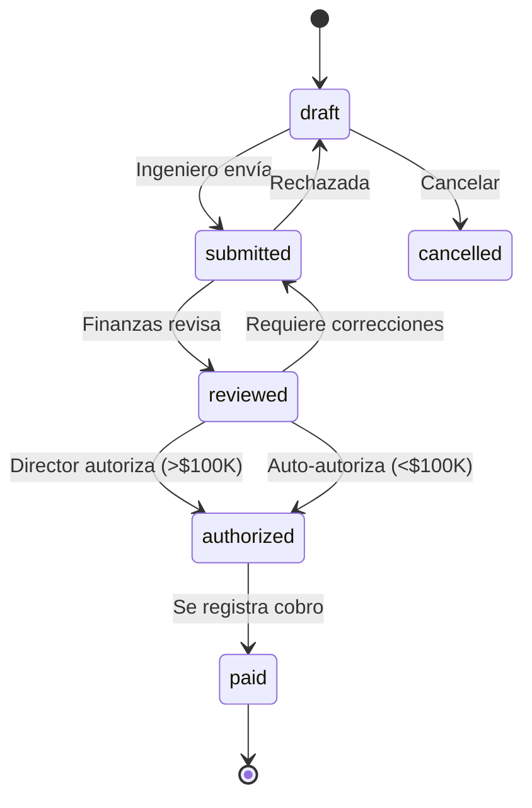
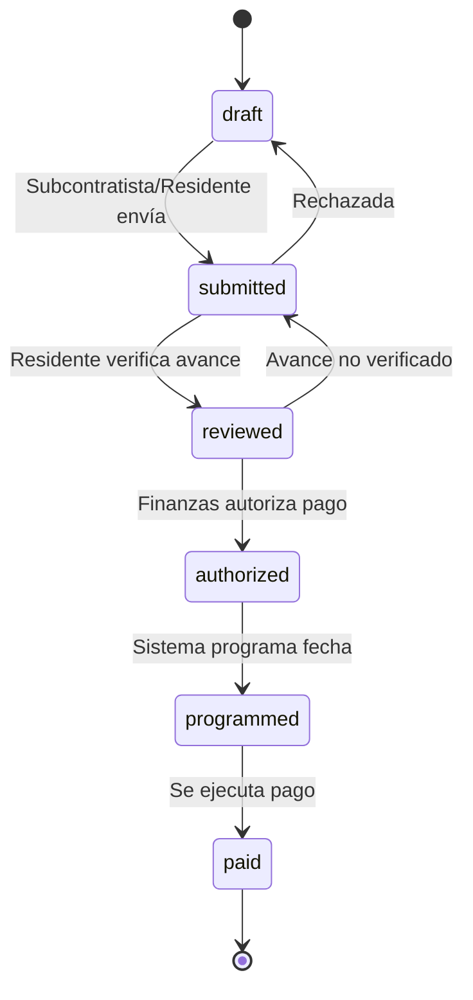

# RF-EST-005: Workflow de Autorización y Estados

**ID:** RF-EST-005  
**Módulo:** MAI-008  
**Prioridad:** Alta  
**Story Points:** 6 SP

---

## 📋 Descripción

Sistema de workflow multinivel para autorización de estimaciones con validaciones por rol, reglas de escalación y trazabilidad completa de aprobaciones/rechazos.

---

## 🎯 Objetivos

1. Workflow diferenciado para estimaciones a cliente vs subcontratistas
2. Validaciones automáticas por monto
3. Notificaciones en cada transición
4. Historial de aprobaciones/rechazos
5. Escalación automática por tiempo

---

## 🔄 Estados y Transiciones

### Estados

```typescript
enum EstimationStatus {
  DRAFT = 'draft',                    // Borrador (editable)
  SUBMITTED = 'submitted',            // Enviada a revisión
  REVIEWED = 'reviewed',              // Revisada (finanzas/ingeniero)
  AUTHORIZED = 'authorized',          // Autorizada para pago/cobro
  PAID = 'paid',                      // Pagada/Cobrada
  REJECTED = 'rejected',              // Rechazada
  CANCELLED = 'cancelled'             // Cancelada
}
```

### Workflow: Estimación a Cliente



**Reglas:**
- `draft → submitted`: Ingeniero con permisos
- `submitted → reviewed`: Finanzas valida cálculos
- `reviewed → authorized`: 
  - Si monto > $100K: Requiere director
  - Si monto <= $100K: Auto-autoriza
- `authorized → paid`: Finanzas registra cobro con referencia

### Workflow: Estimación a Subcontratista



**Reglas:**
- Requiere verificación física por residente
- Finanzas programa fecha de pago
- Pago se ejecuta en fecha programada

---

## 🔐 Validaciones por Rol

### Ingeniero

**Puede:**
- Crear estimaciones a cliente
- Enviar a revisión (draft → submitted)
- Editar borradores

**Validaciones:**
- Avances físicos verificados
- No exceder monto contrato
- Cálculos correctos

### Residente

**Puede:**
- Crear estimaciones a subcontratistas
- Verificar avances físicos
- Aprobar estimaciones <$50K

**Validaciones:**
- Evidencia fotográfica
- Coincidencia avance físico vs reportado

### Finanzas

**Puede:**
- Revisar todas las estimaciones
- Autorizar pagos
- Programar fechas de pago
- Registrar cobros/pagos

**Validaciones:**
- Disponibilidad de flujo de caja
- Documentación completa
- Retenciones correctas

### Director

**Puede:**
- Autorizar estimaciones >$100K
- Ver dashboard global
- Override rechazos

**Validaciones:**
- Aprobación final para montos altos

---

## 📋 Reglas de Autorización

### Por Monto

```typescript
const autorizacion_rules = {
  estimacion_cliente: {
    '<= $100K': ['ingeniero', 'finanzas'],
    '> $100K': ['ingeniero', 'finanzas', 'director']
  },
  estimacion_subcontratista: {
    '<= $50K': ['residente', 'finanzas'],
    '> $50K': ['residente', 'ingeniero', 'finanzas'],
    '> $500K': ['residente', 'ingeniero', 'finanzas', 'director']
  }
}
```

### Por Tipo de Trabajo

**Trabajos extraordinarios:**
- Requiere autorización adicional
- Orden de cambio vinculada
- Director debe aprobar siempre

**Finiquitos:**
- Validación de cumplimiento completo
- Liberación de retenciones
- Firma de ambas partes

---

## ⏱️ Escalación Automática

### Reglas de Tiempo

```typescript
const escalacion = {
  estimacion_en_submitted: {
    despues_de: '24 horas',
    accion: 'Notificar a supervisor de finanzas',
    critica_despues_de: '48 horas',
    accion_critica: 'Escalar a director + alerta SMS'
  },
  estimacion_en_reviewed: {
    despues_de: '12 horas',
    accion: 'Recordatorio a director',
    critica_despues_de: '24 horas',
    accion_critica: 'Alerta urgente + email CEO'
  }
}
```

### Notificaciones

**Al crear:**
- Email a residente/ingeniero confirmando creación

**Al enviar:**
- Email + notificación in-app a revisor
- Enlace directo a estimación

**Al revisar:**
- Notificación a quien sigue en workflow

**Al autorizar:**
- Email a finanzas para programar pago/cobro
- Si es a subcontratista: Notificar fecha programada

**Al pagar:**
- Email con comprobante
- Actualizar dashboard

---

## 📊 Historial de Aprobaciones

### Estructura

```typescript
interface ApprovalHistory {
  estimacionId: string;
  transiciones: {
    de: EstimationStatus;
    a: EstimationStatus;
    timestamp: Date;
    usuarioId: string;
    usuarioNombre: string;
    rol: string;
    comentario?: string;
    razonRechazo?: string;
    tiempoRespuesta: number;  // minutos
  }[];
}
```

### Ejemplo

```
EST-001: Timeline de Aprobaciones

2025-11-20 10:00 - Creada por Juan Pérez (Ingeniero)
2025-11-20 10:30 - Enviada a revisión
2025-11-20 14:15 - Revisada por María López (Finanzas)
  Comentario: "Cálculos validados. Procede."
2025-11-20 15:45 - Autorizada por Carlos Ruiz (Director)
  Monto: $9,500,000 (requería autorización director)
2025-11-22 09:00 - Pagada
  Ref: TRANSF-20251122-001

Tiempo total: 46.5 horas
```

---

## 🔔 Alertas y Recordatorios

### Alertas Críticas

```typescript
const alertas_criticas = [
  {
    condicion: 'Estimación >$100K sin autorizar > 48h',
    destinatarios: ['director', 'cfo'],
    canal: ['email', 'sms'],
    prioridad: 'alta'
  },
  {
    condicion: 'Pago a subcontratista vencido',
    destinatarios: ['finanzas', 'director'],
    canal: ['email', 'notificacion_app'],
    prioridad: 'urgente'
  },
  {
    condicion: 'Estimación rechazada 2 veces',
    destinatarios: ['ingeniero', 'director'],
    canal: ['email'],
    prioridad: 'media'
  }
]
```

### Dashboard de Aprobaciones Pendientes

**Vista para Finanzas:**
```
Estimaciones Pendientes de Revisar:

🔴 EST-PRJ001-001  |  $9.5M  |  Cliente  |  Hace 28h  [Revisar]
🟡 EST-PRJ002-003  |  $2.1M  |  Cliente  |  Hace 8h   [Revisar]
🟢 EST-PRJ001-SUB-01 | $573K | Sub-PLOM | Hace 2h   [Revisar]
```

---

## ✅ Criterios de Aceptación

1. **Workflow estricto:**
   - No saltar estados sin autorización
   - Validar permisos en cada transición
   - Log completo de cambios

2. **Notificaciones:**
   - 100% enviadas en cada transición
   - Enlace directo a estimación
   - Resumen ejecutivo en email

3. **Escalación:**
   - Automática según reglas de tiempo
   - Alertas críticas por SMS
   - Dashboard de pendientes actualizado

4. **Historial:**
   - Inmutable (no se puede borrar)
   - Incluye timestamp y usuario
   - Razones de rechazo registradas

5. **Performance:**
   - Transición de estado <500ms
   - Notificaciones enviadas <5 segundos
   - Dashboard carga <1 segundo

---

## 🔗 Referencias

- [ET-EST-005: Workflow de estados](../especificaciones/ET-EST-005-workflow-estados.md)
- [US-EST-007: Workflow de autorización](../historias-usuario/US-EST-007-workflow-autorizacion.md)

---

**Generado:** 2025-11-20  
**Estado:** ✅ Completo
