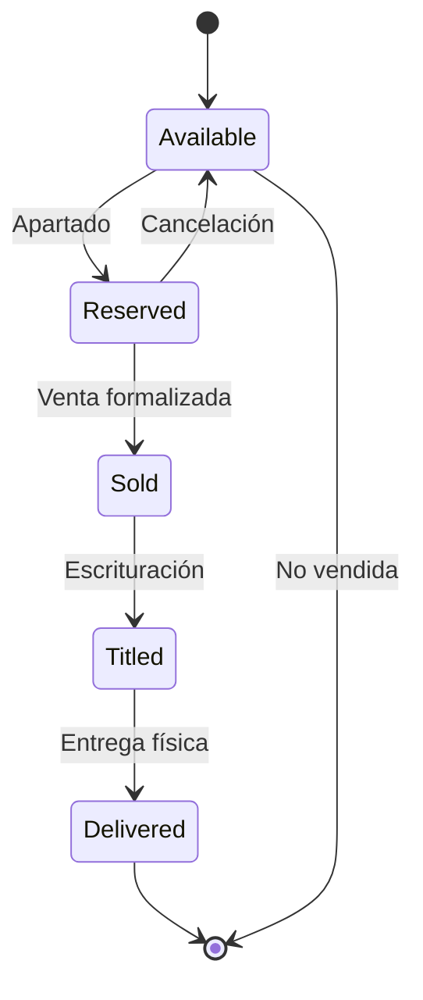

# _MAP: MAI-010 - CRM de Derechohabientes y Comercialización

**Épica:** MAI-010
**Nombre:** CRM de Derechohabientes y Comercialización
**Fase:** 1 - Alcance Inicial
**Presupuesto:** $25,000 MXN
**Story Points:** 35 SP
**Estado:** 📝 A crear
**Sprint:** Sprint 6 (Semanas 11-12)
**Última actualización:** 2025-11-17
**Prioridad:** P2

---

## 📋 Propósito

Gestión completa de derechohabientes/compradores y proceso de comercialización:
- Registro de derechohabientes/prospectos
- Estatus de cada vivienda: disponible, apartada, vendida, escriturada, entregada
- Seguimiento de expediente del crédito (documentos, avances, citas)
- Comunicación por WhatsApp/email con compradores
- Dashboard de comercialización y pipeline de ventas

**Integración clave:** Se vincula con Proyectos (MAI-002), Calidad/Postventa (MAI-009), INFONAVIT (MAI-011) y Contratos (MAI-012).

---

## 📁 Contenido

### Requerimientos Funcionales (Estimados: 5)

| ID | Título | Estado |
|----|--------|--------|
| RF-CRM-001 | Gestión de prospectos y derechohabientes | 📝 A crear |
| RF-CRM-002 | Control de estatus de viviendas y asignaciones | 📝 A crear |
| RF-CRM-003 | Seguimiento de expediente de crédito | 📝 A crear |
| RF-CRM-004 | Comunicación multicanal con clientes | 📝 A crear |
| RF-CRM-005 | Dashboard de comercialización y reportes | 📝 A crear |

### Especificaciones Técnicas (Estimadas: 5)

| ID | Título | RF | Estado |
|----|--------|----|--------|
| ET-CRM-001 | Modelo de datos de clientes y pipeline | RF-CRM-001 | 📝 A crear |
| ET-CRM-002 | Sistema de estados de vivienda y reservaciones | RF-CRM-002 | 📝 A crear |
| ET-CRM-003 | Gestión de documentos y checklist de crédito | RF-CRM-003 | 📝 A crear |
| ET-CRM-004 | Integración con WhatsApp y email | RF-CRM-004 | 📝 A crear |
| ET-CRM-005 | Analytics de ventas y embudo de conversión | RF-CRM-005 | 📝 A crear |

### Historias de Usuario (Estimadas: 7)

| ID | Título | SP | Estado |
|----|--------|----|--------|
| US-CRM-001 | Registrar prospecto desde formulario web | 5 | 📝 A crear |
| US-CRM-002 | Asignar vivienda a derechohabiente | 5 | 📝 A crear |
| US-CRM-003 | Dar seguimiento a expediente de crédito | 5 | 📝 A crear |
| US-CRM-004 | Enviar notificaciones por WhatsApp | 5 | 📝 A crear |
| US-CRM-005 | Programar y registrar citas con clientes | 5 | 📝 A crear |
| US-CRM-006 | Dashboard de comercialización y ventas | 5 | 📝 A crear |
| US-CRM-007 | Generar reporte de ventas por proyecto | 5 | 📝 A crear |

**Total Story Points:** 35 SP

### Implementación

📊 **Inventarios de trazabilidad:**
- [TRACEABILITY.yml](./implementacion/TRACEABILITY.yml) - Matriz completa de trazabilidad
- [DATABASE.yml](./implementacion/DATABASE.yml) - Objetos de base de datos
- [BACKEND.yml](./implementacion/BACKEND.yml) - Módulos backend
- [FRONTEND.yml](./implementacion/FRONTEND.yml) - Componentes frontend

### Pruebas

📋 Documentación de testing:
- [TEST-PLAN.md](./pruebas/TEST-PLAN.md) - Plan de pruebas
- [TEST-CASES.md](./pruebas/TEST-CASES.md) - Casos de prueba

---

## 🔗 Referencias

- **README:** [README.md](./README.md) - Descripción detallada de la épica
- **Fase 1:** [../README.md](../README.md) - Información de la fase completa
- **Módulo relacionado MVP:** Módulo 10 - CRM de Derechohabientes (MVP-APP.md)

---

## 📊 Métricas

| Métrica | Valor |
|---------|-------|
| **Presupuesto estimado** | $25,000 MXN |
| **Story Points estimados** | 35 SP |
| **Duración estimada** | 7 días |
| **Reutilización GAMILIT** | 30% (CRM básico, notificaciones) |
| **RF a implementar** | 5/5 |
| **ET a implementar** | 5/5 |
| **US a completar** | 7/7 |

---

## 🎯 Módulos Afectados

### Base de Datos
- **Schema:** `crm`, `sales`
- **Tablas principales:**
  * `prospects` - Prospectos/leads
  * `clients` - Derechohabientes/clientes
  * `unit_assignments` - Asignación de viviendas a clientes
  * `credit_files` - Expedientes de crédito
  * `credit_documents` - Documentos del expediente
  * `appointments` - Citas con clientes
  * `communications` - Historial de comunicaciones
  * `sales_pipeline` - Pipeline de ventas
- **ENUMs:**
  * `prospect_source` (web, referral, event, social_media, infonavit_portal)
  * `prospect_status` (new, contacted, qualified, lost, converted)
  * `unit_status` (available, reserved, sold, titled, delivered, cancelled)
  * `credit_status` (pre_approval, document_collection, under_review, approved, rejected, disbursed)
  * `appointment_type` (first_visit, document_review, signature, delivery)
  * `communication_channel` (whatsapp, email, sms, phone, in_person)

### Backend
- **Módulo:** `crm`, `sales`
- **Path:** `apps/backend/src/modules/crm/`
- **Services:** ProspectService, ClientService, CreditFileService, AppointmentService, CommunicationService, WhatsAppService
- **Controllers:** CRMController, SalesController, CreditFileController
- **Middlewares:** ClientAccessGuard, DataPrivacyMiddleware

### Frontend
- **Features:** `crm`, `sales`, `clients`
- **Path:** `apps/frontend/src/features/crm/`
- **Componentes:**
  * ProspectList
  * ProspectForm (lead capture)
  * ClientProfile
  * UnitSelector (disponibilidad de viviendas)
  * CreditFileManager
  * DocumentChecklistViewer
  * AppointmentScheduler
  * CommunicationHistory
  * SalesPipeline (Kanban view)
  * SalesDashboard
- **Stores:** crmStore, clientStore, salesStore

---

## 🏠 Gestión de Viviendas

### Estados de Vivienda



| Estado | Descripción | Duración típica | Acciones permitidas |
|--------|-------------|-----------------|---------------------|
| **Disponible** | Vivienda lista para venta | - | Asignar a cliente, mostrar en portal |
| **Apartada** | Cliente pagó apartado | 15-30 días | Confirmar venta, cancelar apartado |
| **Vendida** | Contrato de compraventa firmado | 30-60 días | Iniciar trámite de crédito |
| **Escriturada** | Escritura firmada ante notario | 7-15 días | Programar entrega |
| **Entregada** | Entrega física al cliente | - | Activar postventa |
| **Cancelada** | Venta cancelada | - | Liberar vivienda |

---

### Información de Vivienda

```yaml
unit:
  id: "UNIT-A-12"
  project_id: "PROJ-001"
  stage: "Etapa 1"
  block: "Manzana A"
  lot: "Lote 12"
  prototype: "Tipo A - 2 recámaras"
  area: 42.5  # m² construidos
  price: 580000.00  # Precio de lista
  status: "sold"

  assignment:
    client_id: "CLIENT-456"
    reserved_date: "2025-09-15"
    down_payment_amount: 5000.00
    sold_date: "2025-10-01"
    sale_price: 575000.00  # Precio negociado
    financing_type: "infonavit"
    credit_number: "INF-2025-123456"

  timeline:
    - date: "2025-09-15"
      event: "Apartado"
      notes: "Cliente pagó $5,000 de apartado"

    - date: "2025-10-01"
      event: "Venta formalizada"
      notes: "Contrato firmado, precio $575,000"

    - date: "2025-10-15"
      event: "Trámite de crédito iniciado"
      notes: "Expediente enviado a INFONAVIT"

    - date: "2025-11-10"
      event: "Crédito aprobado"
      notes: "Monto aprobado: $575,000"

    - date: "2025-11-20"
      event: "Escrituración"
      notes: "Escritura firmada ante notario"
      expected: true

    - date: "2025-12-01"
      event: "Entrega programada"
      expected: true
```

---

## 👥 Gestión de Prospectos y Clientes

### Pipeline de Ventas

```
LEADS (Prospectos)
  ↓
CONTACTADOS
  ↓
CALIFICADOS
  ↓
INTERESADOS
  ↓
APARTADO
  ↓
VENTA FORMALIZADA
  ↓
CRÉDITO APROBADO
  ↓
ESCRITURADO
  ↓
ENTREGADO
```

### Fuentes de Prospectos

| Fuente | Descripción | Calidad típica | Conversión |
|--------|-------------|----------------|------------|
| **Portal web** | Formulario de contacto en sitio web | Media | 10-15% |
| **INFONAVIT** | Portal Mi Cuenta INFONAVIT | Alta | 25-30% |
| **Eventos** | Expos de vivienda, ferias | Media-Alta | 15-20% |
| **Referidos** | Clientes actuales refieren conocidos | Muy Alta | 40-50% |
| **Redes sociales** | Facebook, Instagram ads | Baja-Media | 5-10% |
| **Call center** | Llamadas salientes | Baja | 3-5% |

---

### Ficha de Cliente

```yaml
client:
  id: "CLIENT-456"
  personal_info:
    first_name: "María"
    last_name: "González Hernández"
    email: "maria.gonzalez@email.com"
    phone: "+52 442 123 4567"
    birth_date: "1988-05-15"
    curp: "GOHM880515MQTNRR02"
    rfc: "GOHM880515XX1"
    marital_status: "married"
    dependents: 2

  employment:
    company: "Empresa XYZ SA de CV"
    position: "Administradora"
    monthly_income: 18000.00
    employment_years: 5
    infonavit_number: "1234567890"
    infonavit_points: 1250

  address:
    current_street: "Av. Principal 123"
    current_city: "Querétaro"
    current_state: "Querétaro"
    current_zip: "76000"

  origin:
    source: "infonavit_portal"
    campaign: "Campaña INFONAVIT Q4 2025"
    captured_date: "2025-09-01"
    captured_by: "Asesora Comercial: Laura Martínez"

  status:
    current: "sold"
    qualification_score: 85  # Puntaje de calificación (0-100)
    interested_in: ["Tipo A - 2 rec", "Tipo B - 3 rec"]
    budget: 600000.00
    financing_type: "infonavit"
    timeline: "3_months"  # Plazo esperado para compra
```

---

## 📋 Expediente de Crédito

### Checklist de Documentos

| Documento | Requerido por | Estatus | Archivo | Validado |
|-----------|---------------|---------|---------|----------|
| **INE (ambos lados)** | INFONAVIT | ✅ Recibido | `DOC-001.pdf` | Sí |
| **CURP** | INFONAVIT | ✅ Recibido | `DOC-002.pdf` | Sí |
| **Comprobante de domicilio** | INFONAVIT | ✅ Recibido | `DOC-003.pdf` | Sí |
| **Acta de matrimonio** | INFONAVIT | ⏳ Pendiente | - | - |
| **Actas de nacimiento de dependientes** | INFONAVIT | ⏳ Pendiente | - | - |
| **Constancia de percepciones** | INFONAVIT | ✅ Recibido | `DOC-006.pdf` | Sí |
| **Estados de cuenta bancarios (3 meses)** | Notaría | ✅ Recibido | `DOC-007.pdf` | Sí |
| **Solicitud de crédito firmada** | INFONAVIT | ✅ Recibido | `DOC-008.pdf` | Sí |

**Completitud:** 62.5% (5 de 8 documentos)

---

### Flujo de Trámite de Crédito

#### 1. Pre-calificación (Día 1)

**Objetivo:** Verificar que el cliente tiene puntos y capacidad de pago

- Verificación en portal INFONAVIT:
  * Puntos acumulados: ✅ 1,250 pts (mínimo 1,080)
  * Monto pre-aprobado: ✅ $600,000 (vivienda: $575,000)
  * Edad: ✅ 37 años (máximo 64)
  * Sin crédito INFONAVIT previo: ✅

**Resultado:** ✅ PRE-APROBADO

---

#### 2. Integración de Expediente (Días 2-15)

**Responsable:** Asesor comercial + cliente

**Actividades:**
- Solicitud de documentos al cliente
- Carga de documentos en sistema
- Validación de documentos:
  * Vigencia (no mayor a 3 meses)
  * Legibilidad
  * Coincidencia de datos
- Seguimiento diario hasta completar 100%

**Herramientas:**
- Portal del cliente (puede subir documentos)
- WhatsApp (recordatorios automáticos)
- Email (checklist de documentos faltantes)

---

#### 3. Envío a INFONAVIT (Día 16)

**Responsable:** Coordinador de créditos

**Actividades:**
- Validación final de expediente completo
- Llenado de formatos oficiales
- Carga en portal INFONAVIT
- Generación de folio de trámite

**Resultado:** Folio `INF-2025-123456` generado

---

#### 4. Evaluación INFONAVIT (Días 17-30)

**Responsable:** INFONAVIT

**Proceso:**
- Validación de documentos
- Verificación de empleo
- Evaluación crediticia
- Valuación de vivienda
- Emisión de dictamen

**Estados posibles:**
- ✅ **Aprobado:** Monto autorizado, continuar a firma
- ⚠️ **Información adicional requerida:** Solicitar aclaraciones
- ❌ **Rechazado:** No cumple requisitos

**Seguimiento:** Consulta diaria de estatus en portal

---

#### 5. Formalización (Días 31-40)

**Actividades:**
- Firma de contrato de compraventa
- Firma de contrato de crédito INFONAVIT
- Pago de gastos notariales
- Firma de escritura ante notario

**Documentos generados:**
- Contrato de compraventa
- Escritura pública
- Póliza de garantía

---

#### 6. Dispersión de Crédito (Días 41-45)

**Proceso:**
- INFONAVIT transfiere monto a cuenta del vendedor
- Constructora confirma recepción de pago
- Actualización de estatus de vivienda: `titled`

---

#### 7. Entrega de Vivienda (Días 46-60)

**Actividades:**
- Programación de entrega
- Inspección final con cliente
- Firma de acta de entrega-recepción
- Entrega de llaves y documentos
- Actualización de estatus: `delivered`

**Módulo:** Vincula con MAI-009 (Calidad/Postventa)

---

## 💬 Comunicación con Clientes

### Canales de Comunicación

| Canal | Uso principal | Ventajas | Automatización |
|-------|---------------|----------|----------------|
| **WhatsApp** | Recordatorios, actualizaciones rápidas | Alto engagement, respuestas rápidas | Templates, mensajes programados |
| **Email** | Documentos formales, reportes | Trazabilidad, adjuntos | Workflows automáticos |
| **SMS** | Alertas urgentes | Alta tasa de lectura | Notificaciones automáticas |
| **Teléfono** | Consultas complejas, negociación | Contacto personal | Click-to-call desde CRM |
| **Portal web** | Self-service, seguimiento | 24/7 disponible | Notificaciones en app |

---

### Templates de WhatsApp

#### 1. Bienvenida a Prospecto

```
¡Hola {{first_name}}! 👋

Gracias por tu interés en {{project_name}}.

Soy {{advisor_name}}, tu asesora comercial. Estoy aquí para ayudarte a encontrar tu hogar ideal.

📍 Ubicación: {{project_location}}
🏠 Desde: ${{min_price}} MXN
📅 ¿Te gustaría agendar una visita?

Responde SÍ y te compartiremos los horarios disponibles.
```

---

#### 2. Recordatorio de Documentos Pendientes

```
Hola {{first_name}}, 📄

Para continuar con tu trámite de crédito nos faltan los siguientes documentos:

{{missing_documents_list}}

Puedes subirlos desde nuestro portal:
{{client_portal_link}}

O enviarlos por WhatsApp como foto o PDF.

¿Tienes alguna duda? Estoy para ayudarte 😊
```

---

#### 3. Actualización de Estatus de Crédito

```
¡Excelentes noticias {{first_name}}! 🎉

Tu crédito INFONAVIT ha sido *APROBADO* ✅

Monto autorizado: ${{approved_amount}} MXN
Folio: {{credit_number}}

Próximos pasos:
1️⃣ Firma de contrato ({{appointment_date}})
2️⃣ Trámite de escrituración
3️⃣ Entrega de tu vivienda

¿Confirmas tu asistencia a la cita?
```

---

#### 4. Recordatorio de Cita

```
Hola {{first_name}}, 📅

Te recordamos tu cita para {{appointment_type}}:

📍 Lugar: {{location}}
🕐 Fecha: {{date}} a las {{time}}
👤 Con: {{advisor_name}}

Documentos a traer:
{{documents_list}}

¿Confirmas tu asistencia?

Para reprogramar, responde CAMBIAR CITA.
```

---

### Automatizaciones

**Workflows automáticos:**

1. **Nuevo prospecto:**
   - Envío de WhatsApp de bienvenida (inmediato)
   - Email con brochure del proyecto (+2 horas)
   - Asignación a asesor comercial (+1 día)

2. **Documentos pendientes:**
   - Recordatorio WhatsApp (+3 días sin subir documentos)
   - Recordatorio email (+7 días)
   - Escalamiento a coordinador (+10 días)

3. **Crédito aprobado:**
   - Notificación WhatsApp (inmediato)
   - Email formal con detalles (+30 min)
   - SMS de confirmación (+1 hora)

4. **Próxima a entrega:**
   - Email con checklist de entrega (-7 días)
   - WhatsApp confirmación de fecha (-3 días)
   - SMS recordatorio (-1 día)

---

## 📊 Dashboard de Comercialización

### KPIs Principales

| Métrica | Descripción | Cálculo | Meta |
|---------|-------------|---------|------|
| **Tasa de conversión** | % de prospectos que compran | (Ventas / Prospectos) × 100 | >15% |
| **Velocidad de ventas** | Viviendas vendidas por mes | Σ Ventas / Meses | Según inventario |
| **Tiempo promedio de cierre** | Días desde contacto hasta venta | Avg(Fecha venta - Fecha contacto) | <60 días |
| **Viviendas disponibles** | Inventario sin vender | Count(status=available) | Controlar rotación |
| **Viviendas apartadas** | En proceso de venta | Count(status=reserved) | Monitorear expiración |
| **Pipeline value** | Valor potencial de ventas | Σ (Precio × Probabilidad) | - |
| **Satisfacción del cliente** | NPS o CSAT | Encuestas post-venta | >4.5/5 |

---

### Embudo de Ventas

```
PROSPECTOS (500)
    ↓ 40% conversión
CONTACTADOS (200)
    ↓ 50% conversión
CALIFICADOS (100)
    ↓ 40% conversión
APARTADOS (40)
    ↓ 75% conversión
VENTAS (30)
    ↓ 95% conversión
ENTREGADOS (28)

Tasa de conversión final: 5.6% (28/500)
```

---

### Reportes

1. **Reporte semanal de ventas:**
   - Ventas de la semana por proyecto
   - Comparativo vs semana anterior
   - Proyección para mes

2. **Reporte de inventario:**
   - Disponibles por proyecto/etapa
   - Apartados próximos a expirar
   - Viviendas listas para entrega

3. **Reporte de pipeline:**
   - Prospectos por etapa
   - Valor potencial por etapa
   - Acciones pendientes

4. **Reporte de asesores:**
   - Ventas por asesor
   - Prospectos asignados
   - Tasa de conversión individual

---

## 💡 Casos de Uso Clave

### Prospecto desde Portal Web

**Flujo:**

1. **Captura (Día 1, 10:00 AM):**
   - Prospecto llena formulario en sitio web
   - Sistema crea registro automáticamente
   - WhatsApp automático de bienvenida (+5 min)
   - Email con brochure (+2 horas)
   - Asignación automática a asesor de turno

2. **Contacto inicial (Día 1, 2:00 PM):**
   - Asesor llama al prospecto
   - Calificación inicial (presupuesto, puntos INFONAVIT, timeline)
   - Agendamiento de visita al proyecto

3. **Visita (Día 5):**
   - Recorrido por proyecto y vivienda muestra
   - Explicación de proceso de compra
   - Cotización personalizada

4. **Seguimiento (Días 6-20):**
   - Mensajes WhatsApp con información adicional
   - Envío de cotización formal
   - Resolución de dudas

5. **Cierre (Día 25):**
   - Cliente decide apartareservar vivienda
   - Pago de apartado
   - Inicio de trámite de crédito

---

### Venta con Crédito INFONAVIT

**Resumen de timeline típico:**

| Hito | Día | Responsable |
|------|-----|-------------|
| Contacto inicial | 1 | Asesor |
| Primera visita | 5 | Asesor |
| Apartado | 25 | Asesor |
| Expediente completo | 40 | Asesor + Cliente |
| Envío a INFONAVIT | 41 | Coordinador |
| Crédito aprobado | 55 | INFONAVIT |
| Firma de contrato | 60 | Asesor + Notario |
| Escrituración | 75 | Notario |
| Entrega de vivienda | 90 | Postventa |

**Total: 90 días desde primer contacto hasta entrega**

---

## 🚨 Puntos Críticos

1. **Calificación temprana:** No invertir tiempo en prospectos sin capacidad de compra
2. **Seguimiento constante:** Prospectos sin contacto por >7 días se enfrían
3. **Expedientes completos:** Documentos incompletos retrasan aprobación de crédito
4. **Apartados sin avance:** Liberar viviendas si apartado expira
5. **Comunicación clara:** Cliente debe saber en qué etapa está y qué sigue
6. **Portal del cliente:** Self-service reduce carga operativa
7. **Integración con INFONAVIT:** Consulta automática de puntos y estatus

---

## 🎯 Siguiente Paso

Crear documentación de requerimientos y especificaciones técnicas del módulo.

---

**Generado:** 2025-11-17
**Mantenedores:** @tech-lead @backend-team @frontend-team @sales-team
**Estado:** 📝 A crear
