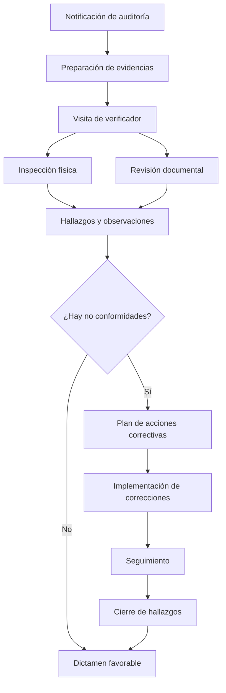

# _MAP: MAI-011 - INFONAVIT & Cumplimiento

**Épica:** MAI-011
**Nombre:** INFONAVIT & Cumplimiento
**Fase:** 1 - Alcance Inicial
**Presupuesto:** $25,000 MXN
**Story Points:** 40 SP
**Estado:** 📝 A crear
**Sprint:** Sprint 6 (Semanas 11-12)
**Última actualización:** 2025-11-17
**Prioridad:** P1

---

## 📋 Propósito

Gestión de cumplimiento normativo y requisitos específicos de INFONAVIT y otros organismos:
- Registro del proyecto bajo programas específicos de INFONAVIT
- Checklists de requisitos técnicos, urbanos y de servicios
- Evidencias documentales, fotográficas y de auditorías
- Reportes para verificadores/auditores externos
- Seguimiento de certificaciones y normativas

**Integración clave:** Se vincula con Proyectos (MAI-002), Calidad (MAI-009), Gestión Documental (MAE-016) y CRM (MAI-010).

---

## 📁 Contenido

### Requerimientos Funcionales (Estimados: 5)

| ID | Título | Estado |
|----|--------|--------|
| RF-INF-001 | Registro de proyecto bajo programas INFONAVIT | 📝 A crear |
| RF-INF-002 | Checklists de cumplimiento normativo y técnico | 📝 A crear |
| RF-INF-003 | Gestión de evidencias y documentación | 📝 A crear |
| RF-INF-004 | Seguimiento de auditorías y verificaciones | 📝 A crear |
| RF-INF-005 | Reportes de cumplimiento para organismos | 📝 A crear |

### Especificaciones Técnicas (Estimadas: 5)

| ID | Título | RF | Estado |
|----|--------|----|--------|
| ET-INF-001 | Modelo de datos de programas y requisitos | RF-INF-001 | 📝 A crear |
| ET-INF-002 | Sistema de checklists dinámicos | RF-INF-002 | 📝 A crear |
| ET-INF-003 | Repositorio de evidencias vinculado a requisitos | RF-INF-003 | 📝 A crear |
| ET-INF-004 | Workflow de auditorías y observaciones | RF-INF-004 | 📝 A crear |
| ET-INF-005 | Generación automática de reportes | RF-INF-005 | 📝 A crear |

### Historias de Usuario (Estimadas: 8)

| ID | Título | SP | Estado |
|----|--------|----|--------|
| US-INF-001 | Registrar proyecto bajo programa INFONAVIT | 5 | 📝 A crear |
| US-INF-002 | Configurar checklist de requisitos aplicables | 5 | 📝 A crear |
| US-INF-003 | Cargar evidencias por requisito | 5 | 📝 A crear |
| US-INF-004 | Registrar visita de verificador | 5 | 📝 A crear |
| US-INF-005 | Gestionar observaciones y acciones correctivas | 5 | 📝 A crear |
| US-INF-006 | Generar reporte de cumplimiento | 5 | 📝 A crear |
| US-INF-007 | Dashboard de estatus de cumplimiento | 5 | 📝 A crear |
| US-INF-008 | Exportar paquete de evidencias para auditoría | 5 | 📝 A crear |

**Total Story Points:** 40 SP

### Implementación

📊 **Inventarios de trazabilidad:**
- [TRACEABILITY.yml](./implementacion/TRACEABILITY.yml) - Matriz completa de trazabilidad
- [DATABASE.yml](./implementacion/DATABASE.yml) - Objetos de base de datos
- [BACKEND.yml](./implementacion/BACKEND.yml) - Módulos backend
- [FRONTEND.yml](./implementacion/FRONTEND.yml) - Componentes frontend

### Pruebas

📋 Documentación de testing:
- [TEST-PLAN.md](./pruebas/TEST-PLAN.md) - Plan de pruebas
- [TEST-CASES.md](./pruebas/TEST-CASES.md) - Casos de prueba

---

## 🔗 Referencias

- **README:** [README.md](./README.md) - Descripción detallada de la épica
- **Fase 1:** [../README.md](../README.md) - Información de la fase completa
- **Módulo relacionado MVP:** Módulo 11 - INFONAVIT & Cumplimiento (MVP-APP.md)

---

## 📊 Métricas

| Métrica | Valor |
|---------|-------|
| **Presupuesto estimado** | $25,000 MXN |
| **Story Points estimados** | 40 SP |
| **Duración estimada** | 8 días |
| **Reutilización GAMILIT** | 25% (checklists y evidencias similares) |
| **RF a implementar** | 5/5 |
| **ET a implementar** | 5/5 |
| **US a completar** | 8/8 |

---

## 🎯 Módulos Afectados

### Base de Datos
- **Schema:** `compliance`
- **Tablas principales:**
  * `infonavit_programs` - Programas INFONAVIT (EVC, tradicional, etc.)
  * `project_compliance` - Relación proyecto-programa
  * `compliance_requirements` - Requisitos por programa
  * `compliance_checklists` - Checklists de cumplimiento
  * `compliance_evidence` - Evidencias documentales
  * `audits` - Auditorías y verificaciones
  * `audit_findings` - Hallazgos y observaciones
  * `corrective_actions` - Acciones correctivas
- **ENUMs:**
  * `program_type` (evc, traditional, cofinavit, infonavit_total)
  * `requirement_category` (technical, urban, services, legal, environmental)
  * `requirement_status` (pending, in_progress, compliant, non_compliant, not_applicable)
  * `audit_type` (initial, progress, final, special, random)
  * `audit_status` (scheduled, in_progress, completed, follow_up)
  * `finding_severity` (minor, major, critical)

### Backend
- **Módulo:** `compliance`, `infonavit`
- **Path:** `apps/backend/src/modules/compliance/`
- **Services:** ComplianceService, AuditService, EvidenceService, InfonavitIntegrationService
- **Controllers:** ComplianceController, AuditController, ReportController
- **Middlewares:** ComplianceAccessGuard, AuditTrailMiddleware

### Frontend
- **Features:** `compliance`, `infonavit`, `audits`
- **Path:** `apps/frontend/src/features/compliance/`
- **Componentes:**
  * ProgramSelector
  * ComplianceChecklist
  * EvidenceUploader
  * AuditScheduler
  * AuditReportViewer
  * FindingsManager
  * CorrectiveActionTracker
  * ComplianceDashboard
  * ReportGenerator
- **Stores:** complianceStore, auditStore, evidenceStore

---

## 🏢 Programas INFONAVIT

### Tipos de Programas

| Programa | Descripción | Características | Requisitos especiales |
|----------|-------------|-----------------|----------------------|
| **EVC** | Esquemas de Valor Compartido | Vivienda nueva o usada con mejoras | Certificación de calidad, sustentabilidad |
| **Tradicional** | Crédito tradicional | Vivienda nueva | Cumplimiento básico de normativa |
| **Cofinavit** | Crédito mixto INFONAVIT + bancario | Vivienda nueva o usada | Evaluación dual |
| **INFONAVIT Total** | Crédito con subsidio | Vivienda económica | Requisitos adicionales de subsidio |
| **Apoyo INFONAVIT** | Solo subsidio (sin crédito) | Vivienda mínima | Estándares mínimos |

---

## ✅ Categorías de Requisitos

### 1. Requisitos Técnicos

**Categoría:** Diseño y construcción de vivienda

- **Superficies mínimas:**
  * Superficie construida mínima (38-58 m² según tipo)
  * Superficie de recámaras (7 m² mínimo)
  * Altura mínima de entrepisos (2.30-2.50 m)
  * Dimensiones de vanos y puertas

- **Instalaciones:**
  * Sistema eléctrico (CFE, centro de carga)
  * Sistema hidráulico (tomas, tinaco, boiler)
  * Sistema sanitario (drenaje, fosas, registros)
  * Gas (instalación certificada)

- **Acabados:**
  * Pisos (firme, loseta, según programa)
  * Muros (aplanado, pintura)
  * Cancelería (ventanas, puertas)
  * Muebles de cocina y baño

- **Estructural:**
  * Cimentación adecuada al tipo de suelo
  * Estructura sismorresistente
  * Materiales certificados
  * Normas técnicas complementarias (NTC)

**Evidencias requeridas:**
- Planos arquitectónicos
- Planos de instalaciones
- Memorias de cálculo estructural
- Especificaciones técnicas
- Bitácora de obra
- Pruebas de laboratorio

---

### 2. Requisitos Urbanos

**Categoría:** Ubicación e infraestructura urbana

- **Ubicación:**
  * Distancia a fuentes de empleo (<30 km)
  * Distancia a servicios (escuelas, salud, comercio)
  * Accesibilidad (transporte público)
  * Uso de suelo habitacional

- **Infraestructura:**
  * Red de agua potable (toma domiciliaria)
  * Red de drenaje sanitario
  * Red eléctrica (acometida CFE)
  * Alumbrado público
  * Pavimentación
  * Banquetas y guarniciones

- **Servicios:**
  * Recolección de basura
  * Seguridad pública (policía)
  * Transporte público (a menos de 500 m)

- **Equipamiento:**
  * Áreas verdes (% mínimo del desarrollo)
  * Espacios deportivos
  * Áreas de juegos infantiles
  * Estacionamientos (cajones mínimos)

**Evidencias requeridas:**
- Constancia de uso de suelo
- Contratos de servicios (agua, CFE)
- Planos de urbanización
- Fotografías de infraestructura
- Certificados de obras inducidas

---

### 3. Requisitos de Servicios

**Categoría:** Disponibilidad de servicios básicos

- **Agua potable:**
  * Contrato con organismo operador
  * Toma domiciliaria por vivienda
  * Presión mínima (1.5 kg/cm²)
  * Calidad del agua (NOM-127)

- **Drenaje:**
  * Conexión a red municipal o planta tratamiento
  * Diámetro mínimo de tuberías
  * Pendientes adecuadas
  * Registros de inspección

- **Electricidad:**
  * Acometida CFE por vivienda
  * Medidor individual
  * Capacidad mínima (110V, 60Hz)
  * Centro de carga de 4-8 circuitos

- **Telecomunicaciones:**
  * Disponibilidad de telefonía (opcional según programa)
  * Infraestructura para internet/TV

**Evidencias requeridas:**
- Contratos de servicios
- Dictámenes técnicos
- Certificados de CFE, agua potable
- Fotografías de instalaciones

---

### 4. Requisitos Legales

**Categoría:** Documentación y permisos

- **Terreno:**
  * Escritura del terreno
  * Certificado de libertad de gravamen
  * Deslinde y levantamiento topográfico
  * Estudio de mecánica de suelos

- **Permisos:**
  * Licencia de construcción
  * Manifesto de obra ante IMSS
  * Permisos ambientales (si aplica)
  * Autorización de impacto vial (si aplica)

- **Desarrollo:**
  * Acta constitutiva de régimen de propiedad en condominio
  * Reglamento de condominio
  * Planos autorizados por autoridad municipal
  * No adeudo de predial

- **Vivienda:**
  * Aviso de terminación de obra
  * Certificado de habitabilidad
  * Certificado de calidad (verificadora autorizada)
  * Póliza de garantía

**Evidencias requeridas:**
- Copias certificadas de escrituras
- Licencias y permisos vigentes
- Actas y reglamentos
- Certificados oficiales

---

### 5. Requisitos Ambientales

**Categoría:** Sustentabilidad y medio ambiente

- **Sustentabilidad:**
  * Uso eficiente de agua (WC ahorradores, regaderas eco)
  * Iluminación eficiente (LED, focos ahorradores)
  * Orientación solar adecuada
  * Aislamiento térmico
  * Ventilación natural

- **Gestión de residuos:**
  * Plan de manejo de residuos de construcción
  * Reciclaje de materiales
  * Disposición final adecuada

- **Áreas verdes:**
  * Mínimo 10-15% del terreno
  * Especies nativas
  * Sistema de riego eficiente

**Evidencias requeridas:**
- Certificación de sustentabilidad (EDGE, LEED, etc.) si aplica
- Facturas de dispositivos ahorradores
- Plan de manejo de residuos
- Fotografías de áreas verdes

---

## 📋 Checklists de Cumplimiento

### Estructura de Checklist

```yaml
checklist:
  program: "EVC"
  project_id: "UUID"
  category: "technical"
  requirements:
    - id: "REQ-TEC-001"
      description: "Superficie construida mínima 38 m²"
      status: "compliant"
      evidence_ids: ["EVD-001", "EVD-002"]
      verified_by: "Ing. Juan Pérez"
      verified_date: "2025-11-10"
      notes: "Vivienda tipo A: 42 m²"

    - id: "REQ-TEC-002"
      description: "Altura mínima de entrepiso 2.30 m"
      status: "compliant"
      evidence_ids: ["EVD-003"]
      verified_by: "Ing. Juan Pérez"
      verified_date: "2025-11-10"
      notes: "Altura verificada: 2.40 m"

    - id: "REQ-TEC-003"
      description: "Sistema eléctrico con centro de carga de 4 circuitos mínimo"
      status: "in_progress"
      evidence_ids: []
      verified_by: null
      verified_date: null
      notes: "Pendiente instalación"
```

### Dashboard de Cumplimiento

**Indicadores:**

| Categoría | Total requisitos | Cumplidos | En proceso | No cumple | % Cumplimiento |
|-----------|-----------------|-----------|------------|-----------|----------------|
| Técnicos | 25 | 20 | 4 | 1 | 80% |
| Urbanos | 15 | 12 | 3 | 0 | 80% |
| Servicios | 10 | 8 | 2 | 0 | 80% |
| Legales | 12 | 10 | 2 | 0 | 83% |
| Ambientales | 8 | 6 | 2 | 0 | 75% |
| **TOTAL** | **70** | **56** | **13** | **1** | **80%** |

**Semáforo:**
- 🟢 Verde: ≥90% cumplimiento
- 🟡 Amarillo: 75-89% cumplimiento
- 🔴 Rojo: <75% cumplimiento

---

## 📸 Gestión de Evidencias

### Tipos de Evidencias

1. **Documentos:**
   - PDFs de licencias, permisos, contratos
   - Planos arquitectónicos, estructurales, instalaciones
   - Memorias de cálculo
   - Certificados y dictámenes

2. **Fotografías:**
   - Avances de obra por etapa constructiva
   - Detalles de instalaciones
   - Acabados
   - Infraestructura urbana
   - Equipamiento

3. **Videos:**
   - Recorridos virtuales del desarrollo
   - Procesos constructivos especiales
   - Pruebas de instalaciones

4. **Datos estructurados:**
   - Resultados de pruebas de laboratorio
   - Mediciones de superficies
   - Certificados de calibración

---

### Organización de Evidencias

```
Proyecto Los Pinos - EVC
├── 01-Requisitos Técnicos
│   ├── Planos
│   │   ├── Arquitectónicos
│   │   ├── Estructurales
│   │   └── Instalaciones
│   ├── Memorias de cálculo
│   ├── Especificaciones técnicas
│   └── Fotografías de construcción
│       ├── Cimentación
│       ├── Estructura
│       ├── Instalaciones
│       └── Acabados
├── 02-Requisitos Urbanos
│   ├── Planos de urbanización
│   ├── Fotografías de infraestructura
│   └── Licencias y permisos
├── 03-Requisitos de Servicios
│   ├── Contratos de servicios
│   ├── Dictámenes técnicos
│   └── Certificados
├── 04-Requisitos Legales
│   ├── Escrituras
│   ├── Permisos de construcción
│   └── Certificaciones
└── 05-Requisitos Ambientales
    ├── Plan de manejo de residuos
    ├── Certificaciones de sustentabilidad
    └── Fotografías de áreas verdes
```

---

## 🔍 Auditorías y Verificaciones

### Tipos de Auditorías

| Tipo | Momento | Alcance | Duración típica |
|------|---------|---------|-----------------|
| **Inicial** | Al inicio del proyecto | Terreno, permisos, diseño | 1 día |
| **Avance** | Durante construcción | Avance físico, calidad, cumplimiento | 1-2 días |
| **Final** | Al término de obra | Verificación integral, entregables | 2-3 días |
| **Especial** | Por solicitud | Tema específico (queja, incidente) | Variable |
| **Aleatoria** | Sin previo aviso | Muestra representativa | 1 día |

---

### Flujo de Auditoría



---

### Hallazgos y Observaciones

**Clasificación por severidad:**

| Severidad | Descripción | Acción requerida | Plazo típico |
|-----------|-------------|------------------|--------------|
| **Menor** | Desviación sin impacto significativo | Corrección | 30 días |
| **Mayor** | Desviación con impacto en cumplimiento | Corrección + plan de prevención | 15 días |
| **Crítica** | Incumplimiento grave | Corrección inmediata + auditoría de seguimiento | 7 días |

**Ejemplo de hallazgo:**

```yaml
finding:
  id: "FIND-2025-001"
  audit_id: "AUD-2025-001"
  date: "2025-11-15"
  category: "technical"
  requirement_id: "REQ-TEC-015"
  description: "Falta instalación de cancelería en 5 viviendas de muestra"
  severity: "major"
  evidence: ["PHOTO-001", "PHOTO-002"]
  responsible: "Contratista XYZ"
  corrective_action:
    description: "Instalación de cancelería faltante"
    deadline: "2025-11-30"
    assigned_to: "Ing. María López"
    status: "in_progress"
  follow_up_date: "2025-12-01"
  resolution_date: null
  resolution_notes: null
```

---

## 📊 Reportes de Cumplimiento

### Tipos de Reportes

1. **Reporte de estatus general:**
   - % de cumplimiento por categoría
   - Requisitos pendientes
   - Evidencias faltantes
   - Próximas auditorías

2. **Reporte para auditoría:**
   - Checklist completo con evidencias
   - Historial de auditorías previas
   - Hallazgos cerrados
   - Acciones correctivas implementadas

3. **Reporte ejecutivo:**
   - KPIs principales
   - Semáforo de cumplimiento
   - Riesgos identificados
   - Plan de acción

4. **Paquete de entrega:**
   - Todos los documentos y evidencias organizadas
   - Certificados de calidad
   - Dictámenes de verificadoras
   - Manual de operación y mantenimiento

---

### Exportación de Evidencias

**Formato de entrega:**
- Carpeta comprimida (.zip)
- Estructura organizada por categorías
- Índice de documentos (Excel/PDF)
- Checklist de cumplimiento firmado
- Certificaciones y dictámenes

**Contenido típico (500-1000 archivos):**
- 200-300 documentos PDF
- 300-500 fotografías
- 10-20 videos
- 50-100 planos
- 20-30 certificados

---

## 🚨 Puntos Críticos

1. **Completitud de evidencias:** No iniciar auditoría sin evidencias completas
2. **Organización:** Sistema de archivos claro y accesible
3. **Vigencia de documentos:** Verificar que permisos y certificados estén vigentes
4. **Trazabilidad:** Vincular cada evidencia a requisito específico
5. **Acciones correctivas oportunas:** Cerrar hallazgos dentro de plazo
6. **Actualización continua:** Agregar evidencias conforme avanza la obra
7. **Backup de evidencias:** No perder información crítica

---

## 🎯 Siguiente Paso

Crear documentación de requerimientos y especificaciones técnicas del módulo.

---

**Generado:** 2025-11-17
**Mantenedores:** @tech-lead @backend-team @frontend-team @compliance-team
**Estado:** 📝 A crear
