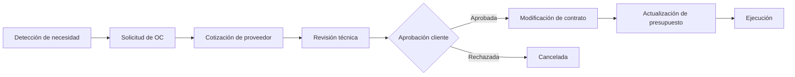

# _MAP: MAI-012 - Contratos y Subcontratos

**Épica:** MAI-012
**Nombre:** Contratos y Subcontratos
**Fase:** 1 - Alcance Inicial
**Presupuesto:** $25,000 MXN
**Story Points:** 45 SP
**Estado:** 📝 A crear
**Sprint:** Sprint 4-5 (Semanas 7-10)
**Última actualización:** 2025-11-17
**Prioridad:** P1

---

## 📋 Propósito

Gestión completa de contratos de obra, subcontratos y proveedores:
- Registro de contratos de obra (clientes) y subcontratos (proveedores/subcontratistas)
- Control de volúmenes contratados, precios unitarios y alcances
- Órdenes de cambio (obra adicional/modificada)
- Retenciones, garantías y penalizaciones
- Seguimiento de cumplimiento contractual

**Integración clave:** Se vincula con Proyectos (MAI-002), Presupuestos (MAI-003), Compras (MAI-004), Estimaciones (MAI-008) y Preconstrucción (MAI-018).

---

## 📁 Contenido

### Requerimientos Funcionales (Estimados: 5)

| ID | Título | Estado |
|----|--------|--------|
| RF-CTR-001 | Registro y gestión de contratos de obra | 📝 A crear |
| RF-CTR-002 | Gestión de subcontratos y proveedores | 📝 A crear |
| RF-CTR-003 | Órdenes de cambio y convenios modificatorios | 📝 A crear |
| RF-CTR-004 | Control de garantías, retenciones y fianzas | 📝 A crear |
| RF-CTR-005 | Seguimiento de cumplimiento y penalizaciones | 📝 A crear |

### Especificaciones Técnicas (Estimadas: 5)

| ID | Título | RF | Estado |
|----|--------|----|--------|
| ET-CTR-001 | Modelo de datos de contratos y anexos | RF-CTR-001 | 📝 A crear |
| ET-CTR-002 | Sistema de control de volúmenes y alcances | RF-CTR-002 | 📝 A crear |
| ET-CTR-003 | Gestión de modificaciones contractuales | RF-CTR-003 | 📝 A crear |
| ET-CTR-004 | Sistema de garantías y fianzas | RF-CTR-004 | 📝 A crear |
| ET-CTR-005 | Motor de penalizaciones y cumplimiento | RF-CTR-005 | 📝 A crear |

### Historias de Usuario (Estimadas: 9)

| ID | Título | SP | Estado |
|----|--------|----|--------|
| US-CTR-001 | Registrar contrato de obra con cliente | 5 | 📝 A crear |
| US-CTR-002 | Crear subcontrato de proveedor/subcontratista | 5 | 📝 A crear |
| US-CTR-003 | Generar orden de cambio por obra adicional | 5 | 📝 A crear |
| US-CTR-004 | Gestionar garantías y fianzas de cumplimiento | 5 | 📝 A crear |
| US-CTR-005 | Registrar retenciones por contrato | 5 | 📝 A crear |
| US-CTR-006 | Aplicar penalizaciones por incumplimiento | 5 | 📝 A crear |
| US-CTR-007 | Comparar avance vs volumen contratado | 5 | 📝 A crear |
| US-CTR-008 | Dashboard de contratos y subcontratos activos | 5 | 📝 A crear |
| US-CTR-009 | Generar anexos y documentos contractuales | 5 | 📝 A crear |

**Total Story Points:** 45 SP

### Implementación

📊 **Inventarios de trazabilidad:**
- [TRACEABILITY.yml](./implementacion/TRACEABILITY.yml) - Matriz completa de trazabilidad
- [DATABASE.yml](./implementacion/DATABASE.yml) - Objetos de base de datos
- [BACKEND.yml](./implementacion/BACKEND.yml) - Módulos backend
- [FRONTEND.yml](./implementacion/FRONTEND.yml) - Componentes frontend

### Pruebas

📋 Documentación de testing:
- [TEST-PLAN.md](./pruebas/TEST-PLAN.md) - Plan de pruebas
- [TEST-CASES.md](./pruebas/TEST-CASES.md) - Casos de prueba

---

## 🔗 Referencias

- **README:** [README.md](./README.md) - Descripción detallada de la épica
- **Fase 1:** [../README.md](../README.md) - Información de la fase completa
- **Módulo relacionado MVP:** Módulo 5 - Contratos y Subcontratos (MVP-APP.md)

---

## 📊 Métricas

| Métrica | Valor |
|---------|-------|
| **Presupuesto estimado** | $25,000 MXN |
| **Story Points estimados** | 45 SP |
| **Duración estimada** | 9 días |
| **Reutilización GAMILIT** | 10% (funcionalidad nueva) |
| **RF a implementar** | 5/5 |
| **ET a implementar** | 5/5 |
| **US a completar** | 9/9 |

---

## 🎯 Módulos Afectados

### Base de Datos
- **Schema:** `contracts`
- **Tablas principales:**
  * `contracts` - Contratos de obra (hacia clientes)
  * `subcontracts` - Subcontratos (hacia proveedores/subcontratistas)
  * `contract_items` - Conceptos/partidas del contrato
  * `change_orders` - Órdenes de cambio
  * `guarantees` - Garantías y fianzas
  * `retentions` - Retenciones por contrato
  * `penalties` - Penalizaciones aplicadas
  * `contract_amendments` - Convenios modificatorios
- **ENUMs:**
  * `contract_type` (main_contract, subcontract, service_contract, supply_contract)
  * `contract_status` (draft, signed, active, suspended, completed, terminated)
  * `change_order_type` (additional_work, modified_work, deductive_work)
  * `change_order_status` (draft, submitted, approved, rejected, executed)
  * `guarantee_type` (performance_bond, advance_payment, warranty, payment_bond)
  * `penalty_type` (delay, quality, safety, breach_of_contract)

### Backend
- **Módulo:** `contracts`
- **Path:** `apps/backend/src/modules/contracts/`
- **Services:** ContractService, SubcontractService, ChangeOrderService, GuaranteeService, PenaltyService
- **Controllers:** ContractController, SubcontractController, ChangeOrderController
- **Middlewares:** ContractAccessGuard, ApprovalWorkflowGuard

### Frontend
- **Features:** `contracts`, `subcontracts`, `change-orders`
- **Path:** `apps/frontend/src/features/contracts/`
- **Componentes:**
  * ContractList
  * ContractForm (create/edit)
  * ContractDetail
  * SubcontractList
  * SubcontractForm
  * ChangeOrderManager
  * GuaranteeTracker
  * RetentionManager
  * PenaltyCalculator
  * ContractComplianceDashboard
- **Stores:** contractStore, subcontractStore, changeOrderStore

---

## 📝 Tipos de Contratos

### 1. Contrato de Obra (hacia Cliente)

**Características:**
- Cliente: INFONAVIT, fideicomiso, desarrollador privado, gobierno
- Objeto: Construcción de vivienda, urbanización, infraestructura
- Modalidad: Precio alzado, precios unitarios, mixto
- Garantías: Anticipo (10-30%), cumplimiento (10%), vicios ocultos (10%)
- Retenciones: Fondo de garantía (5-10%)
- Plazo: 6-24 meses típicamente

**Información clave:**
- Número de contrato
- Monto total contratado
- Plazo de ejecución
- Alcances y especificaciones
- Forma de pago (estimaciones)
- Penalizaciones por retraso
- Causales de rescisión

---

### 2. Subcontrato (hacia Proveedor/Subcontratista)

**Tipos comunes:**

| Tipo | Descripción | Modalidad típica |
|------|-------------|------------------|
| **Mano de obra especializada** | Plomería, electricidad, herrería | Precio unitario / Destajo |
| **Suministro e instalación** | Ventanas, puertas, pisos | Precio alzado por vivienda |
| **Servicios** | Proyecto ejecutivo, topografía, laboratorio | Precio alzado |
| **Suministro** | Concreto, block, acero | Precio unitario |

**Información clave:**
- Proveedor/subcontratista
- Alcance del subcontrato
- Monto contratado
- Precios unitarios
- Plazo de ejecución
- Forma de pago (estimaciones)
- Retenciones (10% típico)
- Garantías requeridas

---

## 🔄 Flujo de Trabajo de Contratos

### Contrato de Obra (Cliente)

1. **Creación desde licitación ganada:**
   - Se crea automáticamente al convertir licitación a proyecto
   - Se arrastra presupuesto "contratado"
   - Se registran datos del contrato firmado

2. **Firma y activación:**
   - Carga de contrato escaneado
   - Registro de garantías (anticipo, cumplimiento)
   - Activación del contrato → habilita estimaciones

3. **Ejecución:**
   - Control de volúmenes ejecutados vs contratados
   - Generación de estimaciones
   - Aplicación de retenciones
   - Seguimiento de cumplimiento de plazo

4. **Modificaciones:**
   - Órdenes de cambio por obra adicional
   - Convenios modificatorios
   - Ampliación de plazo
   - Ajuste de precios (escalatorias)

5. **Cierre:**
   - Finiquito de obra
   - Liberación de retenciones
   - Entrega de fianza de vicios ocultos
   - Cierre administrativo

---

### Subcontrato (Proveedor/Subcontratista)

1. **Solicitud de cotización:**
   - Definición de alcances
   - Solicitud a 3+ proveedores
   - Comparativo de ofertas

2. **Adjudicación:**
   - Selección de proveedor ganador
   - Negociación de términos
   - Creación de subcontrato

3. **Formalización:**
   - Firma de subcontrato
   - Solicitud de garantías (si aplica)
   - Entrega de anticipo (si aplica)

4. **Ejecución:**
   - Supervisión de avances
   - Generación de estimaciones hacia subcontratista
   - Aplicación de retenciones (10% típico)
   - Control de calidad

5. **Cierre:**
   - Finiquito de subcontrato
   - Liberación de retenciones
   - Evaluación de desempeño
   - Actualización de catálogo de proveedores

---

## 📋 Órdenes de Cambio

### Tipos de Órdenes de Cambio

1. **Obra adicional:**
   - Conceptos nuevos no incluidos en contrato original
   - Incremento de volúmenes
   - Ejemplo: Construcción de caseta de vigilancia adicional

2. **Obra modificada:**
   - Cambio en especificaciones
   - Ejemplo: Cambio de piso cerámico a porcelanato

3. **Obra deductiva:**
   - Eliminación de conceptos
   - Reducción de volúmenes
   - Ejemplo: Eliminación de jardinería en área común

---

### Flujo de Orden de Cambio



**Estados:**
- `draft` - Borrador interno
- `submitted` - Enviada a cliente para aprobación
- `approved` - Aprobada por cliente
- `rejected` - Rechazada
- `executed` - Ejecutada e integrada al contrato

**Información registrada:**
- Número de OC
- Tipo (adicional/modificada/deductiva)
- Justificación técnica
- Conceptos afectados
- Monto de la OC
- Impacto en plazo
- Aprobaciones requeridas
- Documentación soporte

---

## 🛡️ Garantías y Fianzas

### Tipos de Garantías

| Tipo | % Típico | Vigencia | Propósito |
|------|----------|----------|-----------|
| **Anticipo** | 10-30% | Hasta amortización total | Garantizar correcta aplicación del anticipo |
| **Cumplimiento** | 10% | Hasta término de obra | Garantizar cumplimiento de contrato |
| **Vicios ocultos** | 10% | 1-2 años post-entrega | Cubrir defectos constructivos |
| **Pago a proveedores** | Variable | Obra + finiquito | Garantizar pago a subcontratistas (obras públicas) |

### Control de Garantías

**Información registrada:**
- Tipo de garantía
- Institución afianzadora
- Número de póliza
- Monto garantizado
- Fecha de emisión
- Vigencia
- Beneficiario
- Estado (vigente, vencida, liberada, ejecutada)

**Alertas:**
- Próxima a vencer (30, 15, 7 días)
- Vencida (requiere renovación)
- Pendiente de liberación (obra terminada)

---

## 💰 Retenciones

### Tipos de Retenciones

1. **Fondo de garantía (cliente → constructora):**
   - Porcentaje: 5-10%
   - Base: Cada estimación
   - Liberación: Al término satisfactorio de la obra o progresiva
   - Propósito: Garantizar corrección de defectos

2. **Retención a subcontratistas (constructora → subcontratista):**
   - Porcentaje: 10% típico
   - Base: Cada estimación
   - Liberación: Al finiquito del subcontrato
   - Propósito: Garantizar cumplimiento de alcances

3. **Retenciones fiscales:**
   - ISR (10% personas físicas sin RFC)
   - IVA retenido (en ciertos casos)

---

### Control de Retenciones

**Información registrada:**
```yaml
retention:
  contract_id: "UUID"
  type: "performance_guarantee"  # fondo_garantia
  percentage: 5.0
  amount: 50000.00  # $50K MXN
  status: "withheld"
  withheld_date: "2025-01-15"
  release_conditions:
    - "Completion of construction"
    - "Approval of final inspection"
    - "60 days after delivery"
  release_date: null
  released_amount: 0.00
  notes: "5% retention per contract clause 12.3"
```

**Dashboard de retenciones:**
- Retenciones activas por contrato
- Monto total retenido
- Próximas a liberar
- Historial de liberaciones

---

## ⚠️ Penalizaciones

### Tipos de Penalizaciones

1. **Por retraso en entrega:**
   - Cálculo: % del monto del contrato por día de retraso
   - Ejemplo: 0.5% por día, máximo 10% del contrato
   - Aplicación: Automática al vencer plazo

2. **Por calidad:**
   - Defectos de construcción
   - Incumplimiento de especificaciones
   - Aplicación: Según gravedad y recurrencia

3. **Por seguridad:**
   - Incidentes/accidentes
   - Incumplimiento de normativa HSE
   - Aplicación: Según matriz de sanciones

4. **Por incumplimiento contractual:**
   - No atender solicitudes de cliente
   - No presentar reportes requeridos
   - No mantener personal clave asignado

---

### Cálculo de Penalización por Retraso

**Ejemplo contractual:**

```
Contrato: $50M MXN
Plazo: 12 meses (365 días)
Fecha inicio: 2025-01-01
Fecha compromiso: 2025-12-31
Penalización: 0.3% por día de retraso
Máximo: 10% del contrato = $5M
```

**Escenarios:**

| Fecha entrega real | Días de retraso | Penalización diaria | Total penalización |
|-------------------|-----------------|---------------------|---------------------|
| 2025-12-31 | 0 | $0 | $0 |
| 2026-01-10 | 10 | $150,000 | $1,500,000 |
| 2026-01-31 | 31 | $150,000 | $4,650,000 |
| 2026-02-10 | 41 | $150,000 | $5,000,000 (tope máximo) |

**Sistema:**
- Cálculo automático de penalizaciones
- Alertas preventivas (30, 15, 7 días antes de vencimiento)
- Registro de justificaciones de retraso
- Aprobación de condonación (si aplica)

---

## 💡 Casos de Uso Clave

### Contrato de Obra con INFONAVIT

**Contexto:**
- Proyecto: 200 viviendas
- Monto: $100M MXN
- Plazo: 18 meses
- Anticipo: 20% = $20M
- Retención: 5%

**Ciclo de vida:**

1. **Firma (Día 1):**
   - Registro de contrato
   - Entrega de fianza de anticipo ($20M)
   - Pago de anticipo

2. **Estimación 1 (Mes 2):**
   - Avance: 10% = $10M bruto
   - Amortización anticipo: 10% × $20M = $2M
   - Retención 5%: $500K
   - **Pago neto: $7.5M**

3. **Orden de cambio (Mes 6):**
   - Cambio de acabados: +$2M
   - **Nuevo monto contratado: $102M**

4. **Penalización (Mes 18):**
   - Retraso: 15 días
   - Penalización: 0.2% × 15 días × $102M = $306K
   - Se descuenta de estimación final

5. **Finiquito (Mes 19):**
   - Liberación de retenciones: $5.1M
   - Entrega de fianza de vicios ocultos (10% × $102M = $10.2M)
   - Cierre administrativo

---

### Subcontrato de Instalaciones Eléctricas

**Contexto:**
- Subcontratista: Instalaciones Eléctricas SA
- Alcance: Instalación eléctrica de 200 viviendas
- Modalidad: Precio alzado por vivienda
- Precio: $8,000/vivienda = $1.6M total
- Retención: 10%

**Ciclo de vida:**

1. **Adjudicación:**
   - Comparativo de 3 cotizaciones
   - Subcontratista ganador: $8K/viv (vs $8.5K y $9K)
   - Firma de subcontrato

2. **Estimación 1 (30 viviendas):**
   - Avance: 30 viv × $8,000 = $240K bruto
   - Retención 10%: $24K
   - **Pago neto: $216K**

3. **Orden de cambio:**
   - Instalación de paneles solares (no incluido)
   - +$1,500/vivienda × 200 = $300K adicionales
   - **Nuevo monto: $1.9M**

4. **Finiquito (200 viviendas):**
   - Trabajo total: $1.9M
   - Retenciones acumuladas: $190K
   - **Liberación de retenciones tras inspección final**

---

## 🚨 Puntos Críticos

1. **Trazabilidad contractual:** Todo cambio debe estar documentado y aprobado
2. **Control de volúmenes:** Evitar sobreejecución sin orden de cambio
3. **Garantías vigentes:** Sistema de alertas para renovaciones
4. **Retenciones claras:** Condiciones de liberación explícitas
5. **Penalizaciones justificadas:** Documentar causas de retrasos
6. **Integración con estimaciones:** Montos contratados limitan estimaciones
7. **Workflow de aprobaciones:** Órdenes de cambio requieren aprobación de cliente

---

## 🎯 Siguiente Paso

Crear documentación de requerimientos y especificaciones técnicas del módulo.

---

**Generado:** 2025-11-17
**Mantenedores:** @tech-lead @backend-team @frontend-team @legal-team
**Estado:** 📝 A crear
