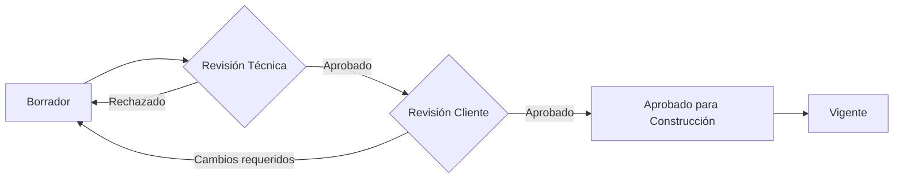

# _MAP: MAE-016 - Gestión Documental y Planos (DMS)

**Épica:** MAE-016
**Nombre:** Gestión Documental y Planos (DMS)
**Fase:** 2 - Enterprise Básico
**Presupuesto:** $35,000 MXN
**Story Points:** 60 SP
**Estado:** 📝 A crear
**Sprint:** Sprint 9-10 (Semanas 17-20)
**Última actualización:** 2025-11-17
**Prioridad:** P2

---

## 📋 Propósito

Sistema de gestión documental enterprise con versionado, control de acceso y flujos de aprobación, similar a Procore Docs o Autodesk Docs:
- Repositorio centralizado de documentos y planos
- Versionado de planos (rev. A, B, C, etc.)
- Control de acceso granular por documento
- Flujos de aprobación (borrador → revisado → aprobado)
- Acceso desde app móvil con anotaciones
- Comparación visual entre versiones de planos
- Búsqueda avanzada con OCR

**Integración clave:** Se vincula con Proyectos (MAI-002), Calidad (MAI-009), INFONAVIT (MAI-011) y Contratos (MAI-012).

---

## 📁 Contenido

### Requerimientos Funcionales (Estimados: 6)

| ID | Título | Estado |
|----|--------|--------|
| RF-DMS-001 | Repositorio centralizado y clasificación de documentos | 📝 A crear |
| RF-DMS-002 | Versionado y control de cambios | 📝 A crear |
| RF-DMS-003 | Control de acceso granular y permisos | 📝 A crear |
| RF-DMS-004 | Flujos de aprobación de documentos | 📝 A crear |
| RF-DMS-005 | Visualización de planos con anotaciones | 📝 A crear |
| RF-DMS-006 | Búsqueda avanzada y metadata | 📝 A crear |

### Especificaciones Técnicas (Estimadas: 6)

| ID | Título | RF | Estado |
|----|--------|----|--------|
| ET-DMS-001 | Modelo de datos de documentos y versiones | RF-DMS-001, RF-DMS-002 | 📝 A crear |
| ET-DMS-002 | Sistema de control de acceso (ACL) | RF-DMS-003 | 📝 A crear |
| ET-DMS-003 | Motor de workflows de aprobación | RF-DMS-004 | 📝 A crear |
| ET-DMS-004 | Visualizador de planos con canvas | RF-DMS-005 | 📝 A crear |
| ET-DMS-005 | Motor de búsqueda con indexación | RF-DMS-006 | 📝 A crear |
| ET-DMS-006 | Storage y CDN para archivos | RF-DMS-001 | 📝 A crear |

### Historias de Usuario (Estimadas: 12)

| ID | Título | SP | Estado |
|----|--------|----|--------|
| US-DMS-001 | Subir documento y clasificar | 5 | 📝 A crear |
| US-DMS-002 | Crear nueva versión de plano | 5 | 📝 A crear |
| US-DMS-003 | Comparar versiones de plano | 5 | 📝 A crear |
| US-DMS-004 | Configurar permisos por documento/carpeta | 5 | 📝 A crear |
| US-DMS-005 | Iniciar workflow de aprobación | 5 | 📝 A crear |
| US-DMS-006 | Aprobar/rechazar documento | 5 | 📝 A crear |
| US-DMS-007 | Visualizar plano con anotaciones | 5 | 📝 A crear |
| US-DMS-008 | Hacer anotaciones sobre plano desde móvil | 5 | 📝 A crear |
| US-DMS-009 | Buscar documentos por metadata | 5 | 📝 A crear |
| US-DMS-010 | Marcar plano como obsoleto | 5 | 📝 A crear |
| US-DMS-011 | Dashboard de documentos del proyecto | 5 | 📝 A crear |
| US-DMS-012 | Exportar paquete de documentos | 5 | 📝 A crear |

**Total Story Points:** 60 SP

### Implementación

📊 **Inventarios de trazabilidad:**
- [TRACEABILITY.yml](./implementacion/TRACEABILITY.yml) - Matriz completa de trazabilidad
- [DATABASE.yml](./implementacion/DATABASE.yml) - Objetos de base de datos
- [BACKEND.yml](./implementacion/BACKEND.yml) - Módulos backend
- [FRONTEND.yml](./implementacion/FRONTEND.yml) - Componentes frontend

### Pruebas

📋 Documentación de testing:
- [TEST-PLAN.md](./pruebas/TEST-PLAN.md) - Plan de pruebas
- [TEST-CASES.md](./pruebas/TEST-CASES.md) - Casos de prueba

---

## 🔗 Referencias

- **README:** [README.md](./README.md) - Descripción detallada de la épica
- **Fase 2:** [../README.md](../README.md) - Información de la fase completa
- **Módulo relacionado MVP:** Módulo 16 - Gestión Documental (MVP-APP.md)

---

## 📊 Métricas

| Métrica | Valor |
|---------|-------|
| **Presupuesto estimado** | $35,000 MXN |
| **Story Points estimados** | 60 SP |
| **Duración estimada** | 12 días |
| **Reutilización GAMILIT** | 20% (gestión de archivos básica) |
| **RF a implementar** | 6/6 |
| **ET a implementar** | 6/6 |
| **US a completar** | 12/12 |

---

## 🎯 Módulos Afectados

### Base de Datos
- **Schema:** `documents`
- **Tablas principales:**
  * `document_categories` - Categorías de documentos
  * `documents` - Documentos maestros
  * `document_versions` - Versiones de documentos
  * `document_permissions` - Control de acceso
  * `approval_workflows` - Workflows de aprobación
  * `approval_steps` - Pasos del workflow
  * `annotations` - Anotaciones sobre planos
  * `document_metadata` - Metadata para búsqueda
- **ENUMs:**
  * `document_type` (drawing, contract, specification, report, photo, rfi, submittal)
  * `document_status` (draft, under_review, approved, rejected, obsolete)
  * `permission_level` (no_access, view, comment, edit, approve, admin)
  * `approval_action` (pending, approved, rejected, requested_changes)

### Backend
- **Módulo:** `documents`
- **Path:** `apps/backend/src/modules/documents/`
- **Services:**
  * DocumentService
  * VersionService
  * PermissionService
  * WorkflowService
  * AnnotationService
  * SearchService
  * StorageService (S3/Azure Blob)
- **Controllers:** DocumentController, VersionController, WorkflowController
- **Middlewares:** DocumentAccessGuard, VersionControl Middleware

### Frontend
- **Features:** `documents`, `document-viewer`
- **Path:** `apps/frontend/src/features/documents/`
- **Componentes:**
  * DocumentLibrary (tree view)
  * DocumentUploader
  * DocumentDetail
  * VersionHistory
  * VersionComparator
  * PermissionManager
  * WorkflowInitiator
  * ApprovalDashboard
  * PlanViewer (canvas-based)
  * AnnotationTool
  * DocumentSearch
- **Stores:** documentStore, versionStore, workflowStore

### App Móvil
- **Features:** `document-viewer-mobile`
- **Componentes:**
  * PlanViewerMobile (touch-optimized)
  * AnnotationToolMobile (draw on screen)
  * OfflineDocumentCache

---

## 📂 Estructura de Repositorio

### Taxonomía de Documentos

```
Proyecto: Fraccionamiento Los Pinos
├── 01-Planos
│   ├── Arquitectónicos
│   │   ├── Conjunto
│   │   │   ├── PC-01-Planta de Conjunto.dwg (Rev. C)
│   │   │   └── PC-02-Distribución de Prototipos.dwg (Rev. B)
│   │   ├── Prototipos
│   │   │   ├── PA-01-Tipo A Plantas.dwg (Rev. D)
│   │   │   ├── PA-02-Tipo A Fachadas.dwg (Rev. C)
│   │   │   ├── PB-01-Tipo B Plantas.dwg (Rev. B)
│   │   │   └── PB-02-Tipo B Fachadas.dwg (Rev. B)
│   │   └── Detalles
│   ├── Estructurales
│   │   ├── PE-01-Cimentación Tipo A.dwg (Rev. A)
│   │   ├── PE-02-Estructura Tipo A.dwg (Rev. B)
│   │   └── PE-03-Detalles Estructurales.dwg (Rev. A)
│   ├── Instalaciones
│   │   ├── Hidráulicas
│   │   │   └── PH-01-Inst. Hidráulica Tipo A.dwg (Rev. B)
│   │   ├── Sanitarias
│   │   │   └── PS-01-Inst. Sanitaria Tipo A.dwg (Rev. B)
│   │   ├── Eléctricas
│   │   │   └── PE-01-Inst. Eléctrica Tipo A.dwg (Rev. C)
│   │   └── Gas
│   │       └── PG-01-Inst. Gas Tipo A.dwg (Rev. A)
│   └── Urbanización
│       ├── PU-01-Lotificación.dwg (Rev. B)
│       ├── PU-02-Pavimentos.dwg (Rev. A)
│       └── PU-03-Redes de Servicios.dwg (Rev. B)
│
├── 02-Contratos
│   ├── Contrato Principal INFONAVIT.pdf
│   ├── Subcontratos
│   │   ├── SC-001-Instalaciones Eléctricas.pdf
│   │   ├── SC-002-Plomería.pdf
│   │   └── SC-003-Herrería.pdf
│   └── Órdenes de Cambio
│       ├── OC-001-Cambio de acabados.pdf
│       └── OC-002-Ampliación caseta.pdf
│
├── 03-Especificaciones
│   ├── Especificaciones Técnicas Generales.pdf
│   ├── Especificaciones de Materiales.xlsx
│   └── Normas Aplicables.pdf
│
├── 04-Permisos y Licencias
│   ├── Licencia de Construcción.pdf
│   ├── Uso de Suelo.pdf
│   ├── Manifesto IMSS.pdf
│   └── Impacto Ambiental.pdf
│
├── 05-RFIs (Request for Information)
│   ├── RFI-001-Aclaración estructura.pdf
│   ├── RFI-002-Detalle ventanería.pdf
│   └── RFI-003-Ubicación registros.pdf
│
├── 06-Submittals
│   ├── SUB-001-Muestras de piso.pdf
│   ├── SUB-002-Ficha técnica pintura.pdf
│   └── SUB-003-Certificado de cancelería.pdf
│
├── 07-Reportes
│   ├── Semanales
│   │   ├── Reporte Semana 01.pdf
│   │   └── ...
│   ├── Mensuales
│   │   ├── Reporte Mes 01.pdf
│   │   └── ...
│   └── Fotografías
│       ├── 2025-11-01-Avance Cimentación
│       └── 2025-11-15-Avance Estructura
│
├── 08-Certificados
│   ├── Certificado de Calidad INFONAVIT.pdf
│   ├── Certificado de Sustentabilidad.pdf
│   └── Garantías
│       ├── Garantía Impermeabilización.pdf
│       └── Garantía Cancelería.pdf
│
└── 09-Manuales
    ├── Manual de Operación y Mantenimiento.pdf
    └── Manual del Propietario.pdf
```

---

## 📄 Versionado de Planos

### Nomenclatura de Revisiones

| Revisión | Descripción | Uso |
|----------|-------------|-----|
| **Rev. 0** | Borrador inicial | Uso interno, no para construcción |
| **Rev. A** | Primera emisión formal | Para construcción |
| **Rev. B** | Primera revisión | Incorpora cambios menores |
| **Rev. C** | Segunda revisión | Incorpora RFIs u órdenes de cambio |
| **Rev. D+** | Revisiones subsecuentes | Cambios adicionales |

---

### Ejemplo de Versión de Plano

```yaml
document:
  id: "DOC-001"
  code: "PA-01"
  title: "Plano Arquitectónico Tipo A - Plantas"
  type: "drawing"
  category: "Planos > Arquitectónicos > Prototipos"
  project_id: "PROJ-001"

  current_version:
    version_number: 4
    revision: "D"
    status: "approved"
    approved_date: "2025-11-15"
    approved_by: "Ing. María López"

  versions:
    - version: 1
      revision: "0"
      date: "2025-01-15"
      description: "Borrador inicial"
      author: "Arq. Juan Pérez"
      file: "PA-01-Rev0.dwg"
      status: "obsolete"

    - version: 2
      revision: "A"
      date: "2025-02-01"
      description: "Primera emisión para construcción"
      author: "Arq. Juan Pérez"
      file: "PA-01-RevA.dwg"
      status: "obsolete"
      changes: "Ajustes de dimensiones según normativa"

    - version: 3
      revision: "B"
      date: "2025-05-15"
      description: "Revisión por cambio de ventanería"
      author: "Arq. Juan Pérez"
      file: "PA-01-RevB.dwg"
      status: "obsolete"
      changes: "Cambio de ventanas de aluminio a PVC según RFI-002"
      references: ["RFI-002"]

    - version: 4
      revision: "C"
      date: "2025-08-20"
      description: "Revisión por adecuaciones INFONAVIT"
      author: "Arq. Juan Pérez"
      file: "PA-01-RevC.dwg"
      status: "obsolete"
      changes: "Incremento de superficie de recámara 2 de 7.0m² a 7.5m²"
      references: ["OC-001", "Observación INFONAVIT"]

    - version: 5
      revision: "D"
      date: "2025-11-15"
      description: "Revisión por cambio de acabados"
      author: "Arq. Juan Pérez"
      file: "PA-01-RevD.dwg"
      status: "approved"
      changes: "Cambio de piso cerámico a porcelanato en sala-comedor"
      references: ["OC-002"]
      watermark: "PARA CONSTRUCCIÓN - REV D"
```

---

## 🔒 Control de Acceso

### Niveles de Permiso

| Nivel | Descripción | Acciones permitidas |
|-------|-------------|---------------------|
| **Sin acceso** | No puede ver el documento | - |
| **Vista** | Solo lectura | Ver, descargar |
| **Comentarios** | Puede agregar anotaciones | Ver, descargar, comentar |
| **Edición** | Puede subir nuevas versiones | Ver, descargar, comentar, subir versión |
| **Aprobación** | Puede aprobar documentos | Ver, descargar, comentar, aprobar |
| **Admin** | Control total | Todas las anteriores + eliminar, cambiar permisos |

---

### Matriz de Permisos por Rol

| Carpeta / Documento | Director | Ingeniero | Residente | Subcontratista | Cliente |
|---------------------|----------|-----------|-----------|----------------|---------|
| **Planos Arquitectónicos** | Admin | Edición | Vista | Vista | Sin acceso |
| **Planos Instalaciones** | Admin | Edición | Vista | Edición* | Sin acceso |
| **Contratos** | Admin | Vista | Sin acceso | Vista* | Sin acceso |
| **RFIs** | Vista | Edición | Edición | Vista | Sin acceso |
| **Reportes** | Admin | Vista | Edición | Sin acceso | Sin acceso |
| **Planos As-Built** | Admin | Edición | Comentarios | Sin acceso | Vista |

(*) Solo para su especialidad

---

## ✅ Flujos de Aprobación

### Workflow Típico: Aprobación de Plano



---

### Ejemplo de Workflow

```yaml
workflow:
  id: "WF-2025-045"
  document_id: "DOC-001"
  document_version: 5
  title: "Aprobación Plano PA-01 Rev. D"
  initiated_by: "Arq. Juan Pérez"
  initiated_date: "2025-11-10"
  status: "completed"

  steps:
    - step: 1
      role: "Ingeniero Estructural"
      assignee: "Ing. Carlos Ramírez"
      action_required: "approval"
      status: "approved"
      completed_date: "2025-11-11"
      notes: "Sin conflictos estructurales"

    - step: 2
      role: "Residente de Obra"
      assignee: "Ing. Pedro Martínez"
      action_required: "approval"
      status: "approved"
      completed_date: "2025-11-12"
      notes: "Verificado en sitio, viable"

    - step: 3
      role: "Director Técnico"
      assignee: "Ing. María López"
      action_required: "approval"
      status: "approved"
      completed_date: "2025-11-15"
      notes: "Aprobado para construcción"
      final_approval: true

  final_status: "approved"
  approved_date: "2025-11-15"
  watermark_added: "PARA CONSTRUCCIÓN - REV D - APROBADO 2025-11-15"
```

---

## 🖼️ Visualizador de Planos

### Funcionalidades

1. **Navegación:**
   - Zoom in/out
   - Pan (arrastrar)
   - Ajustar a pantalla
   - Rotación

2. **Anotaciones:**
   - Dibujo libre (lápiz)
   - Formas (círculo, rectángulo, flecha)
   - Texto
   - Mediciones (distancia, área)
   - Marcadores de ubicación

3. **Comparación:**
   - Vista lado a lado de 2 versiones
   - Overlay con opacidad ajustable
   - Resaltado de diferencias automático

4. **Colaboración:**
   - Anotaciones multi-usuario
   - Comentarios vinculados a punto en plano
   - Notificaciones en tiempo real

---

### Ejemplo de Anotación

```yaml
annotation:
  id: "ANN-123"
  document_id: "DOC-001"
  document_version: 5
  created_by: "Residente Pedro Martínez"
  created_date: "2025-11-16T10:30:00Z"
  type: "comment"
  position:
    x: 1250  # píxeles
    y: 800
    page: 1
  shape:
    type: "circle"
    radius: 20
    color: "#FF0000"
  content:
    text: "Verificar medida de ventana en sitio. Parece tener 10cm menos."
    priority: "high"
  status: "open"
  responses:
    - user: "Arq. Juan Pérez"
      date: "2025-11-16T14:00:00Z"
      text: "Verificado en sitio, es correcto. Ventana instalada según especificación."
  resolved_by: "Arq. Juan Pérez"
  resolved_date: "2025-11-16T14:00:00Z"
```

---

## 🔍 Búsqueda Avanzada

### Criterios de Búsqueda

| Campo | Tipo | Ejemplo |
|-------|------|---------|
| **Texto completo** | Full-text | "instalación eléctrica" |
| **Código** | Exacto | "PA-01" |
| **Categoría** | Jerárquico | "Planos > Arquitectónicos" |
| **Tipo** | Enum | "Plano", "Contrato", "RFI" |
| **Estado** | Enum | "Aprobado", "Vigente" |
| **Revisión** | Texto | "Rev. D" |
| **Autor** | Usuario | "Arq. Juan Pérez" |
| **Fecha** | Rango | "2025-01-01" a "2025-12-31" |
| **Proyecto** | Relación | "Fraccionamiento Los Pinos" |
| **Tags** | Múltiple | "tipo-a", "instalaciones", "aprobado-infonavit" |

---

### OCR para Búsqueda

**Proceso:**
1. Al subir PDF escaneado o imagen
2. Sistema ejecuta OCR (Tesseract o Cloud Vision API)
3. Texto extraído se indexa para búsqueda
4. Usuario puede buscar contenido dentro de escaneos

**Ejemplo:**
- Documento: Licencia de construcción (PDF escaneado)
- OCR detecta: "Licencia de construcción No. 2025-456..."
- Usuario busca: "licencia 2025"
- Resultado: Se encuentra el documento

---

## 📊 Dashboard de Documentos

### Indicadores

| Métrica | Valor | Meta |
|---------|-------|------|
| **Total documentos** | 1,250 | - |
| **Planos vigentes** | 85 | 100% al día |
| **Planos obsoletos** | 120 | Archivados |
| **Documentos en revisión** | 12 | <20 |
| **RFIs pendientes** | 3 | <5 |
| **Aprobaciones pendientes** | 5 | <10 |
| **Espacio usado** | 45 GB | <100 GB |

---

## 🚨 Puntos Críticos

1. **Versionado estricto:** Nunca sobrescribir, siempre nueva versión
2. **Planos obsoletos:** Marcar claramente para evitar uso incorrecto
3. **Control de acceso:** Subcontratistas solo ven su especialidad
4. **Aprobaciones formales:** Workflow obligatorio para planos de construcción
5. **Backup:** Repositorio crítico, backup diario
6. **Sincronización móvil:** Cache offline para uso en obra
7. **Watermarks:** Planos para construcción deben estar marcados

---

## 🎯 Siguiente Paso

Crear documentación de requerimientos y especificaciones técnicas del módulo.

---

**Generado:** 2025-11-17
**Mantenedores:** @tech-lead @backend-team @frontend-team @document-team
**Estado:** 📝 A crear
