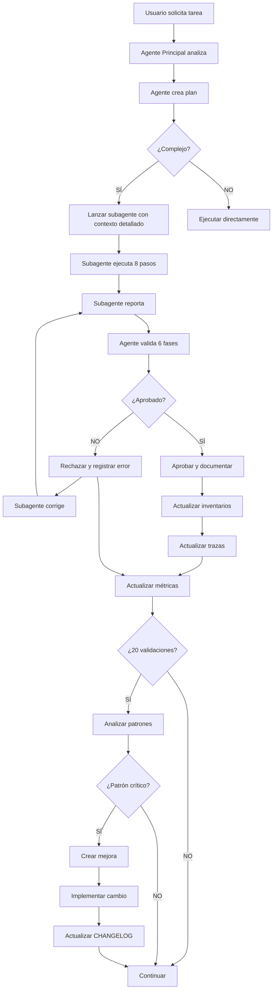

# CHANGELOG - Sistema de Subagentes

Registro de mejoras al sistema de prompts, directivas y templates de subagentes.

---

## 2025-11-17 - v1.0.0

### 🎉 Inicial - Creación del Sistema

**Contexto:**
Implementación completa del sistema de orquestación de agentes y subagentes en respuesta a errores frecuentes de subagentes por falta de contexto, validación insuficiente y ausencia de estándares.

### Archivos Creados

#### Prompts
- **PROMPT-AGENTES-PRINCIPALES.md** (~900 líneas)
  - Prompt completo para Database-Agent, Backend-Agent, Frontend-Agent
  - 5 fases obligatorias: Análisis → Plan → Ejecución → Validación → Documentación
  - Anti-duplicación sistemática
  - Ejemplos específicos del stack tecnológico del proyecto

- **PROMPT-SUBAGENTES.md** (~1,100 líneas)
  - Prompt detallado con 8 pasos obligatorios
  - Sección de errores históricos críticos
  - Validación exhaustiva antes de reportar
  - Múltiples checkpoints de detención y solicitud de clarificación

- **PROMPT-REQUIREMENTS-ANALYST.md** (~650 líneas)
  - Agente especializado en análisis de requerimientos
  - Workflow completo de análisis del MVP

#### Templates
- **TEMPLATE-CONTEXTO-SUBAGENTE.md** (~800 líneas)
  - Template para agentes principales al lanzar subagentes
  - 10 secciones obligatorias con tablas de especificaciones detalladas
  - Checklist de verificación para agente principal
  - Ejemplos para Database, Backend, Frontend

- **TEMPLATE-ANALISIS.md** (~370 líneas)
  - Template de análisis pre-ejecución
  - Verificación de inventarios, riesgos, dependencias

- **TEMPLATE-VALIDACION.md** (~500 líneas)
  - Template de validación post-ejecución
  - Checklists para DB, Backend, Frontend, Integración

- **TEMPLATE-PLAN.md** (~250 líneas)
  - Template de planificación de tareas
  - Ciclos de trabajo, estimaciones, riesgos

#### Directivas
- **POLITICAS-USO-AGENTES.md** (~540 líneas)
  - 8 tipos de agentes definidos
  - Límites de concurrencia
  - Políticas de escalamiento y manejo de errores

- **DIRECTIVA-DOCUMENTACION-OBLIGATORIA.md** (~750 líneas)
  - 6 dimensiones de documentación
  - Métricas de calidad con objetivos
  - Prohibiciones absolutas

- **DIRECTIVA-VALIDACION-SUBAGENTES.md** (~1,300 líneas) ⭐
  - Proceso de validación en 6 fases
  - Criterios de aceptación/rechazo
  - Ejemplos completos de validación exitosa y rechazada
  - Sistema de registro de feedback

- **ESTANDARES-NOMENCLATURA.md** (~950 líneas) ⭐
  - Convenciones para Database (schemas, tablas, columnas, índices, constraints)
  - Convenciones para Backend (entities, services, controllers, DTOs, enums)
  - Convenciones para Frontend (componentes, páginas, hooks, stores)
  - Convenciones de archivos y carpetas
  - Quick reference y ejemplos

- **SISTEMA-RETROALIMENTACION-MEJORA-CONTINUA.md** (~850 líneas) ⭐
  - Captura estructurada de errores en JSONL
  - Análisis de patrones con scripts
  - Proceso de implementación de mejoras
  - Seguimiento y medición de efectividad
  - Ciclo completo de mejora continua

#### Inventarios
- **MASTER_INVENTORY.yml** (~200 líneas)
  - Inventario unificado con relaciones DB→Backend→Frontend
  - Estructura modular por módulos del MVP

- **DATABASE_INVENTORY.yml** (inicializado)
- **BACKEND_INVENTORY.yml** (inicializado)
- **FRONTEND_INVENTORY.yml** (inicializado)

#### Trazas
- **TRAZA-REQUERIMIENTOS.md** (~270 líneas)
  - Inicializada con 8 módulos del MVP
  - Formato mejorado con métricas y relaciones

- **TRAZA-TAREAS-DATABASE.md** (~120 líneas)
- **TRAZA-TAREAS-BACKEND.md** (~120 líneas)
- **TRAZA-TAREAS-FRONTEND.md** (~130 líneas)

#### Estados
- **ESTADO-GENERAL.json** (~80 líneas)
  - Estado inicial del proyecto
  - 8 módulos MVP al 0%

- **METRICAS-VALIDACION.yml** (estructura definida)
  - Métricas de validación de subagentes
  - Objetivos: 85% aprobación primera vez, <1.5 iteraciones, <10 min validación

- **FEEDBACK-SUBAGENTES.jsonl** (inicializado)
  - Archivo para registro de errores en formato JSONL
  - Estructura de campos definida

#### Scripts
- **analyze-feedback.sh** (documentado)
  - Análisis de patrones de errores
  - Generación de reportes con recomendaciones

- **update-metrics.py** (documentado)
  - Actualización automática de métricas
  - Cálculo de tasas y promedios

#### Documentación
- **orchestration/README.md** (~650 líneas)
  - Punto de entrada del sistema
  - Quick reference para usuarios y agentes
  - Estructura completa documentada

- **CHANGELOG-SISTEMA-SUBAGENTES.md** (este archivo)
  - Registro de cambios y mejoras
  - Formato Semantic Versioning

### Características Principales

#### 1. Sistema de Validación Riguroso
- 6 fases de validación obligatorias
- Criterios claros de aceptación/rechazo
- Registro sistemático de errores
- No se aprueba trabajo sin validación completa

#### 2. Contexto Detallado para Subagentes
- Template estandarizado con 10 secciones obligatorias
- Tablas de especificaciones detalladas
- Referencias a templates y documentación
- Checklist de verificación pre-lanzamiento

#### 3. Estándares de Nomenclatura Estrictos
- Convenciones claras por capa (DB/Backend/Frontend)
- Ejemplos abundantes
- Validación de nombres en proceso de review
- Consistencia absoluta requerida

#### 4. Feedback Loop Automatizado
- Captura estructurada de errores (JSONL)
- Análisis automatizado de patrones
- Identificación de causas raíz
- Ciclo de mejora continua con seguimiento

#### 5. Anti-Duplicación Sistemática
- Verificación obligatoria de inventarios
- Búsquedas en múltiples fuentes
- Detención inmediata si se detecta duplicado
- Documentación de verificación en reportes

### Métricas Iniciales

```yaml
version: 1.0.0
fecha: 2025-11-17

archivos_creados: 25
lineas_documentacion: ~11,000

objetivos:
  tasa_aprobacion_primera_vez: 85%    # Target para validaciones
  promedio_iteraciones: <1.5           # Máximo de reintentos
  tiempo_validacion: <10 min           # Tiempo máximo de validación

categorias_error_rastreadas: 23        # Categorías estandarizadas
fases_validacion: 6                    # Checkpoints de calidad
```

### Principios del Sistema

```markdown
1. **Si no está documentado, no existe**
   - Obligación absoluta de documentar todo

2. **Validar antes de aprobar**
   - No se aprueba trabajo sin validación completa en 6 fases

3. **Anti-duplicación obligatoria**
   - Verificar inventarios ANTES de crear cualquier objeto

4. **Contexto completo o no empezar**
   - Subagentes deben recibir contexto detallado

5. **Mejora continua basada en datos**
   - Registrar errores, analizar patrones, implementar mejoras
```

### Flujo Completo



### Impacto Esperado

**Antes del sistema:**
- ❌ Subagentes cometían errores frecuentes
- ❌ Falta de contexto causaba ambigüedad
- ❌ No había validación sistemática
- ❌ Duplicados no detectados
- ❌ Nomenclatura inconsistente
- ❌ No había aprendizaje de errores

**Después del sistema:**
- ✅ Contexto detallado y estructurado
- ✅ Validación rigurosa en 6 fases
- ✅ Anti-duplicación obligatoria
- ✅ Estándares claros y documentados
- ✅ Feedback loop para mejora continua
- ✅ Métricas de calidad rastreadas
- ✅ Sistema auto-mejorante

### Próximos Pasos

1. **Semana 1-2:**
   - Ejecutar primeras tareas con el nuevo sistema
   - Recopilar feedback inicial
   - Ajustar según necesidad

2. **Semana 3-4:**
   - Primera revisión semanal de feedback
   - Identificar primeros patrones
   - Implementar primeras mejoras

3. **Mes 1:**
   - Revisión mensual completa
   - Evaluar cumplimiento de objetivos
   - Ajustar métricas si necesario

4. **Mes 2-3:**
   - Estabilización del sistema
   - Optimización de prompts basada en datos reales
   - Alcanzar objetivos de calidad

### Referencias

- [PROMPT-SUBAGENTES.md](prompts/PROMPT-SUBAGENTES.md)
- [DIRECTIVA-VALIDACION-SUBAGENTES.md](directivas/DIRECTIVA-VALIDACION-SUBAGENTES.md)
- [ESTANDARES-NOMENCLATURA.md](directivas/ESTANDARES-NOMENCLATURA.md)
- [SISTEMA-RETROALIMENTACION-MEJORA-CONTINUA.md](directivas/SISTEMA-RETROALIMENTACION-MEJORA-CONTINUA.md)

---

## Formato del CHANGELOG

**Versionado:** Semantic Versioning (MAJOR.MINOR.PATCH)
- **MAJOR:** Cambios incompatibles con versiones anteriores
- **MINOR:** Nuevas funcionalidades compatibles
- **PATCH:** Correcciones de bugs

**Próximas versiones:**
- v1.1.0: Primera mejora basada en feedback real
- v1.2.0: Segunda mejora
- v2.0.0: Cambio mayor (si necesario)

---

**Última actualización:** 2025-11-17
**Versión actual:** 1.0.0
**Estado:** ✅ Sistema implementado y operativo
