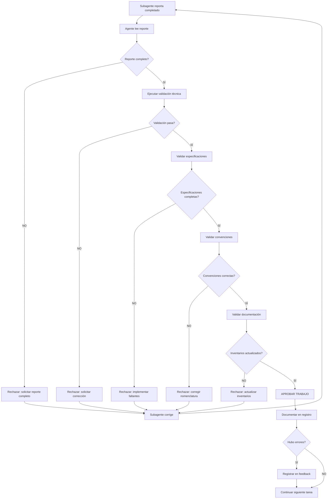

# DIRECTIVA DE VALIDACIÓN DE SUBAGENTES

**Proyecto:** MVP Sistema Administración de Obra e INFONAVIT
**Versión:** 1.0.0
**Fecha:** 2025-11-17
**Audiencia:** Agentes Principales (Database-Agent, Backend-Agent, Frontend-Agent)

---

## PROPÓSITO

Esta directiva establece el **proceso obligatorio de validación** que todo Agente Principal debe ejecutar después de que un subagente reporta una tarea completada.

**Objetivo:** Garantizar calidad, detectar errores sistemáticos y retroalimentar el sistema de prompts/directivas para mejorar continuamente la eficiencia de los subagentes.

---

## ⚠️ PRINCIPIO FUNDAMENTAL

```markdown
NINGÚN trabajo de subagente se considera completado hasta que
el Agente Principal lo valide y apruebe explícitamente.
```

**Razones:**
1. Los subagentes tienen contexto limitado y pueden cometer errores
2. Los errores no detectados se propagan a otras tareas
3. La validación temprana es 10x más barata que correcciones tardías
4. La retroalimentación sistemática mejora la eficiencia del sistema

---

## FLUJO DE VALIDACIÓN



---

## FASE 1: VERIFICACIÓN DE REPORTE

### 1.1. Checklist de Completitud del Reporte

**El reporte del subagente DEBE incluir:**

```markdown
**Secciones Obligatorias:**
- [ ] Resumen ejecutivo (completado/error/con warnings)
- [ ] Archivos generados (rutas completas y absolutas)
- [ ] Especificaciones implementadas (tabla comparativa solicitado vs implementado)
- [ ] Validaciones ejecutadas (comandos + outputs completos)
- [ ] Convenciones seguidas (checklist con referencias)
- [ ] Anti-duplicación verificada (comandos grep/search ejecutados)
- [ ] Problemas encontrados (si los hay, con detalles)
- [ ] Tiempo real vs estimado
- [ ] Solicitud explícita de validación
```

### 1.2. Acción si Reporte Incompleto

```markdown
❌ **RECHAZAR INMEDIATAMENTE**

**Mensaje al subagente:**
"Reporte incompleto. Falta(n):
- [Sección X]
- [Sección Y]

Por favor completa el reporte con TODAS las secciones obligatorias
según PROMPT-SUBAGENTES.md Paso 8 antes de solicitar validación."

**NO continuar validación hasta recibir reporte completo.**
```

---

## FASE 2: VALIDACIÓN TÉCNICA

### 2.1. Validación Database (DDL)

**Para tareas de creación de tablas, views, functions, etc.**

```bash
# 1. Verificar que archivo existe en ubicación exacta
ls -la {ruta_completa_archivo}
# Resultado esperado: Archivo existe

# 2. Leer archivo completo para inspección
cat {archivo.sql}
# Verificar manualmente:
# - Sintaxis SQL correcta
# - Nombres coinciden con especificación
# - TODOS los elementos solicitados están presentes

# 3. Ejecutar script en base de datos
psql $DATABASE_URL -f {archivo.sql}
# Resultado esperado: Sin errores
# Si hay errores: RECHAZAR y solicitar corrección

# 4. Verificar estructura creada
psql $DATABASE_URL -c "\d {schema}.{tabla}"
# Verificar:
# - Número correcto de columnas
# - Tipos de datos correctos
# - Constraints aplicados

# 5. Verificar índices
psql $DATABASE_URL -c "\d+ {schema}.{tabla}"
# Verificar que TODOS los índices especificados existen

# 6. Verificar foreign keys
psql $DATABASE_URL -c "
SELECT
    tc.constraint_name,
    tc.table_name,
    kcu.column_name,
    ccu.table_name AS foreign_table_name,
    ccu.column_name AS foreign_column_name
FROM information_schema.table_constraints AS tc
JOIN information_schema.key_column_usage AS kcu
    ON tc.constraint_name = kcu.constraint_name
JOIN information_schema.constraint_column_usage AS ccu
    ON ccu.constraint_name = tc.constraint_name
WHERE tc.constraint_type = 'FOREIGN KEY'
    AND tc.table_schema = '{schema}'
    AND tc.table_name = '{tabla}';
"
# Verificar que TODOS los FKs especificados existen

# 7. Probar insert de datos de prueba
psql $DATABASE_URL -c "INSERT INTO {schema}.{tabla} (...) VALUES (...);"
# Resultado esperado: Exitoso

# 8. Probar constraints (si aplica)
psql $DATABASE_URL -c "INSERT INTO {schema}.{tabla} (status) VALUES ('INVALID_STATUS');"
# Resultado esperado: ERROR (constraint funciona)

# 9. Cleanup
psql $DATABASE_URL -c "DELETE FROM {schema}.{tabla} WHERE {condicion_test};"
```

**Criterios de Aceptación:**
- ✅ Script ejecuta sin errores
- ✅ Estructura coincide 100% con especificación
- ✅ TODOS los índices creados
- ✅ TODOS los constraints aplicados
- ✅ Insert de prueba exitoso
- ✅ Constraints funcionan (rechazan datos inválidos)

**Si CUALQUIER criterio falla:** ❌ RECHAZAR

### 2.2. Validación Backend (Entity/Service/Controller)

**Para tareas de Entity:**

```bash
# 1. Verificar que archivo existe
ls -la {ruta_completa_archivo}

# 2. Compilar TypeScript
cd apps/backend
npm run build
# Resultado esperado: Build exitoso sin errores
# Si hay errores: RECHAZAR

# 3. Lint
npm run lint -- {archivo.ts}
# Resultado esperado: Sin errores críticos
# Warnings aceptables solo si están justificados

# 4. Leer código completo
cat {archivo.ts}
# Verificar manualmente:
# - Imports correctos
# - Decorators TypeORM presentes
# - TODAS las properties especificadas
# - Tipos correctos
# - Validations (class-validator)
# - Relaciones (@ManyToOne, @OneToMany, etc.)
# - JSDoc comments en properties importantes
```

**Validación de Entity - Checklist:**

```markdown
**Properties:**
- [ ] TODAS las properties especificadas están presentes
- [ ] Tipos TypeScript correctos
- [ ] Decorators TypeORM correctos (@Column, @PrimaryGeneratedColumn, etc.)
- [ ] Decorators de validación presentes (@IsNotEmpty, @IsEmail, etc.)
- [ ] Longitudes/constraints coinciden con DB

**Relaciones:**
- [ ] TODAS las relaciones especificadas están presentes
- [ ] Decorators correctos (@ManyToOne, @OneToMany, etc.)
- [ ] Cascade configurado según especificación
- [ ] @JoinColumn en lado correcto

**Metadata:**
- [ ] @Entity con nombre correcto
- [ ] Tabla y schema correctos en decorator
- [ ] JSDoc comments en clase
- [ ] JSDoc en properties importantes

**Código:**
- [ ] Compila sin errores
- [ ] Sin errores de lint críticos
- [ ] Imports organizados correctamente
```

**Para tareas de Service/Controller:**

```bash
# 1-3. Igual que Entity

# 4. Verificar métodos implementados
grep -E "(async |public |private )" {archivo.ts}
# Listar todos los métodos y comparar con especificación

# 5. Verificar inyección de dependencias
grep -E "@Injectable|@InjectRepository" {archivo.ts}

# 6. Verificar DTOs usados
grep -E "import.*DTO" {archivo.ts}
```

**Criterios de Aceptación:**
- ✅ Compila sin errores
- ✅ Lint pasa (o warnings justificados)
- ✅ TODAS las properties/métodos especificados presentes
- ✅ Tipos y decorators correctos
- ✅ Validaciones implementadas
- ✅ JSDoc presente
- ✅ Imports organizados

**Si CUALQUIER criterio falla:** ❌ RECHAZAR

### 2.3. Validación Frontend (Componente/Página)

**Para tareas de Componente/Página:**

```bash
# 1. Verificar que archivo existe
ls -la {ruta_completa_archivo}

# 2. Compilar proyecto
cd apps/frontend/web  # o mobile
npm run build
# Resultado esperado: Build exitoso
# Si hay errores: RECHAZAR

# 3. Lint
npm run lint -- {archivo.tsx}
# Resultado esperado: Sin errores críticos

# 4. Verificar tipos
npx tsc --noEmit {archivo.tsx}
# Resultado esperado: Sin errores de tipos

# 5. Leer código
cat {archivo.tsx}
# Verificar manualmente:
# - Props definidas con TypeScript
# - State management correcto (useState/Zustand)
# - API calls a endpoints correctos
# - Componentes usados correctamente
# - Manejo de errores
# - Loading states

# 6. Verificar renderizado (desarrollo)
npm run dev
# Abrir URL del componente
# Verificar en consola: Sin errores
# Verificar visualmente: Renderiza correctamente
```

**Validación de Componente/Página - Checklist:**

```markdown
**Estructura:**
- [ ] Archivo en ubicación correcta
- [ ] Nombre de archivo correcto (PascalCase)
- [ ] Exports correctos

**TypeScript:**
- [ ] Props interface definida
- [ ] Tipos correctos en props
- [ ] State tipado correctamente
- [ ] Sin errores de tipos

**Funcionalidad:**
- [ ] Props requeridas implementadas
- [ ] State necesario implementado
- [ ] API calls a endpoints correctos
- [ ] Manejo de errores implementado
- [ ] Loading states implementados

**Componentes:**
- [ ] Todos los componentes usados importados
- [ ] Props pasadas correctamente

**Código:**
- [ ] Compila sin errores
- [ ] Lint pasa
- [ ] Renderiza sin errores en consola
- [ ] JSDoc en funciones complejas
```

**Criterios de Aceptación:**
- ✅ Compila sin errores
- ✅ Lint pasa
- ✅ Sin errores de tipos TypeScript
- ✅ Renderiza sin errores en consola
- ✅ TODAS las props/state especificadas presentes
- ✅ API calls correctos
- ✅ Manejo de errores presente

**Si CUALQUIER criterio falla:** ❌ RECHAZAR

---

## FASE 3: VALIDACIÓN DE ESPECIFICACIONES

### 3.1. Comparación Solicitado vs Implementado

**Crear tabla comparativa:**

```markdown
| Elemento | Solicitado | Implementado | ✅/❌ |
|----------|------------|--------------|-------|
| Tabla/Entity | projects | projects | ✅ |
| Columna: id | UUID, PK | UUID, PK | ✅ |
| Columna: code | VARCHAR(50), UNIQUE | VARCHAR(50), UNIQUE | ✅ |
| Columna: status | VARCHAR(20), CHECK | VARCHAR(20), sin CHECK | ❌ |
| Índice: idx_projects_code | BTREE | Falta | ❌ |
| ... | ... | ... | ... |
```

**Criterio:**
- **Todas las filas deben ser ✅**
- Si HAY ALGÚN ❌: **RECHAZAR** y solicitar completar elementos faltantes

### 3.2. Validación de Elementos No Solicitados

**Verificar que NO se agregaron elementos no solicitados:**

```bash
# Database: Contar columnas
psql $DATABASE_URL -c "SELECT COUNT(*) FROM information_schema.columns WHERE table_name = '{tabla}';"
# Número debe coincidir con especificación

# Backend: Contar properties
grep -c "@Column\|@PrimaryGeneratedColumn\|@ManyToOne\|@OneToMany" {entity.ts}
# Número debe coincidir con especificación

# Frontend: Verificar props
grep -A 20 "interface.*Props" {componente.tsx}
# Solo props especificadas
```

**Si se agregaron elementos NO solicitados:**
- ⚠️ **WARNING** (no rechazar automáticamente)
- Evaluar si son necesarios o deben eliminarse
- Si son innecesarios: solicitar eliminación

---

## FASE 4: VALIDACIÓN DE CONVENCIONES

### 4.1. Nomenclatura

**Verificar convenciones de nombres según `ESTANDARES-NOMENCLATURA.md`:**

**Archivos:**
```bash
# Verificar nombre de archivo
basename {archivo}
# Debe coincidir EXACTAMENTE con especificación
```

**Database:**
```markdown
- [ ] Tabla: snake_case (ej: `project_developments`)
- [ ] Columnas: snake_case (ej: `created_at`)
- [ ] Índices: `idx_{tabla}_{columna}` (ej: `idx_projects_code`)
- [ ] Foreign Keys: `fk_{tabla}_to_{tabla_ref}` (ej: `fk_projects_to_users`)
- [ ] Constraints CHECK: `chk_{tabla}_{columna}` (ej: `chk_projects_status`)
```

**Backend:**
```markdown
- [ ] Entity: PascalCase + sufijo Entity (ej: `ProjectEntity`)
- [ ] Service: PascalCase + sufijo Service (ej: `ProjectService`)
- [ ] Controller: PascalCase + sufijo Controller (ej: `ProjectController`)
- [ ] DTO: PascalCase + sufijo DTO (ej: `CreateProjectDto`)
- [ ] Variables: camelCase (ej: `projectCode`)
- [ ] Métodos: camelCase (ej: `findProjectById`)
```

**Frontend:**
```markdown
- [ ] Componentes: PascalCase (ej: `ProjectCard`)
- [ ] Páginas: PascalCase + sufijo Page (ej: `ProjectsPage`)
- [ ] Hooks: camelCase + prefijo use (ej: `useProjects`)
- [ ] Stores: camelCase + sufijo Store (ej: `projectStore`)
- [ ] Variables: camelCase (ej: `projectList`)
- [ ] Constantes: UPPER_SNAKE_CASE (ej: `API_BASE_URL`)
```

**Si HAY violaciones de nomenclatura:** ❌ RECHAZAR

### 4.2. Estructura de Carpetas

**Verificar que archivos están en ubicaciones correctas:**

```bash
# Listar archivos creados
ls -la {ruta1} {ruta2} ...

# Verificar contra contexto proporcionado
# TODAS las rutas deben coincidir EXACTAMENTE
```

**Verificación crítica:**
```bash
# ❌ PROHIBIDO: carpetas orchestration/ fuera de raíz
find apps/ docs/ -type d -name "orchestration"
# Resultado esperado: vacío (no debe encontrar nada)
# Si encuentra: RECHAZAR INMEDIATAMENTE
```

**Si archivos en ubicaciones incorrectas:** ❌ RECHAZAR

---

## FASE 5: VALIDACIÓN DE DOCUMENTACIÓN

### 5.1. Verificación de Inventarios

**Verificar que subagente actualizó inventarios:**

```bash
# 1. Verificar última modificación de inventario
ls -la orchestration/inventarios/{INVENTORY}.yml
# Timestamp debe ser reciente (hoy)

# 2. Buscar objetos creados en inventario
grep -i "{nombre_objeto}" orchestration/inventarios/{INVENTORY}.yml
# Debe encontrar el objeto

# 3. Verificar estructura de entrada
grep -A 10 "{nombre_objeto}" orchestration/inventarios/{INVENTORY}.yml
# Verificar que tiene todos los campos requeridos
```

**Checklist de inventario:**
```markdown
- [ ] Inventario modificado (timestamp reciente)
- [ ] Objeto agregado al inventario
- [ ] Todos los campos requeridos presentes:
      - name
      - type
      - location
      - dependencies
      - created_by
      - date_created
      - status
      - related_requirement (si aplica)
```

**Si inventario NO actualizado:** ❌ RECHAZAR

### 5.2. Verificación de Traza

**Verificar que subagente documentó en traza:**

```bash
# 1. Verificar última modificación de traza
ls -la orchestration/trazas/TRAZA-TAREAS-{GRUPO}.md
# Timestamp debe ser reciente

# 2. Buscar tarea en traza
grep -i "{TAREA-ID}" orchestration/trazas/TRAZA-TAREAS-{GRUPO}.md
# Debe encontrar la tarea

# 3. Verificar completitud de entrada
grep -A 30 "{TAREA-ID}" orchestration/trazas/TRAZA-TAREAS-{GRUPO}.md
# Verificar secciones obligatorias
```

**Checklist de traza:**
```markdown
- [ ] Traza modificada (timestamp reciente)
- [ ] Tarea documentada
- [ ] Secciones obligatorias presentes:
      - Fecha
      - Estado
      - Descripción
      - Archivos Creados
      - Archivos Modificados
      - Objetos Creados
      - Validación
      - Impacto
```

**Si traza NO actualizada:** ❌ RECHAZAR

---

## FASE 6: ANTI-DUPLICACIÓN

### 6.1. Verificación de Búsqueda

**Validar que subagente realmente ejecutó búsquedas anti-duplicación:**

```bash
# El reporte DEBE incluir comandos ejecutados

# Ejemplo esperado en reporte:
# ```bash
# $ grep -ri "projects" orchestration/inventarios/MASTER_INVENTORY.yml
# No encontrado
#
# $ find apps/database/ddl -name "*projects*"
# No encontrado
# ```
```

**Validar tú mismo (Agente Principal):**

```bash
# 1. Buscar en inventarios
grep -ri "{nombre_objeto}" orchestration/inventarios/

# 2. Buscar archivos similares
find apps/ -name "*{nombre_objeto}*"

# 3. Buscar en código
grep -ri "class {NombreObjeto}" apps/
```

**Si encuentras duplicados que el subagente NO detectó:**
- ❌ **RECHAZAR**
- Documentar el error en registro de feedback (Fase 8)
- Notificar al subagente el duplicado encontrado

---

## FASE 7: DECISIÓN FINAL

### 7.1. Matriz de Decisión

```markdown
| Fase | Resultado | Acción |
|------|-----------|--------|
| 1. Reporte | Incompleto | ❌ RECHAZAR - Completar reporte |
| 2. Técnica | Errores | ❌ RECHAZAR - Corregir errores |
| 3. Especificaciones | Incompletas | ❌ RECHAZAR - Implementar faltantes |
| 4. Convenciones | Violadas | ❌ RECHAZAR - Corregir nomenclatura |
| 5. Documentación | Faltante | ❌ RECHAZAR - Actualizar docs |
| 6. Anti-duplicación | Duplicados | ❌ RECHAZAR - Eliminar duplicados |
| **TODAS** | ✅ PASARON | ✅ **APROBAR** |
```

### 7.2. Mensaje de Aprobación

**Si TODO pasó validación:**

```markdown
✅ **TRABAJO APROBADO**

**Validación completada exitosamente:**

**Técnica:**
- ✅ Script/código ejecuta sin errores
- ✅ Tests de integración pasaron
- ✅ Estructura correcta verificada

**Especificaciones:**
- ✅ Todos los elementos solicitados implementados
- ✅ Sin elementos no solicitados

**Convenciones:**
- ✅ Nomenclatura correcta
- ✅ Ubicación de archivos correcta

**Documentación:**
- ✅ Inventario actualizado
- ✅ Traza documentada

**Anti-duplicación:**
- ✅ Sin duplicados detectados

**Archivos aprobados:**
- {lista de archivos con rutas completas}

**Objetos creados/modificados:**
- {lista de objetos}

**Próximos pasos:**
{Descripción de siguiente tarea o fin de ciclo}

---
**Registrado en:** orchestration/agentes/{grupo}/{TAREA-ID}/04-VALIDACIONES/VALIDACION-SUB-{N}.md
**Fecha:** {timestamp}
**Validador:** {Tu nombre - Agente Principal}
```

### 7.3. Mensaje de Rechazo

**Si CUALQUIER fase falló:**

```markdown
❌ **TRABAJO RECHAZADO**

**Fase fallida:** {nombre de fase}

**Problemas detectados:**

1. **{Problema 1}:**
   - Detalle: {descripción}
   - Ubicación: {archivo:línea o comando}
   - Esperado: {valor correcto}
   - Actual: {valor encontrado}
   - Acción requerida: {qué hacer}

2. **{Problema 2}:**
   - ...

**Archivos a corregir:**
- {lista de archivos}

**Comandos para validar corrección:**
```bash
{comandos que debes ejecutar para demostrar que corregiste}
```

**Siguiente paso:**
Por favor corrige los problemas listados y vuelve a reportar con:
- Correcciones realizadas
- Evidencia de validación (outputs de comandos)
- Reporte actualizado

**NO continuar con otras tareas hasta corregir esto.**

---
**Registrado en:** orchestration/agentes/{grupo}/{TAREA-ID}/04-VALIDACIONES/RECHAZO-SUB-{N}-v{X}.md
**Fecha:** {timestamp}
**Validador:** {Tu nombre}
```

---

## FASE 8: REGISTRO Y FEEDBACK

### 8.1. Documentar Validación

**Crear archivo de registro:**

```bash
# Ubicación
orchestration/agentes/{grupo}/{TAREA-ID}/04-VALIDACIONES/VALIDACION-SUB-{N}.md

# Si fue rechazado (versionar)
orchestration/agentes/{grupo}/{TAREA-ID}/04-VALIDACIONES/RECHAZO-SUB-{N}-v{X}.md
```

**Contenido mínimo:**

```markdown
# VALIDACIÓN: {TAREA-ID}-SUB-{N}

**Subagente:** {nombre}
**Fecha validación:** {timestamp}
**Validador:** {Agente Principal}
**Resultado:** ✅ APROBADO | ❌ RECHAZADO

---

## FASES VALIDADAS

### 1. Reporte
{checklist con resultados}

### 2. Validación Técnica
{comandos ejecutados + outputs}

### 3. Especificaciones
{tabla comparativa}

### 4. Convenciones
{checklist con resultados}

### 5. Documentación
{verificación de inventarios y trazas}

### 6. Anti-duplicación
{búsquedas ejecutadas}

---

## DECISIÓN FINAL

{Mensaje de aprobación o rechazo completo}

---

## MÉTRICAS

- Tiempo de validación: {X} minutos
- Errores detectados: {N}
- Iteraciones requeridas: {N} (1 = aprobado en primera vez)
```

### 8.2. Actualizar Registro de Feedback

**Si hubo errores (trabajo rechazado o aprobado con warnings):**

```bash
# Agregar entrada al registro de feedback
echo >> orchestration/estados/FEEDBACK-SUBAGENTES.jsonl
```

**Formato JSONL (una línea por error):**

```json
{"timestamp":"2025-11-17T14:30:00Z","subagent":"general-purpose-001","task_id":"DB-042-SUB-001","error_category":"missing_specification","error_detail":"Faltó implementar índice idx_projects_code especificado en contexto","phase":"validation_technical","corrected":true,"iterations":2,"agente_principal":"Database-Agent"}
{"timestamp":"2025-11-17T15:45:00Z","subagent":"general-purpose-002","task_id":"BE-010-SUB-003","error_category":"wrong_nomenclature","error_detail":"Usó ProjectsEntity en vez de ProjectEntity","phase":"validation_conventions","corrected":true,"iterations":1,"agente_principal":"Backend-Agent"}
{"timestamp":"2025-11-17T16:20:00Z","subagent":"Explore-001","task_id":"FE-005-SUB-002","error_category":"duplicate_not_detected","error_detail":"No detectó componente ProjectCard existente en shared/components","phase":"anti_duplication","corrected":true,"iterations":1,"agente_principal":"Frontend-Agent"}
```

**Categorías de errores (estandarizadas):**

```yaml
error_categories:
  # Errores de reporte
  - incomplete_report          # Reporte sin secciones obligatorias
  - missing_validation_output  # No incluyó outputs de comandos

  # Errores técnicos
  - syntax_error              # Error de sintaxis (SQL, TS, etc.)
  - build_error               # No compila
  - runtime_error             # Error en ejecución

  # Errores de especificación
  - missing_specification     # Faltó implementar algo solicitado
  - wrong_specification       # Implementó diferente a lo solicitado
  - extra_elements           # Agregó elementos no solicitados

  # Errores de convenciones
  - wrong_nomenclature       # Nombres incorrectos
  - wrong_location           # Archivos en ubicación incorrecta
  - wrong_structure          # Estructura de código incorrecta

  # Errores de documentación
  - inventory_not_updated    # No actualizó inventario
  - trace_not_updated        # No actualizó traza
  - incomplete_documentation # Documentación incompleta

  # Errores de anti-duplicación
  - duplicate_created        # Creó duplicado
  - duplicate_not_detected   # No detectó duplicado existente
  - wrong_search            # Búsqueda anti-duplicación insuficiente

  # Errores de contexto
  - context_not_read         # No leyó archivos de contexto
  - reference_not_consulted  # No consultó templates/referencias
  - assumption_made          # Asumió valores no especificados
```

### 8.3. Analizar Patrones de Errores

**Semanalmente (o cada 20 tareas), ejecutar análisis:**

```bash
# 1. Contar errores por categoría
cat orchestration/estados/FEEDBACK-SUBAGENTES.jsonl | \
  jq -r '.error_category' | \
  sort | uniq -c | sort -rn

# Ejemplo output:
# 15 missing_specification
# 12 wrong_nomenclature
#  8 duplicate_not_detected
#  5 inventory_not_updated
#  3 incomplete_report
```

**Si una categoría tiene > 10 ocurrencias:**
1. ✅ Problema sistemático identificado
2. ✅ Analizar casos específicos
3. ✅ Identificar causa raíz común
4. ✅ Actualizar prompts/directivas para prevenir
5. ✅ Documentar mejora en CHANGELOG

**Ejemplo de mejora:**

```markdown
## Patrón Detectado

**Categoría:** missing_specification
**Frecuencia:** 15 ocurrencias en 50 tareas (30%)

**Casos específicos:**
- DB-042-SUB-001: Faltó índice
- BE-010-SUB-003: Faltó validación
- FE-005-SUB-002: Faltó prop

**Causa raíz:**
Los subagentes no están verificando la tabla de especificaciones
completa antes de reportar. Leen el contexto pero no lo validan
contra lo implementado.

**Mejora implementada:**
Actualizado PROMPT-SUBAGENTES.md Paso 5 (Validación):
- Agregado paso obligatorio: "Crear tabla comparativa Solicitado vs Implementado"
- Agregado ejemplo de tabla
- Agregado warning: "Si falta CUALQUIER elemento, NO reportar como completado"

**Ubicación de cambio:**
orchestration/prompts/PROMPT-SUBAGENTES.md:450-475

**Fecha mejora:** 2025-11-18

**Resultado esperado:**
Reducir missing_specification de 30% a <5%
```

### 8.4. Actualizar Métricas Globales

**Archivo:** `orchestration/estados/METRICAS-VALIDACION.yml`

```yaml
# Métricas de validación de subagentes
version: 1.0.0
ultima_actualizacion: 2025-11-17T18:00:00Z

# Métricas generales
total_validaciones: 50
total_aprobadas_primera_vez: 35
total_rechazadas: 15
tasa_aprobacion_primera_vez: 70.0  # %

# Métricas por agente principal
por_agente:
  Database-Agent:
    validaciones: 18
    aprobadas_primera_vez: 14
    rechazadas: 4
    tasa_aprobacion: 77.8

  Backend-Agent:
    validaciones: 20
    aprobadas_primera_vez: 12
    rechazadas: 8
    tasa_aprobacion: 60.0

  Frontend-Agent:
    validaciones: 12
    aprobadas_primera_vez: 9
    rechazadas: 3
    tasa_aprobacion: 75.0

# Métricas por fase
errores_por_fase:
  reporte: 3
  tecnica: 5
  especificaciones: 15
  convenciones: 12
  documentacion: 5
  anti_duplicacion: 8

# Categorías de errores más frecuentes
top_errores:
  - categoria: missing_specification
    count: 15
    porcentaje: 31.3

  - categoria: wrong_nomenclature
    count: 12
    porcentaje: 25.0

  - categoria: duplicate_not_detected
    count: 8
    porcentaje: 16.7

  - categoria: inventory_not_updated
    count: 5
    porcentaje: 10.4

  - categoria: syntax_error
    count: 5
    porcentaje: 10.4

# Iteraciones promedio
iteraciones:
  promedio: 1.3
  minimo: 1
  maximo: 3

# Tiempo de validación promedio (minutos)
tiempo_validacion:
  promedio: 8.5
  minimo: 5
  maximo: 15

# Objetivos
objetivos:
  tasa_aprobacion_primera_vez: 85.0  # % objetivo
  tiempo_validacion_max: 10.0        # minutos objetivo
  iteraciones_max: 1.5               # promedio objetivo

# Estado de objetivos
cumplimiento_objetivos:
  tasa_aprobacion: false  # 70% < 85%
  tiempo_validacion: true # 8.5 < 10
  iteraciones: true       # 1.3 < 1.5
```

**Actualizar después de cada validación:**

```bash
# Script para actualizar métricas
python orchestration/scripts/update_validation_metrics.py \
  --result {approved|rejected} \
  --agent {agent_name} \
  --time {minutes} \
  --iterations {count} \
  --errors {error_category_1,error_category_2,...}
```

---

## MEJORA CONTINUA

### 9.1. Revisión Mensual

**Cada mes, revisar:**

1. **Métricas globales**
   - ¿Se cumplen objetivos?
   - ¿Tendencias positivas o negativas?

2. **Patrones de errores**
   - ¿Nuevas categorías de errores?
   - ¿Errores recurrentes?

3. **Efectividad de mejoras**
   - ¿Mejoras implementadas funcionan?
   - ¿Redujeron errores esperados?

4. **Actualizar prompts/directivas**
   - Incorporar lecciones aprendidas
   - Agregar nuevos ejemplos
   - Clarificar secciones confusas

### 9.2. Changelog de Mejoras

**Archivo:** `orchestration/CHANGELOG-SISTEMA-SUBAGENTES.md`

```markdown
# CHANGELOG - Sistema de Subagentes

## 2025-11-25 - v1.2.0

### Mejoras
- **PROMPT-SUBAGENTES.md**: Agregado paso obligatorio de tabla comparativa en validación
  - Razón: 30% de errores por especificaciones faltantes
  - Resultado esperado: Reducir a <5%

### Errores Detectados
- missing_specification: 15 ocurrencias (30%)
- wrong_nomenclature: 12 ocurrencias (25%)

### Métricas
- Tasa aprobación: 70% → Objetivo: 85%
- Tiempo validación: 8.5 min (cumple objetivo <10 min)

---

## 2025-11-18 - v1.1.0

### Mejoras
- **TEMPLATE-CONTEXTO-SUBAGENTE.md**: Agregadas tablas de especificaciones detalladas
  - Razón: Subagentes no tenían suficiente detalle
  - Resultado: Mejoró claridad de especificaciones

### Errores Detectados
- incomplete_report: 5 ocurrencias (15%)

### Métricas
- Tasa aprobación: 65% → 70% (+5%)
```

---

## RESPONSABILIDADES CLARAS

### Agente Principal (tú)

**SIEMPRE debes:**
- ✅ Ejecutar validación completa (6 fases) antes de aprobar
- ✅ Documentar validación en archivo dedicado
- ✅ Registrar errores en feedback
- ✅ Rechazar trabajo si cualquier fase falla
- ✅ Proporcionar feedback específico y accionable
- ✅ Actualizar métricas después de cada validación

**NUNCA debes:**
- ❌ Aprobar trabajo sin validar todas las fases
- ❌ Asumir que algo está bien sin verificar
- ❌ Corregir errores del subagente tú mismo (hazlo corregir)
- ❌ Aprobar "para avanzar rápido" (calidad > velocidad)
- ❌ Ignorar errores menores (se acumulan)

### Subagente

**SIEMPRE debe:**
- ✅ Ejecutar todas las validaciones antes de reportar
- ✅ Incluir outputs de comandos en reporte
- ✅ Solicitar clarificación si contexto insuficiente
- ✅ Corregir errores cuando se rechazan
- ✅ Actualizar inventarios y trazas

**NUNCA debe:**
- ❌ Reportar como completado sin validar
- ❌ Asumir que algo está bien sin verificar
- ❌ Omitir secciones del reporte
- ❌ Ignorar feedback del Agente Principal

---

## CRITERIOS DE ÉXITO

### A Corto Plazo (1 mes)

```yaml
objetivos:
  tasa_aprobacion_primera_vez: 85%  # actual: 70%
  tiempo_validacion: < 10 min        # actual: 8.5 min ✅
  iteraciones_promedio: < 1.5        # actual: 1.3 ✅
  errores_missing_specification: < 5%  # actual: 31%
```

### A Largo Plazo (3 meses)

```yaml
objetivos:
  tasa_aprobacion_primera_vez: 95%
  tiempo_validacion: < 8 min
  iteraciones_promedio: < 1.2
  cero_duplicados_no_detectados: true
```

---

## APÉNDICE: EJEMPLOS COMPLETOS

### Ejemplo 1: Validación Exitosa (Database)

**Tarea:** Crear tabla `projects` en schema `project_management`

**Fase 1: Reporte**
```markdown
✅ Reporte completo (todas las secciones presentes)
```

**Fase 2: Validación Técnica**
```bash
$ ls -la apps/database/ddl/schemas/project_management/tables/01-projects.sql
-rw-r--r-- 1 user user 3245 Nov 17 14:30 01-projects.sql
✅ Archivo existe

$ psql $DATABASE_URL -f apps/database/ddl/schemas/project_management/tables/01-projects.sql
CREATE TABLE
CREATE INDEX
CREATE INDEX
ALTER TABLE
COMMENT
✅ Script ejecuta sin errores

$ psql $DATABASE_URL -c "\d project_management.projects"
                                          Table "project_management.projects"
    Column     |          Type          | Collation | Nullable |      Default
---------------+------------------------+-----------+----------+-------------------
 id            | uuid                   |           | not null | gen_random_uuid()
 code          | character varying(50)  |           | not null |
 name          | character varying(200) |           | not null |
 status        | character varying(20)  |           | not null | 'PLANNING'::character varying
 coordinates   | geography(Point,4326)  |           |          |
 created_by_id | uuid                   |           | not null |
 created_at    | timestamp              |           | not null | CURRENT_TIMESTAMP
 updated_at    | timestamp              |           | not null | CURRENT_TIMESTAMP
Indexes:
    "projects_pkey" PRIMARY KEY, btree (id)
    "projects_code_key" UNIQUE CONSTRAINT, btree (code)
    "idx_projects_code" btree (code)
    "idx_projects_coordinates" gist (coordinates)
    "idx_projects_status" btree (status)
Foreign-key constraints:
    "fk_projects_to_users" FOREIGN KEY (created_by_id) REFERENCES auth_management.users(id)
Check constraints:
    "chk_projects_status" CHECK (status::text = ANY (ARRAY['PLANNING'::text, 'ACTIVE'::text, 'PAUSED'::text, 'COMPLETED'::text, 'CANCELLED'::text]))
✅ Estructura correcta (8 columnas, 5 índices, 1 FK, 1 CHECK)
```

**Fase 3: Especificaciones**
```markdown
| Elemento | Solicitado | Implementado | ✅/❌ |
|----------|------------|--------------|-------|
| Tabla | projects | projects | ✅ |
| Columna: id | UUID, PK | UUID, PK | ✅ |
| Columna: code | VARCHAR(50), UNIQUE | VARCHAR(50), UNIQUE | ✅ |
| Columna: status | VARCHAR(20), CHECK | VARCHAR(20), CHECK | ✅ |
| Índice: idx_projects_code | BTREE | BTREE | ✅ |
| Índice: idx_projects_coordinates | GIST | GIST | ✅ |
| FK: fk_projects_to_users | A auth_management.users | A auth_management.users | ✅ |
| CHECK: chk_projects_status | 5 valores | 5 valores | ✅ |

✅ Todas las especificaciones implementadas
```

**Fase 4: Convenciones**
```markdown
- [✅] Nombre tabla: snake_case (projects)
- [✅] Nombre archivo: 01-projects.sql (patrón {NN}-{nombre}.sql)
- [✅] Índices: idx_{tabla}_{columna}
- [✅] FK: fk_{tabla}_to_{tabla_ref}
- [✅] CHECK: chk_{tabla}_{columna}
✅ Convenciones correctas
```

**Fase 5: Documentación**
```bash
$ grep "projects" orchestration/inventarios/DATABASE_INVENTORY.yml
  - name: projects
    schema: project_management
    type: table
    location: apps/database/ddl/schemas/project_management/tables/01-projects.sql
    dependencies:
      - auth_management.users
✅ Inventario actualizado

$ grep "DB-042-SUB-001" orchestration/trazas/TRAZA-TAREAS-DATABASE.md
## [DB-042-SUB-001] Crear tabla projects
**Fecha:** 2025-11-17 14:30
**Estado:** ✅ Completado
✅ Traza actualizada
```

**Fase 6: Anti-duplicación**
```bash
$ grep -ri "projects" orchestration/inventarios/MASTER_INVENTORY.yml
✅ No encontrado (antes de crear)
```

**Decisión Final:**
```markdown
✅ **TRABAJO APROBADO**

Todas las fases pasaron validación exitosamente.
Archivo: apps/database/ddl/schemas/project_management/tables/01-projects.sql
Objeto: Tabla project_management.projects

Registrado en: orchestration/agentes/database/DB-042/04-VALIDACIONES/VALIDACION-SUB-001.md
Validador: Database-Agent
Tiempo validación: 7 minutos
Iteraciones: 1 (aprobado primera vez)
```

### Ejemplo 2: Validación Rechazada (Backend)

**Tarea:** Crear Entity `ProjectEntity`

**Fase 1: Reporte**
```markdown
✅ Reporte completo
```

**Fase 2: Validación Técnica**
```bash
$ npm run build
apps/backend/src/modules/projects/entities/project.entity.ts:25:3
  Type error: Property 'coordinates' is declared but its value is never read.
❌ Error de compilación
```

**Decisión:**
```markdown
❌ **TRABAJO RECHAZADO**

**Fase fallida:** Validación Técnica

**Problema:**
1. **Error de compilación TypeScript:**
   - Archivo: apps/backend/src/modules/projects/entities/project.entity.ts:25
   - Error: Property 'coordinates' is declared but its value is never read
   - Causa probable: Property definida pero no usada/exportada
   - Acción requerida: Corregir error de TypeScript

**Siguiente paso:**
Por favor corrige el error y vuelve a compilar:
```bash
$ npm run build
# Debe ser exitoso sin errores
```

Registrado en: orchestration/agentes/backend/BE-010/04-VALIDACIONES/RECHAZO-SUB-003-v1.md
Validador: Backend-Agent
```

**Registro de feedback:**
```json
{"timestamp":"2025-11-17T15:45:00Z","subagent":"general-purpose-002","task_id":"BE-010-SUB-003","error_category":"build_error","error_detail":"Property 'coordinates' declared but not used","phase":"validation_technical","corrected":true,"iterations":2,"agente_principal":"Backend-Agent"}
```

---

## REFERENCIAS

- [PROMPT-SUBAGENTES.md](../prompts/PROMPT-SUBAGENTES.md) - Prompt completo para subagentes
- [TEMPLATE-CONTEXTO-SUBAGENTE.md](../templates/TEMPLATE-CONTEXTO-SUBAGENTE.md) - Template de contexto
- [ESTANDARES-NOMENCLATURA.md](./ESTANDARES-NOMENCLATURA.md) - Estándares de nombres
- [POLITICAS-USO-AGENTES.md](./POLITICAS-USO-AGENTES.md) - Políticas generales de agentes

---

**Versión:** 1.0.0
**Última actualización:** 2025-11-17
**Uso:** Obligatorio para todos los Agentes Principales al validar trabajo de subagentes
