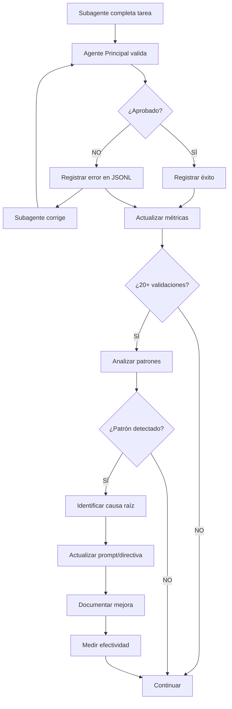
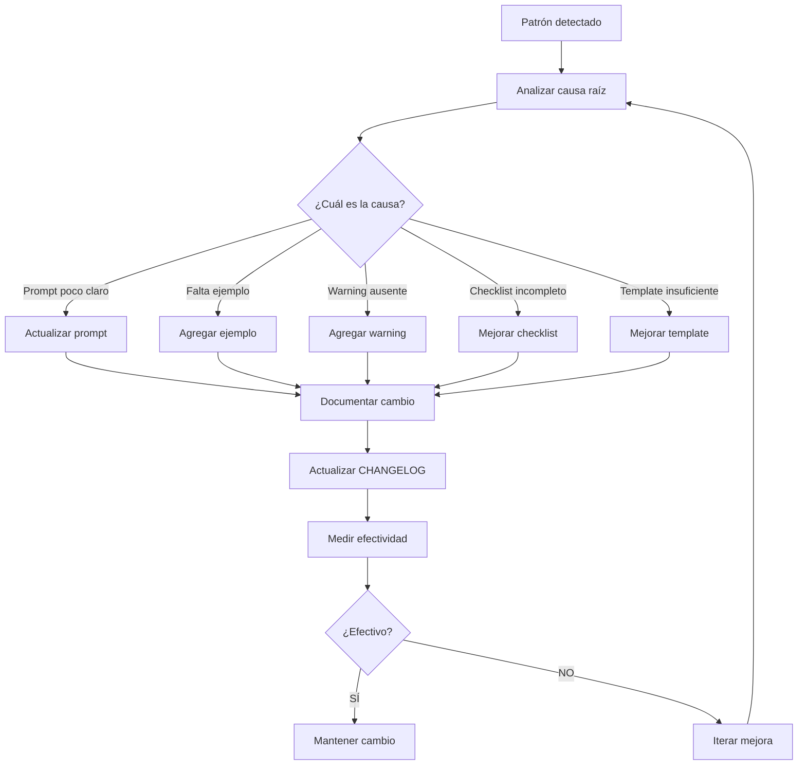

# SISTEMA DE RETROALIMENTACIÓN Y MEJORA CONTINUA

**Proyecto:** MVP Sistema Administración de Obra e INFONAVIT
**Versión:** 1.0.0
**Fecha:** 2025-11-17
**Audiencia:** Agentes Principales y administradores del sistema

---

## PROPÓSITO

Este documento establece el **sistema de retroalimentación** que permite:

1. **Capturar** errores y problemas de subagentes de forma estructurada
2. **Analizar** patrones de errores sistemáticos
3. **Identificar** causas raíz comunes
4. **Mejorar** prompts, directivas y templates basándose en datos reales
5. **Medir** efectividad de las mejoras implementadas

**Objetivo:** Crear un ciclo de mejora continua que reduzca progresivamente los errores de subagentes y aumente su eficiencia.

---

## ARQUITECTURA DEL SISTEMA



---

## COMPONENTE 1: CAPTURA DE FEEDBACK

### 1.1. Archivo de Feedback

**Ubicación:** `orchestration/estados/FEEDBACK-SUBAGENTES.jsonl`

**Formato:** JSONL (JSON Lines) - una línea por error

**Estructura de cada entrada:**

```json
{
  "timestamp": "2025-11-17T14:30:00Z",
  "subagent": "general-purpose-001",
  "task_id": "DB-042-SUB-001",
  "agent_principal": "Database-Agent",
  "error_category": "missing_specification",
  "error_detail": "Faltó implementar índice idx_projects_code especificado en contexto",
  "phase": "validation_technical",
  "archivo_afectado": "apps/database/ddl/schemas/project_management/tables/01-projects.sql",
  "corrected": true,
  "iterations": 2,
  "time_to_fix_minutes": 15,
  "context_provided": true,
  "reference_consulted": true,
  "inventory_checked": false
}
```

**Campos obligatorios:**

```yaml
timestamp:              # ISO 8601 timestamp del error
subagent:               # ID o tipo del subagente
task_id:                # ID de la tarea (ej: DB-042-SUB-001)
agent_principal:        # Agente que validó (Database-Agent, Backend-Agent, etc.)
error_category:         # Categoría estandarizada del error (ver 1.2)
error_detail:           # Descripción específica del error
phase:                  # Fase donde se detectó (ver 1.3)
archivo_afectado:       # Archivo donde ocurrió el error (si aplica)
corrected:              # true/false - ¿Se corrigió el error?
iterations:             # Número de intentos hasta corrección o abandono
time_to_fix_minutes:    # Tiempo en minutos para corregir
context_provided:       # ¿Se proporcionó contexto completo al subagente?
reference_consulted:    # ¿Subagente consultó referencias?
inventory_checked:      # ¿Subagente verificó inventarios?
```

### 1.2. Categorías de Errores Estandarizadas

```yaml
# Errores de Reporte
incomplete_report:           # Reporte sin secciones obligatorias
missing_validation_output:   # No incluyó outputs de comandos de validación
no_report:                   # No generó reporte

# Errores Técnicos
syntax_error:                # Error de sintaxis (SQL, TypeScript, etc.)
build_error:                 # Código no compila
runtime_error:               # Error en ejecución
type_error:                  # Error de tipos TypeScript
import_error:                # Imports incorrectos o faltantes

# Errores de Especificación
missing_specification:       # Faltó implementar elemento solicitado
wrong_specification:         # Implementó diferente a lo solicitado
extra_elements:             # Agregó elementos no solicitados
incomplete_implementation:   # Implementación parcial

# Errores de Convenciones
wrong_nomenclature:          # Nombres incorrectos (no siguen estándares)
wrong_location:              # Archivos en ubicación incorrecta
wrong_structure:             # Estructura de código incorrecta
wrong_file_name:             # Nombre de archivo incorrecto

# Errores de Documentación
inventory_not_updated:       # No actualizó inventario
trace_not_updated:           # No actualizó traza
incomplete_documentation:    # Documentación incompleta o incorrecta
wrong_inventory_format:      # Formato incorrecto en inventario

# Errores de Anti-Duplicación
duplicate_created:           # Creó un objeto duplicado
duplicate_not_detected:      # No detectó duplicado existente
wrong_search:                # Búsqueda anti-duplicación insuficiente o incorrecta

# Errores de Contexto
context_not_read:            # No leyó archivos de contexto proporcionados
reference_not_consulted:     # No consultó templates/referencias
assumption_made:             # Asumió valores no especificados sin preguntar
misunderstood_context:       # Malinterpretó el contexto proporcionado

# Errores de Proceso
skipped_validation:          # No ejecutó validaciones antes de reportar
wrong_validation:            # Ejecutó validaciones incorrectas
no_questions_asked:          # No preguntó cuando contexto insuficiente
premature_report:            # Reportó antes de completar

# Errores de Orchestration
orchestration_folder_wrong_place: # Creó carpeta orchestration/ en lugar incorrecto
modified_unspecified_files:       # Modificó archivos no especificados
ignored_restrictions:             # Ignoró restricciones explícitas
```

### 1.3. Fases de Detección

```yaml
validation_report:       # Error detectado al revisar reporte
validation_technical:    # Error detectado en validación técnica (compilación, ejecución)
validation_specs:        # Error detectado al verificar especificaciones
validation_conventions:  # Error detectado al verificar convenciones
validation_docs:         # Error detectado al verificar documentación
anti_duplication:        # Error detectado al verificar duplicados
execution:               # Error durante ejecución de tarea (antes de reportar)
```

### 1.4. Registrar Feedback (Agente Principal)

**Cuando detectes un error durante validación:**

```bash
# Agregar entrada al archivo JSONL
cat >> orchestration/estados/FEEDBACK-SUBAGENTES.jsonl << 'EOF'
{"timestamp":"2025-11-17T14:30:00Z","subagent":"general-purpose-001","task_id":"DB-042-SUB-001","agent_principal":"Database-Agent","error_category":"missing_specification","error_detail":"Faltó implementar índice idx_projects_code especificado en contexto","phase":"validation_technical","archivo_afectado":"apps/database/ddl/schemas/project_management/tables/01-projects.sql","corrected":true,"iterations":2,"time_to_fix_minutes":15,"context_provided":true,"reference_consulted":false,"inventory_checked":true}
EOF
```

**Campos a registrar:**

```markdown
**Siempre registrar:**
- timestamp (ISO 8601)
- subagent (tipo o ID)
- task_id
- agent_principal (tu nombre)
- error_category (de la lista estandarizada)
- error_detail (descripción específica)
- phase (dónde se detectó)
- corrected (true si se corrigió, false si se abandonó)
- iterations (cuántos intentos)

**Si es aplicable:**
- archivo_afectado (ruta del archivo con error)
- time_to_fix_minutes (tiempo que tomó corregir)
- context_provided (¿le diste contexto completo?)
- reference_consulted (¿consultó templates?)
- inventory_checked (¿verificó inventarios?)
```

---

## COMPONENTE 2: ANÁLISIS DE PATRONES

### 2.1. Frecuencia de Análisis

**Ejecutar análisis:**
- Cada 20 validaciones completadas
- Semanalmente (si hay actividad)
- Mensualmente (análisis completo)

### 2.2. Script de Análisis

**Ubicación:** `orchestration/scripts/analyze-feedback.sh`

```bash
#!/bin/bash

# Script para analizar feedback de subagentes
# Uso: ./analyze-feedback.sh [--last N] [--category CATEGORY]

FEEDBACK_FILE="orchestration/estados/FEEDBACK-SUBAGENTES.jsonl"
OUTPUT_DIR="orchestration/reportes/analisis-feedback"

# Crear directorio de salida
mkdir -p "$OUTPUT_DIR"

TIMESTAMP=$(date +%Y%m%d_%H%M%S)
REPORT_FILE="$OUTPUT_DIR/analisis-$TIMESTAMP.md"

echo "# ANÁLISIS DE FEEDBACK - $TIMESTAMP" > "$REPORT_FILE"
echo "" >> "$REPORT_FILE"
echo "Generado: $(date --iso-8601=seconds)" >> "$REPORT_FILE"
echo "" >> "$REPORT_FILE"

# 1. Estadísticas generales
echo "## 1. ESTADÍSTICAS GENERALES" >> "$REPORT_FILE"
echo "" >> "$REPORT_FILE"

TOTAL_ERRORS=$(wc -l < "$FEEDBACK_FILE")
echo "- **Total de errores registrados:** $TOTAL_ERRORS" >> "$REPORT_FILE"

CORRECTED=$(jq -r 'select(.corrected == true)' "$FEEDBACK_FILE" | wc -l)
NOT_CORRECTED=$(jq -r 'select(.corrected == false)' "$FEEDBACK_FILE" | wc -l)
echo "- **Errores corregidos:** $CORRECTED ($((CORRECTED * 100 / TOTAL_ERRORS))%)" >> "$REPORT_FILE"
echo "- **Errores no corregidos:** $NOT_CORRECTED ($((NOT_CORRECTED * 100 / TOTAL_ERRORS))%)" >> "$REPORT_FILE"

AVG_ITERATIONS=$(jq -r '.iterations' "$FEEDBACK_FILE" | awk '{sum+=$1; count++} END {printf "%.2f", sum/count}')
echo "- **Promedio de iteraciones:** $AVG_ITERATIONS" >> "$REPORT_FILE"

echo "" >> "$REPORT_FILE"

# 2. Top 10 categorías de errores
echo "## 2. TOP 10 CATEGORÍAS DE ERRORES" >> "$REPORT_FILE"
echo "" >> "$REPORT_FILE"
echo "| Categoría | Frecuencia | % | Promedio Iteraciones |" >> "$REPORT_FILE"
echo "|-----------|------------|---|----------------------|" >> "$REPORT_FILE"

jq -r '.error_category' "$FEEDBACK_FILE" | sort | uniq -c | sort -rn | head -10 | while read count category; do
    percentage=$((count * 100 / TOTAL_ERRORS))
    avg_iter=$(jq -r "select(.error_category == \"$category\") | .iterations" "$FEEDBACK_FILE" | awk '{sum+=$1; cnt++} END {printf "%.1f", sum/cnt}')
    echo "| $category | $count | $percentage% | $avg_iter |" >> "$REPORT_FILE"
done

echo "" >> "$REPORT_FILE"

# 3. Errores por fase
echo "## 3. ERRORES POR FASE DE DETECCIÓN" >> "$REPORT_FILE"
echo "" >> "$REPORT_FILE"
echo "| Fase | Frecuencia | % |" >> "$REPORT_FILE"
echo "|------|------------|---|" >> "$REPORT_FILE"

jq -r '.phase' "$FEEDBACK_FILE" | sort | uniq -c | sort -rn | while read count phase; do
    percentage=$((count * 100 / TOTAL_ERRORS))
    echo "| $phase | $count | $percentage% |" >> "$REPORT_FILE"
done

echo "" >> "$REPORT_FILE"

# 4. Errores por agente principal
echo "## 4. ERRORES POR AGENTE PRINCIPAL" >> "$REPORT_FILE"
echo "" >> "$REPORT_FILE"
echo "| Agente | Frecuencia | % | Promedio Iteraciones |" >> "$REPORT_FILE"
echo "|--------|------------|---|----------------------|" >> "$REPORT_FILE"

jq -r '.agent_principal' "$FEEDBACK_FILE" | sort | uniq -c | sort -rn | while read count agent; do
    percentage=$((count * 100 / TOTAL_ERRORS))
    avg_iter=$(jq -r "select(.agent_principal == \"$agent\") | .iterations" "$FEEDBACK_FILE" | awk '{sum+=$1; cnt++} END {printf "%.1f", sum/cnt}')
    echo "| $agent | $count | $percentage% | $avg_iter |" >> "$REPORT_FILE"
done

echo "" >> "$REPORT_FILE"

# 5. Análisis de contexto
echo "## 5. ANÁLISIS DE CONTEXTO PROPORCIONADO" >> "$REPORT_FILE"
echo "" >> "$REPORT_FILE"

CONTEXT_YES=$(jq -r 'select(.context_provided == true)' "$FEEDBACK_FILE" | wc -l)
CONTEXT_NO=$(jq -r 'select(.context_provided == false)' "$FEEDBACK_FILE" | wc -l)
echo "- **Contexto proporcionado:** $CONTEXT_YES ($((CONTEXT_YES * 100 / TOTAL_ERRORS))%)" >> "$REPORT_FILE"
echo "- **Contexto NO proporcionado:** $CONTEXT_NO ($((CONTEXT_NO * 100 / TOTAL_ERRORS))%)" >> "$REPORT_FILE"

# Iteraciones promedio con/sin contexto
AVG_WITH_CONTEXT=$(jq -r 'select(.context_provided == true) | .iterations' "$FEEDBACK_FILE" | awk '{sum+=$1; cnt++} END {printf "%.2f", sum/cnt}')
AVG_WITHOUT_CONTEXT=$(jq -r 'select(.context_provided == false) | .iterations' "$FEEDBACK_FILE" | awk '{sum+=$1; cnt++} END {printf "%.2f", sum/cnt}')
echo "- **Promedio iteraciones CON contexto:** $AVG_WITH_CONTEXT" >> "$REPORT_FILE"
echo "- **Promedio iteraciones SIN contexto:** $AVG_WITHOUT_CONTEXT" >> "$REPORT_FILE"

echo "" >> "$REPORT_FILE"

# 6. Patrones críticos (>10 ocurrencias)
echo "## 6. PATRONES CRÍTICOS (≥10 ocurrencias)" >> "$REPORT_FILE"
echo "" >> "$REPORT_FILE"

jq -r '.error_category' "$FEEDBACK_FILE" | sort | uniq -c | sort -rn | while read count category; do
    if [ "$count" -ge 10 ]; then
        echo "### ⚠️ $category ($count ocurrencias)" >> "$REPORT_FILE"
        echo "" >> "$REPORT_FILE"
        echo "**Ejemplos de errores:**" >> "$REPORT_FILE"
        jq -r "select(.error_category == \"$category\") | .error_detail" "$FEEDBACK_FILE" | head -5 | while read detail; do
            echo "- $detail" >> "$REPORT_FILE"
        done
        echo "" >> "$REPORT_FILE"

        # Archivos más afectados
        echo "**Archivos más afectados:**" >> "$REPORT_FILE"
        jq -r "select(.error_category == \"$category\") | .archivo_afectado" "$FEEDBACK_FILE" | grep -v "^$" | sort | uniq -c | sort -rn | head -3 | while read cnt file; do
            echo "- $file ($cnt veces)" >> "$REPORT_FILE"
        done
        echo "" >> "$REPORT_FILE"
    fi
done

# 7. Recomendaciones
echo "## 7. RECOMENDACIONES DE MEJORA" >> "$REPORT_FILE"
echo "" >> "$REPORT_FILE"
echo "Basado en el análisis, se recomienda:" >> "$REPORT_FILE"
echo "" >> "$REPORT_FILE"

# Recomendar según categoría más frecuente
TOP_CATEGORY=$(jq -r '.error_category' "$FEEDBACK_FILE" | sort | uniq -c | sort -rn | head -1 | awk '{print $2}')
TOP_COUNT=$(jq -r '.error_category' "$FEEDBACK_FILE" | sort | uniq -c | sort -rn | head -1 | awk '{print $1}')

echo "1. **Prioridad 1:** Abordar categoría \`$TOP_CATEGORY\` ($TOP_COUNT ocurrencias)" >> "$REPORT_FILE"
echo "   - Revisar PROMPT-SUBAGENTES.md sección relacionada" >> "$REPORT_FILE"
echo "   - Agregar ejemplos específicos" >> "$REPORT_FILE"
echo "   - Añadir warnings explícitos" >> "$REPORT_FILE"
echo "" >> "$REPORT_FILE"

if [ "$CONTEXT_NO" -gt "$((TOTAL_ERRORS / 4))" ]; then
    echo "2. **Prioridad 2:** Mejorar provisión de contexto" >> "$REPORT_FILE"
    echo "   - $CONTEXT_NO errores ($((CONTEXT_NO * 100 / TOTAL_ERRORS))%) ocurrieron sin contexto completo" >> "$REPORT_FILE"
    echo "   - Revisar uso de TEMPLATE-CONTEXTO-SUBAGENTE.md" >> "$REPORT_FILE"
    echo "" >> "$REPORT_FILE"
fi

if [ "$AVG_ITERATIONS" -gt 1.5 ]; then
    echo "3. **Prioridad 3:** Reducir iteraciones promedio" >> "$REPORT_FILE"
    echo "   - Actual: $AVG_ITERATIONS iteraciones promedio" >> "$REPORT_FILE"
    echo "   - Objetivo: <1.5 iteraciones" >> "$REPORT_FILE"
    echo "   - Mejorar claridad de instrucciones en prompts" >> "$REPORT_FILE"
    echo "" >> "$REPORT_FILE"
fi

echo "---" >> "$REPORT_FILE"
echo "" >> "$REPORT_FILE"
echo "**Próximo análisis:** Ejecutar después de 20 validaciones más" >> "$REPORT_FILE"

# Mostrar reporte
cat "$REPORT_FILE"

echo ""
echo "✅ Reporte guardado en: $REPORT_FILE"
```

**Hacer ejecutable:**

```bash
chmod +x orchestration/scripts/analyze-feedback.sh
```

**Ejecutar:**

```bash
# Análisis completo
./orchestration/scripts/analyze-feedback.sh

# Solo últimas N entradas
./orchestration/scripts/analyze-feedback.sh --last 50

# Filtrar por categoría
./orchestration/scripts/analyze-feedback.sh --category missing_specification
```

### 2.3. Identificación de Patrones

**Un patrón crítico se identifica cuando:**

```yaml
criterios:
  - frecuencia >= 10 ocurrencias
  - porcentaje >= 15% del total
  - promedio_iteraciones >= 2.0
  - tasa_correccion < 90%
```

**Ejemplo de patrón crítico:**

```markdown
## PATRÓN CRÍTICO DETECTADO

**Categoría:** missing_specification
**Frecuencia:** 18 ocurrencias en 60 validaciones (30%)
**Promedio iteraciones:** 2.3
**Tasa corrección:** 94%

**Ejemplos de errores:**
1. Faltó implementar índice idx_projects_code especificado en contexto
2. No implementó constraint CHECK en columna status
3. Omitió validación @IsNotEmpty en property code
4. No creó relación @ManyToOne especificada

**Análisis:**
Los subagentes están leyendo el contexto pero NO están verificando
que implementaron TODOS los elementos antes de reportar.

**Causa raíz:**
PROMPT-SUBAGENTES.md Paso 5 (Validación) no enfatiza suficientemente
la necesidad de crear una tabla comparativa Solicitado vs Implementado.

**Acción requerida:**
Actualizar PROMPT-SUBAGENTES.md con tabla comparativa obligatoria.
```

---

## COMPONENTE 3: IMPLEMENTACIÓN DE MEJORAS

### 3.1. Proceso de Mejora



### 3.2. Template de Mejora

**Ubicación:** `orchestration/reportes/mejoras/MEJORA-{YYYY-MM-DD}-{N}.md`

```markdown
# MEJORA DEL SISTEMA DE SUBAGENTES

**ID:** MEJORA-2025-11-17-001
**Fecha:** 2025-11-17
**Tipo:** Actualización de Prompt | Nueva Directiva | Mejora de Template | Otro

---

## 1. PATRÓN DETECTADO

**Categoría de error:** {error_category}
**Frecuencia:** {N} ocurrencias en {M} validaciones ({porcentaje}%)
**Periodo:** {fecha_inicio} a {fecha_fin}
**Promedio iteraciones:** {X.X}

**Ejemplos de errores:**
1. {Ejemplo 1}
2. {Ejemplo 2}
3. {Ejemplo 3}

**Referencias:**
- Análisis completo: `orchestration/reportes/analisis-feedback/analisis-{timestamp}.md`
- Entradas JSONL: Líneas {X}-{Y} en FEEDBACK-SUBAGENTES.jsonl

---

## 2. ANÁLISIS DE CAUSA RAÍZ

### Causa Identificada

{Descripción detallada de por qué ocurre el error}

**Ejemplo:**
Los subagentes están omitiendo la validación de especificaciones completas
porque el PROMPT-SUBAGENTES.md Paso 5 solo menciona "validar localmente"
sin explicitar que deben crear una tabla comparativa de Solicitado vs Implementado.

### Evidencia

**Fragmento del prompt actual:**
```markdown
Paso 5: VALIDAR LOCALMENTE

Antes de reportar, valida que tu implementación funciona correctamente.
```

**Problema:**
No especifica CÓMO validar que TODAS las especificaciones fueron implementadas.

---

## 3. SOLUCIÓN PROPUESTA

### Cambio a Implementar

**Archivo a modificar:** `{ruta del archivo}`
**Sección a modificar:** `{sección específica}`

**Cambio propuesto:**

```markdown
ANTES:
{Contenido actual}

DESPUÉS:
{Contenido propuesto}
```

### Ejemplos Adicionales (si aplica)

Agregar los siguientes ejemplos:

```markdown
{Ejemplo 1}
{Ejemplo 2}
```

### Warnings Adicionales (si aplica)

Agregar el siguiente warning:

```markdown
⚠️ WARNING: {Texto del warning}
```

---

## 4. IMPLEMENTACIÓN

### Archivos Modificados

- [ ] `orchestration/prompts/PROMPT-SUBAGENTES.md`
  - Sección modificada: {sección}
  - Líneas: {X-Y}
  - Tipo: {agregado/modificado/eliminado}

- [ ] `orchestration/templates/TEMPLATE-CONTEXTO-SUBAGENTE.md`
  - Sección modificada: {sección}
  - Líneas: {X-Y}
  - Tipo: {agregado/modificado/eliminado}

### Diff de Cambios

```diff
{Git diff de los cambios realizados}
```

---

## 5. DOCUMENTACIÓN DEL CAMBIO

### Actualizar CHANGELOG

```markdown
## {Fecha} - v{X.Y.Z}

### Mejoras
- **{Archivo}**: {Descripción del cambio}
  - Razón: {Categoría de error} - {N} ocurrencias ({porcentaje}%)
  - Resultado esperado: Reducir a <{objetivo}%
  - Referencias: MEJORA-{YYYY-MM-DD}-{N}

### Errores Corregidos
- {Categoría}: {N} ocurrencias → Objetivo: <{X}
```

### Comunicar a Agentes

**Mensaje a incluir en próximo prompt de agentes:**

```markdown
📢 ACTUALIZACIÓN IMPORTANTE

Se actualizó {archivo} para prevenir error frecuente:
- Problema: {descripción breve}
- Solución: {cambio implementado}
- Acción: Consultar nueva sección {X}
```

---

## 6. MEDICIÓN DE EFECTIVIDAD

### Métricas Baseline (Antes de Mejora)

```yaml
categoria: {error_category}
frecuencia_antes: {N} ocurrencias
porcentaje_antes: {X}%
promedio_iteraciones_antes: {X.X}
periodo_medicion: {fecha_inicio} a {fecha_fin}
validaciones_totales: {M}
```

### Métricas Objetivo (Después de Mejora)

```yaml
objetivo_frecuencia: < {N} ocurrencias
objetivo_porcentaje: < {X}%
objetivo_iteraciones: < {X.X}
periodo_medicion: 30 días después de implementación
```

### Plan de Seguimiento

```markdown
**Verificación 1:** +7 días
- Revisar últimas 10 validaciones
- Calcular frecuencia de {error_category}
- ¿Mejoró? SÍ/NO

**Verificación 2:** +14 días
- Revisar últimas 20 validaciones
- Calcular frecuencia de {error_category}
- ¿Alcanzó objetivo? SÍ/NO

**Verificación 3:** +30 días
- Análisis completo (50+ validaciones)
- Comparar con baseline
- Decisión: MANTENER / ITERAR / REVERTIR
```

---

## 7. RESULTADOS (Completar después de seguimiento)

### Verificación 1 (+7 días)

**Fecha:** {YYYY-MM-DD}
**Validaciones revisadas:** {N}
**Frecuencia observada:** {N} ocurrencias ({porcentaje}%)
**vs Baseline:** {+/-X}%
**Estado:** ✅ Mejora / ⚠️ Sin cambio / ❌ Empeoró

**Comentarios:**
{Observaciones}

### Verificación 2 (+14 días)

**Fecha:** {YYYY-MM-DD}
**Validaciones revisadas:** {N}
**Frecuencia observada:** {N} ocurrencias ({porcentaje}%)
**vs Baseline:** {+/-X}%
**Estado:** ✅ Mejora / ⚠️ Sin cambio / ❌ Empeoró

**Comentarios:**
{Observaciones}

### Verificación Final (+30 días)

**Fecha:** {YYYY-MM-DD}
**Validaciones revisadas:** {N}
**Frecuencia observada:** {N} ocurrencias ({porcentaje}%)
**vs Baseline:** {+/-X}%
**Objetivo alcanzado:** ✅ SÍ / ❌ NO

**Comentarios:**
{Observaciones}

**Decisión:**
- [ ] ✅ MANTENER - La mejora es efectiva
- [ ] 🔄 ITERAR - Mejoró pero no alcanzó objetivo
- [ ] ❌ REVERTIR - No tuvo efecto o empeoró

---

## 8. LECCIONES APRENDIDAS

### Qué funcionó bien

{Lista de aspectos positivos}

### Qué no funcionó

{Lista de aspectos negativos}

### Próximos pasos

{Acciones adicionales recomendadas}

---

**Estado:** 🔄 En Implementación | 📊 En Seguimiento | ✅ Completado | ❌ Revertido
**Responsable:** {Nombre del agente o persona}
**Última actualización:** {YYYY-MM-DD}
```

### 3.3. Actualizar CHANGELOG

**Archivo:** `orchestration/CHANGELOG-SISTEMA-SUBAGENTES.md`

```markdown
# CHANGELOG - Sistema de Subagentes

Registro de mejoras al sistema de prompts, directivas y templates de subagentes.

---

## 2025-11-25 - v1.2.0

### Mejoras

- **PROMPT-SUBAGENTES.md (Paso 5)**: Agregado paso obligatorio de tabla comparativa
  - Razón: `missing_specification` - 18 ocurrencias (30%)
  - Cambio: Sección "5.2. Validación de Especificaciones" ahora incluye tabla obligatoria
  - Resultado esperado: Reducir missing_specification de 30% a <5%
  - Referencias: MEJORA-2025-11-25-001

- **TEMPLATE-CONTEXTO-SUBAGENTE.md**: Mejoradas tablas de especificaciones
  - Razón: Contexto insuficiente causaba ambigüedad
  - Cambio: Agregadas columnas "Descripción" y "Ejemplo" en tablas
  - Resultado esperado: Reducir `misunderstood_context` de 12% a <5%
  - Referencias: MEJORA-2025-11-25-002

### Errores Detectados (Periodo: 2025-11-10 a 2025-11-25)

| Categoría | Frecuencia | % | Acción |
|-----------|------------|---|--------|
| missing_specification | 18 | 30% | ✅ Corregido v1.2.0 |
| wrong_nomenclature | 12 | 20% | ⏳ Pendiente v1.3.0 |
| duplicate_not_detected | 8 | 13% | 🔄 En análisis |

### Métricas del Periodo

```yaml
validaciones_totales: 60
errores_totales: 22
tasa_aprobacion_primera_vez: 63.3%
promedio_iteraciones: 1.6
tiempo_validacion_promedio: 9.2 min

objetivos:
  tasa_aprobacion: 85% (actual: 63% ❌)
  iteraciones: 1.5 (actual: 1.6 ❌)
  tiempo_validacion: 10 min (actual: 9.2 ✅)
```

---

## 2025-11-18 - v1.1.0

### Mejoras

- **PROMPT-SUBAGENTES.md**: Agregadas secciones de errores comunes
  - Razón: Subagentes repetían errores históricos
  - Cambio: Sección "❌ ERRORES HISTÓRICOS CRÍTICOS" con 5 errores comunes
  - Resultado: Redujo errores generales de 40% a 30%

- **TEMPLATE-CONTEXTO-SUBAGENTE.md**: Template inicial creado
  - Razón: Agentes no proporcionaban contexto estructurado
  - Resultado: Redujo `context_not_read` de 25% a 12%

### Métricas del Periodo

```yaml
validaciones_totales: 40
tasa_aprobacion_primera_vez: 60%
promedio_iteraciones: 1.8
```

---

## 2025-11-17 - v1.0.0

### Inicial

- Creación del sistema de orquestación de agentes
- PROMPT-SUBAGENTES.md v1.0.0
- DIRECTIVA-VALIDACION-SUBAGENTES.md v1.0.0
- ESTANDARES-NOMENCLATURA.md v1.0.0
- Sistema de feedback implementado

---

**Formato:** Semantic Versioning (MAJOR.MINOR.PATCH)
- MAJOR: Cambios incompatibles con versiones anteriores
- MINOR: Nuevas funcionalidades compatibles
- PATCH: Correcciones de bugs
```

---

## COMPONENTE 4: SEGUIMIENTO Y MÉTRICAS

### 4.1. Dashboard de Métricas

**Archivo:** `orchestration/estados/METRICAS-VALIDACION.yml`

(Ya descrito en DIRECTIVA-VALIDACION-SUBAGENTES.md)

### 4.2. Script de Actualización de Métricas

**Ubicación:** `orchestration/scripts/update-metrics.py`

```python
#!/usr/bin/env python3
"""
Script para actualizar métricas de validación
Uso: python update-metrics.py --result approved|rejected --agent Database-Agent --time 10 --iterations 1
"""

import argparse
import yaml
import json
from datetime import datetime
from pathlib import Path

METRICS_FILE = Path("orchestration/estados/METRICAS-VALIDACION.yml")
FEEDBACK_FILE = Path("orchestration/estados/FEEDBACK-SUBAGENTES.jsonl")

def load_metrics():
    if METRICS_FILE.exists():
        with open(METRICS_FILE) as f:
            return yaml.safe_load(f)
    return {
        'version': '1.0.0',
        'ultima_actualizacion': datetime.now().isoformat(),
        'total_validaciones': 0,
        'total_aprobadas_primera_vez': 0,
        'total_rechazadas': 0,
        'tasa_aprobacion_primera_vez': 0.0,
        'por_agente': {},
        'errores_por_fase': {},
        'top_errores': [],
        'iteraciones': {'promedio': 0.0, 'minimo': 999, 'maximo': 0},
        'tiempo_validacion': {'promedio': 0.0, 'minimo': 999, 'maximo': 0},
        'objetivos': {
            'tasa_aprobacion_primera_vez': 85.0,
            'tiempo_validacion_max': 10.0,
            'iteraciones_max': 1.5
        },
        'cumplimiento_objetivos': {}
    }

def update_metrics(result, agent, time_minutes, iterations, errors=None):
    metrics = load_metrics()

    # Actualizar totales
    metrics['total_validaciones'] += 1

    if result == 'approved' and iterations == 1:
        metrics['total_aprobadas_primera_vez'] += 1
    elif result == 'rejected':
        metrics['total_rechazadas'] += 1

    # Calcular tasa de aprobación
    if metrics['total_validaciones'] > 0:
        metrics['tasa_aprobacion_primera_vez'] = round(
            (metrics['total_aprobadas_primera_vez'] / metrics['total_validaciones']) * 100, 1
        )

    # Actualizar por agente
    if agent not in metrics['por_agente']:
        metrics['por_agente'][agent] = {
            'validaciones': 0,
            'aprobadas_primera_vez': 0,
            'rechazadas': 0,
            'tasa_aprobacion': 0.0
        }

    agent_metrics = metrics['por_agente'][agent]
    agent_metrics['validaciones'] += 1

    if result == 'approved' and iterations == 1:
        agent_metrics['aprobadas_primera_vez'] += 1
    elif result == 'rejected':
        agent_metrics['rechazadas'] += 1

    if agent_metrics['validaciones'] > 0:
        agent_metrics['tasa_aprobacion'] = round(
            (agent_metrics['aprobadas_primera_vez'] / agent_metrics['validaciones']) * 100, 1
        )

    # Actualizar iteraciones
    iter_data = metrics['iteraciones']
    total = metrics['total_validaciones']
    iter_data['minimo'] = min(iter_data['minimo'], iterations)
    iter_data['maximo'] = max(iter_data['maximo'], iterations)

    # Recalcular promedio leyendo feedback
    if FEEDBACK_FILE.exists():
        with open(FEEDBACK_FILE) as f:
            all_iterations = [json.loads(line)['iterations'] for line in f]
            iter_data['promedio'] = round(sum(all_iterations) / len(all_iterations), 1)

    # Actualizar tiempo
    time_data = metrics['tiempo_validacion']
    time_data['minimo'] = min(time_data['minimo'], time_minutes)
    time_data['maximo'] = max(time_data['maximo'], time_minutes)

    # Recalcular promedio de tiempo
    if FEEDBACK_FILE.exists():
        with open(FEEDBACK_FILE) as f:
            all_times = [json.loads(line).get('time_to_fix_minutes', 0) for line in f]
            all_times = [t for t in all_times if t > 0]
            if all_times:
                time_data['promedio'] = round(sum(all_times) / len(all_times), 1)

    # Actualizar cumplimiento de objetivos
    objetivos = metrics['objetivos']
    cumplimiento = metrics['cumplimiento_objetivos']

    cumplimiento['tasa_aprobacion'] = metrics['tasa_aprobacion_primera_vez'] >= objetivos['tasa_aprobacion_primera_vez']
    cumplimiento['tiempo_validacion'] = time_data['promedio'] <= objetivos['tiempo_validacion_max']
    cumplimiento['iteraciones'] = iter_data['promedio'] <= objetivos['iteraciones_max']

    # Actualizar timestamp
    metrics['ultima_actualizacion'] = datetime.now().isoformat()

    # Guardar
    with open(METRICS_FILE, 'w') as f:
        yaml.dump(metrics, f, default_flow_style=False, allow_unicode=True)

    print(f"✅ Métricas actualizadas: {result} - {agent} - {iterations} iter - {time_minutes} min")
    print(f"   Tasa aprobación: {metrics['tasa_aprobacion_primera_vez']}% (objetivo: {objetivos['tasa_aprobacion_primera_vez']}%)")
    print(f"   Iteraciones promedio: {iter_data['promedio']} (objetivo: <{objetivos['iteraciones_max']})")
    print(f"   Tiempo promedio: {time_data['promedio']} min (objetivo: <{objetivos['tiempo_validacion_max']} min)")

if __name__ == '__main__':
    parser = argparse.ArgumentParser()
    parser.add_argument('--result', required=True, choices=['approved', 'rejected'])
    parser.add_argument('--agent', required=True)
    parser.add_argument('--time', type=int, required=True)
    parser.add_argument('--iterations', type=int, required=True)
    parser.add_argument('--errors', help='Comma-separated error categories')

    args = parser.parse_args()

    errors = args.errors.split(',') if args.errors else None
    update_metrics(args.result, args.agent, args.time, args.iterations, errors)
```

**Hacer ejecutable:**

```bash
chmod +x orchestration/scripts/update-metrics.py
```

**Uso:**

```bash
# Después de cada validación
python orchestration/scripts/update-metrics.py \
    --result approved \
    --agent Database-Agent \
    --time 8 \
    --iterations 1

python orchestration/scripts/update-metrics.py \
    --result rejected \
    --agent Backend-Agent \
    --time 15 \
    --iterations 2 \
    --errors missing_specification,wrong_nomenclature
```

---

## COMPONENTE 5: REVISIÓN PERIÓDICA

### 5.1. Revisión Semanal (Agentes Principales)

**Cada semana, ejecutar:**

```bash
# 1. Análisis de feedback
./orchestration/scripts/analyze-feedback.sh

# 2. Revisar reporte generado
cat orchestration/reportes/analisis-feedback/analisis-{timestamp}.md

# 3. Identificar patrones críticos (≥10 ocurrencias)

# 4. Si hay patrones, crear registro de mejora
cp orchestration/templates/TEMPLATE-MEJORA.md \
   orchestration/reportes/mejoras/MEJORA-$(date +%Y-%m-%d)-001.md

# 5. Completar template de mejora

# 6. Implementar cambios

# 7. Actualizar CHANGELOG
```

### 5.2. Revisión Mensual (Administrador del Sistema)

**Cada mes, ejecutar:**

```bash
# 1. Análisis completo
./orchestration/scripts/analyze-feedback.sh

# 2. Revisar métricas globales
cat orchestration/estados/METRICAS-VALIDACION.yml

# 3. Revisar mejoras implementadas
ls -la orchestration/reportes/mejoras/

# 4. Evaluar efectividad de mejoras
# Para cada mejora implementada hace 30+ días:
#   - ¿Redujo la frecuencia del error?
#   - ¿Alcanzó el objetivo?
#   - ¿Debe iterarse o revertirse?

# 5. Actualizar CHANGELOG con resultados

# 6. Planificar mejoras para próximo mes
```

### 5.3. Checklist de Revisión Mensual

```markdown
## REVISIÓN MENSUAL - {YYYY-MM}

**Fecha:** {YYYY-MM-DD}
**Periodo:** {fecha_inicio} a {fecha_fin}
**Validaciones totales:** {N}

### 1. Métricas Globales

- [ ] Revisadas métricas en METRICAS-VALIDACION.yml
- [ ] Tasa de aprobación: {X}% (objetivo: 85%)
- [ ] Iteraciones promedio: {X.X} (objetivo: <1.5)
- [ ] Tiempo validación: {X} min (objetivo: <10 min)

### 2. Análisis de Feedback

- [ ] Ejecutado script analyze-feedback.sh
- [ ] Identificados patrones críticos (≥10 ocurrencias)
- [ ] Top 3 categorías de errores:
  1. {categoria1}: {N} ({porcentaje}%)
  2. {categoria2}: {N} ({porcentaje}%)
  3. {categoria3}: {N} ({porcentaje}%)

### 3. Mejoras Implementadas

- [ ] Revisadas mejoras del mes pasado
- [ ] Evaluada efectividad (mejoras +30 días):
  - MEJORA-{ID}: {Efectiva/Inefectiva/En seguimiento}
  - MEJORA-{ID}: {Efectiva/Inefectiva/En seguimiento}

### 4. Nuevas Mejoras

- [ ] Creadas mejoras para patrones críticos:
  - MEJORA-{ID}: {Categoría} - {Descripción breve}
  - MEJORA-{ID}: {Categoría} - {Descripción breve}

### 5. CHANGELOG

- [ ] Actualizado CHANGELOG-SISTEMA-SUBAGENTES.md
- [ ] Documentadas métricas del periodo
- [ ] Documentadas mejoras implementadas

### 6. Comunicación

- [ ] Comunicadas actualizaciones a agentes
- [ ] Actualizada documentación si necesario

### 7. Planificación

**Objetivos próximo mes:**
- {Objetivo 1}
- {Objetivo 2}
- {Objetivo 3}

**Mejoras prioritarias:**
1. {Categoría}: {Acción}
2. {Categoría}: {Acción}
```

---

## EJEMPLOS COMPLETOS

### Ejemplo 1: Ciclo Completo de Mejora

**1. Detección del Patrón (Semana 1)**

```bash
$ ./orchestration/scripts/analyze-feedback.sh
...
## 6. PATRONES CRÍTICOS (≥10 ocurrencias)

### ⚠️ missing_specification (18 ocurrencias)

**Ejemplos de errores:**
- Faltó implementar índice idx_projects_code especificado en contexto
- No implementó constraint CHECK en columna status
- Omitió validación @IsNotEmpty en property code
...
```

**2. Creación de Registro de Mejora**

```bash
$ cp orchestration/templates/TEMPLATE-MEJORA.md \
     orchestration/reportes/mejoras/MEJORA-2025-11-25-001.md

$ vim orchestration/reportes/mejoras/MEJORA-2025-11-25-001.md
# Completar template con análisis de causa raíz
```

**3. Implementación del Cambio**

```bash
$ vim orchestration/prompts/PROMPT-SUBAGENTES.md
# Agregar sección de tabla comparativa en Paso 5
```

**4. Actualización del CHANGELOG**

```bash
$ vim orchestration/CHANGELOG-SISTEMA-SUBAGENTES.md
# Agregar entrada de v1.2.0 con mejora
```

**5. Seguimiento (+7 días)**

```bash
# Revisar últimas 10 validaciones
$ tail -10 orchestration/estados/FEEDBACK-SUBAGENTES.jsonl | \
  jq -r 'select(.error_category == "missing_specification")'
# Resultado: 0 ocurrencias (¡mejora!)
```

**6. Seguimiento (+30 días)**

```bash
$ ./orchestration/scripts/analyze-feedback.sh --last 50
...
| missing_specification | 2 | 4% | 1.0 |
# ¡Bajó de 30% a 4%! ✅ Mejora efectiva
```

**7. Actualización del Registro de Mejora**

```bash
$ vim orchestration/reportes/mejoras/MEJORA-2025-11-25-001.md
# Completar sección "7. RESULTADOS" con datos de seguimiento
# Marcar como "✅ MANTENER - La mejora es efectiva"
```

---

## RESPONSABILIDADES

### Agentes Principales

**SIEMPRE debes:**
- ✅ Registrar TODOS los errores en FEEDBACK-SUBAGENTES.jsonl
- ✅ Actualizar métricas después de cada validación
- ✅ Ejecutar análisis semanal de feedback
- ✅ Identificar patrones críticos
- ✅ Crear registros de mejora para patrones detectados
- ✅ Implementar mejoras aprobadas

### Administrador del Sistema

**SIEMPRE debe:**
- ✅ Ejecutar revisión mensual completa
- ✅ Evaluar efectividad de mejoras implementadas
- ✅ Aprobar/rechazar propuestas de mejora
- ✅ Mantener CHANGELOG actualizado
- ✅ Comunicar actualizaciones a agentes

---

## CRITERIOS DE ÉXITO

### A Corto Plazo (1 mes)

```yaml
objetivos:
  patrones_criticos_detectados: >= 1
  mejoras_implementadas: >= 1
  reduccion_errores: >= 20%  # Para categoría mejorada
```

### A Mediano Plazo (3 meses)

```yaml
objetivos:
  tasa_aprobacion_primera_vez: >= 85%
  promedio_iteraciones: <= 1.5
  tiempo_validacion: <= 10 min
  categorias_criticas_resueltas: >= 3
```

### A Largo Plazo (6 meses)

```yaml
objetivos:
  tasa_aprobacion_primera_vez: >= 95%
  promedio_iteraciones: <= 1.2
  errores_duplicados: 0
  prompts_estables: true  # Sin necesidad de cambios frecuentes
```

---

## REFERENCIAS

- [DIRECTIVA-VALIDACION-SUBAGENTES.md](./DIRECTIVA-VALIDACION-SUBAGENTES.md) - Proceso de validación
- [PROMPT-SUBAGENTES.md](../prompts/PROMPT-SUBAGENTES.md) - Prompt de subagentes
- [CHANGELOG-SISTEMA-SUBAGENTES.md](../CHANGELOG-SISTEMA-SUBAGENTES.md) - Historial de mejoras

---

**Versión:** 1.0.0
**Última actualización:** 2025-11-17
**Uso:** Obligatorio para mantener y mejorar el sistema de subagentes
